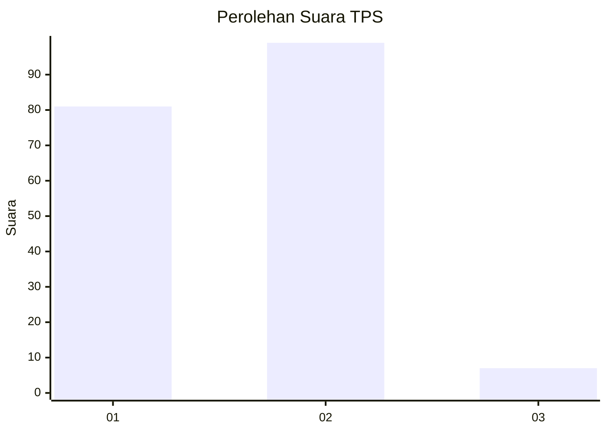
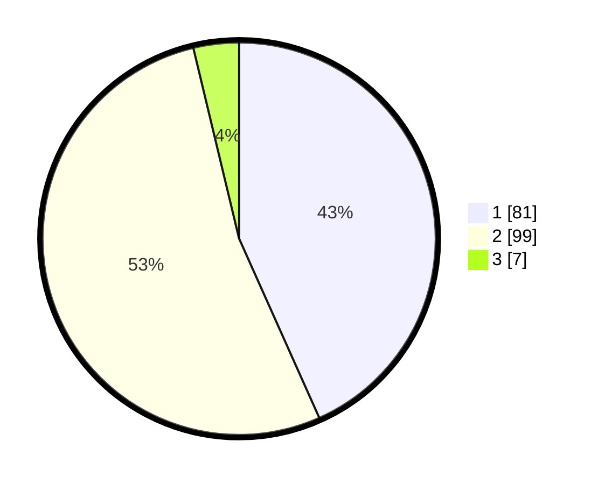

# Hasil

## Grafik

## Tabel

| No. | Nama Paslon    | Suara | Suara (raw) | Persentase |
|:--- |:-------------- | -----:| -----------:| ----------:|
| 1   | ANIES MUHAIMIN | 81    | [81][p-1]   | 43,32      |
| 2   | PRABOWO GIBRAN | 99    | [99][p-2]   | 52,94      |
| 3   | GANJAR MAHFUD  | 7     | [7][p-3]    | 3,74       |

[p-1]: https://github.com/gigit-pemilu/pemilu-2024-35-jawa-timur/blob/main/pilpres/hitung-suara/sub/35-jawa-timur/sub/11-bondowoso/sub/02-tamanan/sub/2014-sumber-anom/sub/009-tps/sub/paslon-1.txt
[p-2]: https://github.com/gigit-pemilu/pemilu-2024-35-jawa-timur/blob/main/pilpres/hitung-suara/sub/35-jawa-timur/sub/11-bondowoso/sub/02-tamanan/sub/2014-sumber-anom/sub/009-tps/sub/paslon-2.txt
[p-3]: https://github.com/gigit-pemilu/pemilu-2024-35-jawa-timur/blob/main/pilpres/hitung-suara/sub/35-jawa-timur/sub/11-bondowoso/sub/02-tamanan/sub/2014-sumber-anom/sub/009-tps/sub/paslon-3.txt

## Foto C Plano

https://sirekap-obj-formc.kpu.go.id/7aea/pemilu/ppwp/35/11/02/20/14/3511022014009-20240215-053826--1d588355-bd51-4fa5-8e3e-2b3af890e1fa.jpg

https://sirekap-obj-formc.kpu.go.id/7aea/pemilu/ppwp/35/11/02/20/14/3511022014009-20240215-055116--8998390e-fcb8-48cc-b9fa-1381bf81f1c5.jpg

https://sirekap-obj-formc.kpu.go.id/7aea/pemilu/ppwp/35/11/02/20/14/3511022014009-20240215-054821--ccdaccdb-0591-40ca-957d-fd561044cb88.jpg

## Metadata

| Key        | Value               |
| ---------- | ------------------- |
| Time Stamp | 2024-02-16 10:30:29 |

