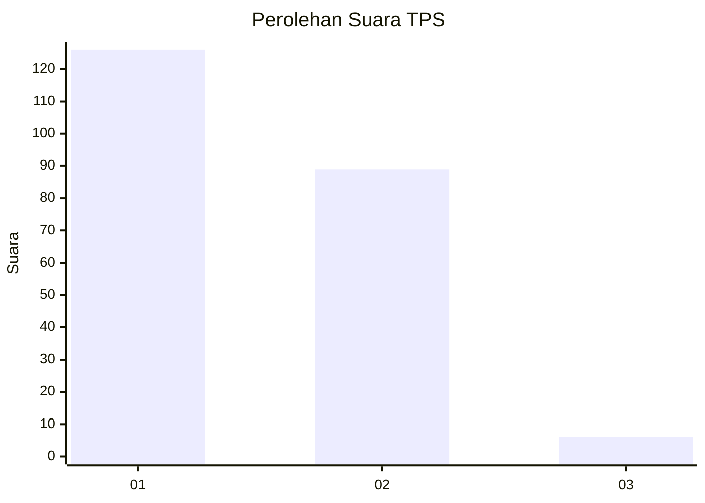
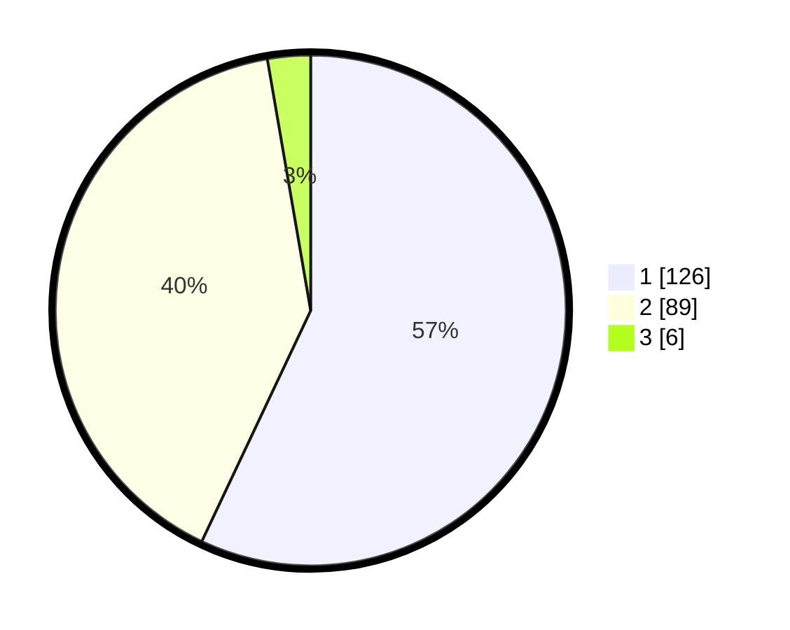

# Hasil

## Grafik

## Tabel

| No. | Nama Paslon    | Suara | Suara (raw) | Persentase |
|:--- |:-------------- | -----:| -----------:| ----------:|
| 1   | ANIES MUHAIMIN | 126   | [126][p-1]  | 57,01      |
| 2   | PRABOWO GIBRAN | 89    | [89][p-2]   | 40,27      |
| 3   | GANJAR MAHFUD  | 6     | [6][p-3]    | 2,71       |

[p-1]: https://github.com/gigit-pemilu/pemilu-2024-35-jawa-timur/blob/main/pilpres/hitung-suara/sub/35-jawa-timur/sub/11-bondowoso/sub/03-tlogosari/sub/2001-kembang/sub/001-tps/sub/paslon-1.txt
[p-2]: https://github.com/gigit-pemilu/pemilu-2024-35-jawa-timur/blob/main/pilpres/hitung-suara/sub/35-jawa-timur/sub/11-bondowoso/sub/03-tlogosari/sub/2001-kembang/sub/001-tps/sub/paslon-2.txt
[p-3]: https://github.com/gigit-pemilu/pemilu-2024-35-jawa-timur/blob/main/pilpres/hitung-suara/sub/35-jawa-timur/sub/11-bondowoso/sub/03-tlogosari/sub/2001-kembang/sub/001-tps/sub/paslon-3.txt

## Foto C Plano

https://sirekap-obj-formc.kpu.go.id/1167/pemilu/ppwp/35/11/03/20/01/3511032001001-20240215-020915--033bb8f5-41da-4e23-bbb4-17f1aa6b94e5.jpg

https://sirekap-obj-formc.kpu.go.id/1167/pemilu/ppwp/35/11/03/20/01/3511032001001-20240215-021307--27c8c1da-71a7-4403-8aa6-71b36ca1484b.jpg

https://sirekap-obj-formc.kpu.go.id/1167/pemilu/ppwp/35/11/03/20/01/3511032001001-20240215-021539--6d638db7-580d-40b4-aaee-718709722b94.jpg

## Metadata

| Key        | Value               |
| ---------- | ------------------- |
| Time Stamp | 2024-02-15 15:00:29 |

