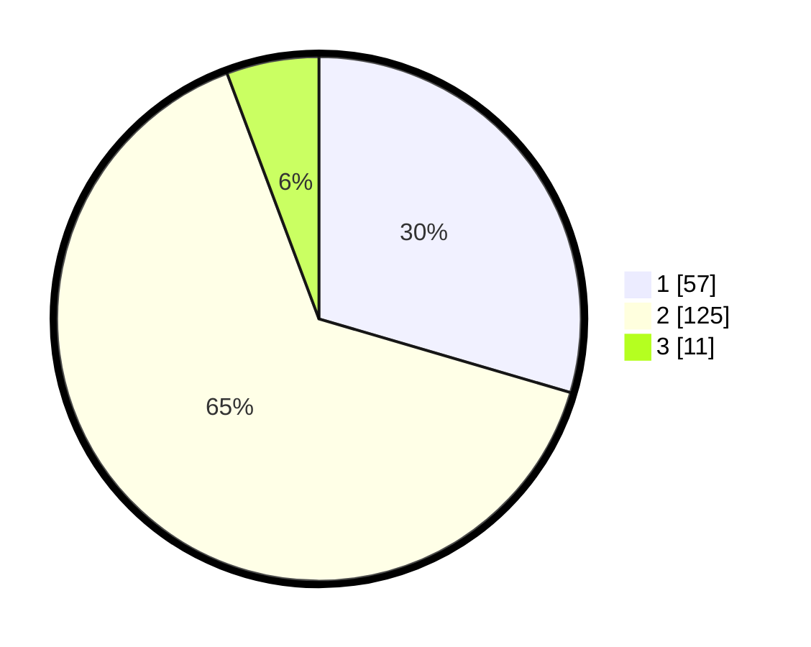

# Hasil

## Grafik

## Tabel

| No. | Nama Paslon    | Suara | Suara (raw) | Persentase |
|:--- |:-------------- | -----:| -----------:| ----------:|
| 1   | ANIES MUHAIMIN | 57    | [57][p-1]   | 29,53      |
| 2   | PRABOWO GIBRAN | 125   | [125][p-2]  | 64,77      |
| 3   | GANJAR MAHFUD  | 11    | [11][p-3]   | 5,70       |

[p-1]: https://github.com/gigit-pemilu/pemilu-2024-35-jawa-timur/blob/main/pilpres/hitung-suara/sub/35-jawa-timur/sub/11-bondowoso/sub/03-tlogosari/sub/2001-kembang/sub/002-tps/sub/paslon-1.txt
[p-2]: https://github.com/gigit-pemilu/pemilu-2024-35-jawa-timur/blob/main/pilpres/hitung-suara/sub/35-jawa-timur/sub/11-bondowoso/sub/03-tlogosari/sub/2001-kembang/sub/002-tps/sub/paslon-2.txt
[p-3]: https://github.com/gigit-pemilu/pemilu-2024-35-jawa-timur/blob/main/pilpres/hitung-suara/sub/35-jawa-timur/sub/11-bondowoso/sub/03-tlogosari/sub/2001-kembang/sub/002-tps/sub/paslon-3.txt

## Foto C Plano

https://sirekap-obj-formc.kpu.go.id/24b1/pemilu/ppwp/35/11/03/20/01/3511032001002-20240215-002436--531c8299-66ad-4a24-bec0-ee7838a5f5d4.jpg

https://sirekap-obj-formc.kpu.go.id/24b1/pemilu/ppwp/35/11/03/20/01/3511032001002-20240215-002713--17ce7fc7-f9ac-4a5f-8972-4ea0c1d140c0.jpg

https://sirekap-obj-formc.kpu.go.id/24b1/pemilu/ppwp/35/11/03/20/01/3511032001002-20240215-013412--2a2a925c-f96a-43d3-a2cf-72bd8a43b660.jpg

## Metadata

| Key        | Value               |
| ---------- | ------------------- |
| Time Stamp | 2024-02-16 08:30:27 |

