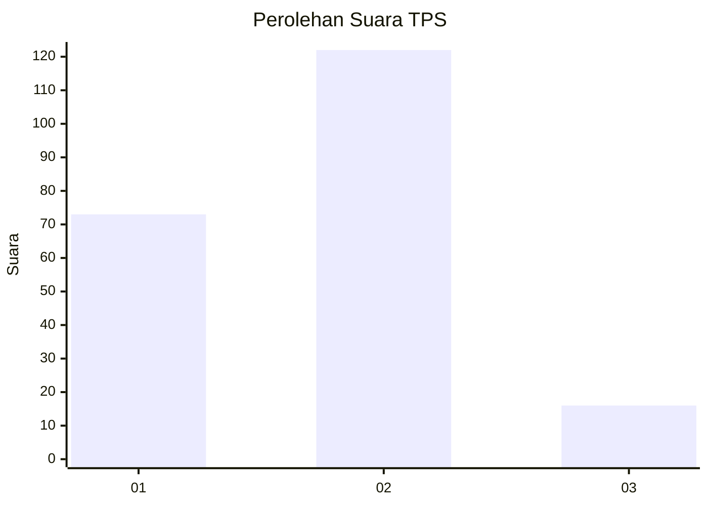
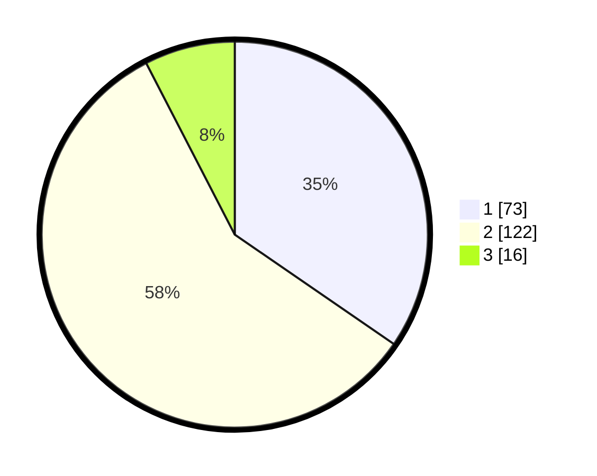

# Hasil

## Grafik

## Tabel

| No. | Nama Paslon    | Suara | Suara (raw) | Persentase |
|:--- |:-------------- | -----:| -----------:| ----------:|
| 1   | ANIES MUHAIMIN | 73    | [73][p-1]   | 34,60      |
| 2   | PRABOWO GIBRAN | 122   | [122][p-2]  | 57,82      |
| 3   | GANJAR MAHFUD  | 16    | [16][p-3]   | 7,58       |

[p-1]: https://github.com/gigit-pemilu/pemilu-2024/blob/main/pilpres/hitung-suara/sub/35-jawa-timur/sub/11-bondowoso/sub/03-tlogosari/sub/2001-kembang/sub/010-tps/sub/paslon-1.txt
[p-2]: https://github.com/gigit-pemilu/pemilu-2024/blob/main/pilpres/hitung-suara/sub/35-jawa-timur/sub/11-bondowoso/sub/03-tlogosari/sub/2001-kembang/sub/010-tps/sub/paslon-2.txt
[p-3]: https://github.com/gigit-pemilu/pemilu-2024/blob/main/pilpres/hitung-suara/sub/35-jawa-timur/sub/11-bondowoso/sub/03-tlogosari/sub/2001-kembang/sub/010-tps/sub/paslon-3.txt

## Foto C Plano

https://sirekap-obj-formc.kpu.go.id/28f0/pemilu/ppwp/35/11/03/20/01/3511032001010-20240215-003430--7102ee00-8e27-4fca-a1eb-b4a0b81c336c.jpg

https://sirekap-obj-formc.kpu.go.id/28f0/pemilu/ppwp/35/11/03/20/01/3511032001010-20240215-003607--352f0892-61ff-41e7-8005-1ecc984119cf.jpg

https://sirekap-obj-formc.kpu.go.id/28f0/pemilu/ppwp/35/11/03/20/01/3511032001010-20240214-225714--af30021e-2393-4e8d-942b-e89c34d3e07c.jpg

## Metadata

| Key        | Value               |
| ---------- | ------------------- |
| Time Stamp | 2024-02-16 08:30:27 |

