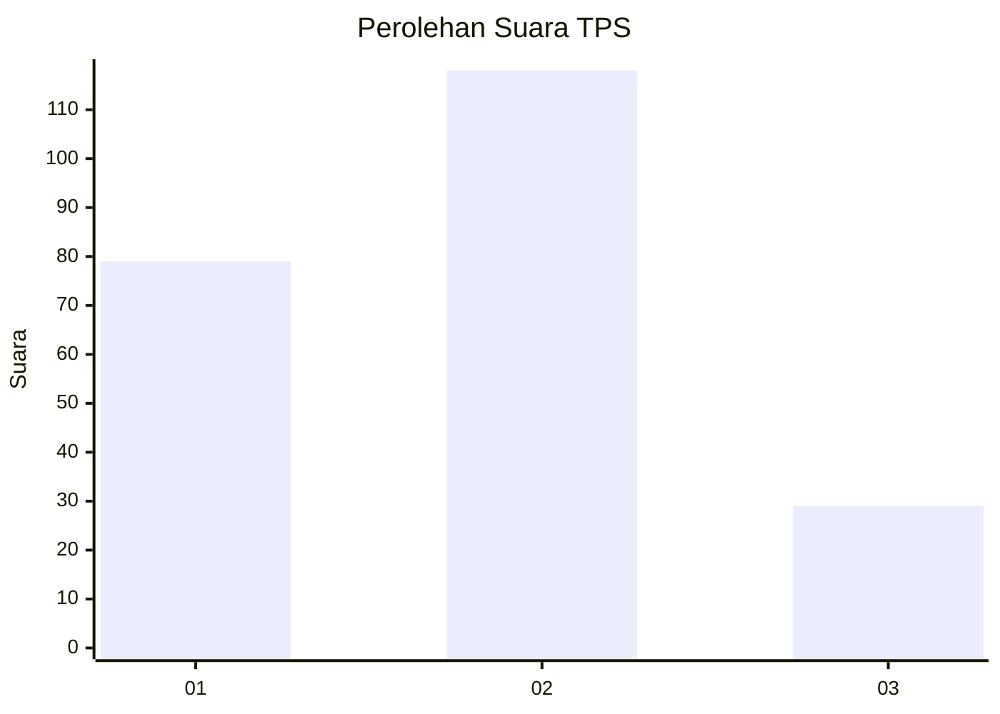
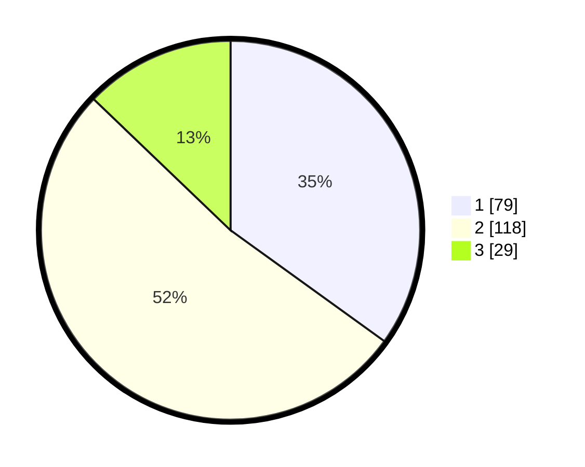

# Hasil

## Grafik

## Tabel

| No. | Nama Paslon    | Suara | Suara (raw) | Persentase |
|:--- |:-------------- | -----:| -----------:| ----------:|
| 1   | ANIES MUHAIMIN | 79    | [79][p-1]   | 34,96      |
| 2   | PRABOWO GIBRAN | 118   | [118][p-2]  | 52,21      |
| 3   | GANJAR MAHFUD  | 29    | [29][p-3]   | 12,83      |

[p-1]: https://github.com/gigit-pemilu/pemilu-2024-35-jawa-timur/blob/main/pilpres/hitung-suara/sub/35-jawa-timur/sub/11-bondowoso/sub/03-tlogosari/sub/2001-kembang/sub/015-tps/sub/paslon-1.txt
[p-2]: https://github.com/gigit-pemilu/pemilu-2024-35-jawa-timur/blob/main/pilpres/hitung-suara/sub/35-jawa-timur/sub/11-bondowoso/sub/03-tlogosari/sub/2001-kembang/sub/015-tps/sub/paslon-2.txt
[p-3]: https://github.com/gigit-pemilu/pemilu-2024-35-jawa-timur/blob/main/pilpres/hitung-suara/sub/35-jawa-timur/sub/11-bondowoso/sub/03-tlogosari/sub/2001-kembang/sub/015-tps/sub/paslon-3.txt

## Foto C Plano

https://sirekap-obj-formc.kpu.go.id/4242/pemilu/ppwp/35/11/03/20/01/3511032001015-20240214-225227--9b428432-a2eb-4377-9c91-246ebf40f3db.jpg

https://sirekap-obj-formc.kpu.go.id/4242/pemilu/ppwp/35/11/03/20/01/3511032001015-20240214-225405--2b269c88-886a-4ab4-afc0-de05fc63270f.jpg

https://sirekap-obj-formc.kpu.go.id/4242/pemilu/ppwp/35/11/03/20/01/3511032001015-20240214-225558--f823fd6e-e010-42c4-9607-2b873a63f02f.jpg

## Metadata

| Key        | Value               |
| ---------- | ------------------- |
| Time Stamp | 2024-02-16 08:30:27 |

