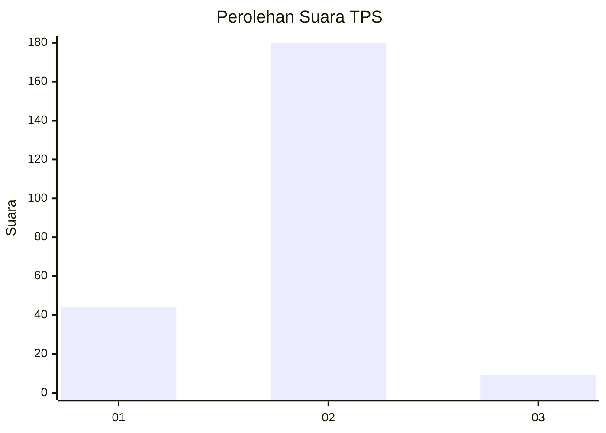
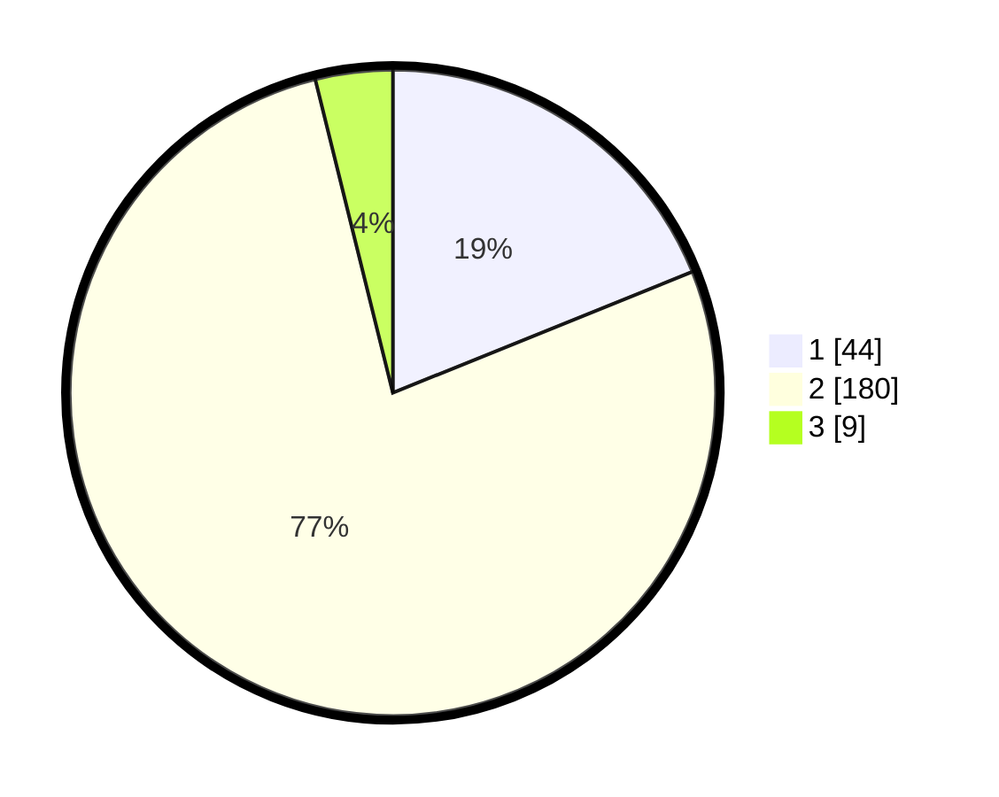

# Hasil

## Grafik

## Tabel

| No. | Nama Paslon    | Suara | Suara (raw) | Persentase |
|:--- |:-------------- | -----:| -----------:| ----------:|
| 1   | ANIES MUHAIMIN | 44    | [44][p-1]   | 18,88      |
| 2   | PRABOWO GIBRAN | 180   | [180][p-2]  | 77,25      |
| 3   | GANJAR MAHFUD  | 9     | [9][p-3]    | 3,86       |

[p-1]: https://github.com/gigit-pemilu/pemilu-2024-35-jawa-timur/blob/main/pilpres/hitung-suara/sub/35-jawa-timur/sub/11-bondowoso/sub/03-tlogosari/sub/2001-kembang/sub/020-tps/sub/paslon-1.txt
[p-2]: https://github.com/gigit-pemilu/pemilu-2024-35-jawa-timur/blob/main/pilpres/hitung-suara/sub/35-jawa-timur/sub/11-bondowoso/sub/03-tlogosari/sub/2001-kembang/sub/020-tps/sub/paslon-2.txt
[p-3]: https://github.com/gigit-pemilu/pemilu-2024-35-jawa-timur/blob/main/pilpres/hitung-suara/sub/35-jawa-timur/sub/11-bondowoso/sub/03-tlogosari/sub/2001-kembang/sub/020-tps/sub/paslon-3.txt

## Foto C Plano

https://sirekap-obj-formc.kpu.go.id/1de3/pemilu/ppwp/35/11/03/20/01/3511032001020-20240214-231650--d07c5b9f-5b5d-4be4-90fc-8417974fc092.jpg

https://sirekap-obj-formc.kpu.go.id/1de3/pemilu/ppwp/35/11/03/20/01/3511032001020-20240214-231957--bd1bb2e2-90f7-45dc-80e4-37c4763c0b1f.jpg

https://sirekap-obj-formc.kpu.go.id/1de3/pemilu/ppwp/35/11/03/20/01/3511032001020-20240214-232155--961fd922-2000-4abb-b60e-e6cd3d51d270.jpg

## Metadata

| Key        | Value               |
| ---------- | ------------------- |
| Time Stamp | 2024-02-15 04:00:24 |

