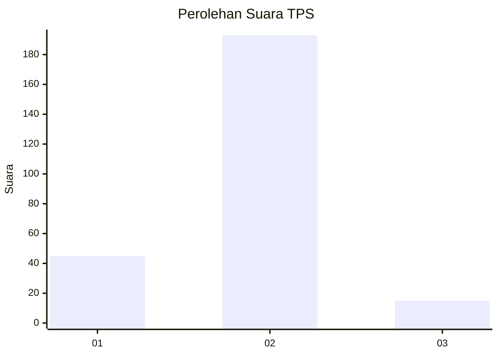
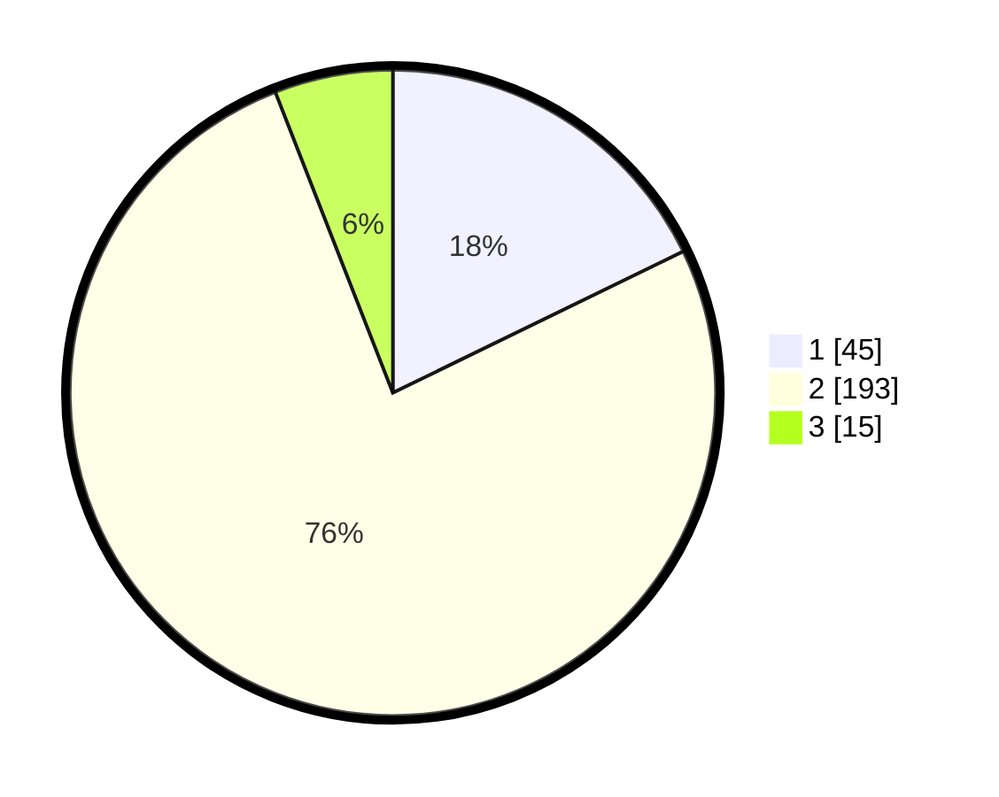

# Hasil

## Grafik

## Tabel

| No. | Nama Paslon    | Suara | Suara (raw) | Persentase |
|:--- |:-------------- | -----:| -----------:| ----------:|
| 1   | ANIES MUHAIMIN | 45    | [45][p-1]   | 17,79      |
| 2   | PRABOWO GIBRAN | 193   | [193][p-2]  | 76,28      |
| 3   | GANJAR MAHFUD  | 15    | [15][p-3]   | 5,93       |

[p-1]: https://github.com/gigit-pemilu/pemilu-2024-35-jawa-timur/blob/main/pilpres/hitung-suara/sub/35-jawa-timur/sub/11-bondowoso/sub/03-tlogosari/sub/2002-gunosari/sub/002-tps/sub/paslon-1.txt
[p-2]: https://github.com/gigit-pemilu/pemilu-2024-35-jawa-timur/blob/main/pilpres/hitung-suara/sub/35-jawa-timur/sub/11-bondowoso/sub/03-tlogosari/sub/2002-gunosari/sub/002-tps/sub/paslon-2.txt
[p-3]: https://github.com/gigit-pemilu/pemilu-2024-35-jawa-timur/blob/main/pilpres/hitung-suara/sub/35-jawa-timur/sub/11-bondowoso/sub/03-tlogosari/sub/2002-gunosari/sub/002-tps/sub/paslon-3.txt

## Foto C Plano

https://sirekap-obj-formc.kpu.go.id/5c12/pemilu/ppwp/35/11/03/20/02/3511032002002-20240215-010144--b55c61ac-581d-4ce5-8e7a-5d61a6eae7d8.jpg

https://sirekap-obj-formc.kpu.go.id/5c12/pemilu/ppwp/35/11/03/20/02/3511032002002-20240215-010239--eec82b48-2432-43ab-b1bb-9149be877a6d.jpg

https://sirekap-obj-formc.kpu.go.id/5c12/pemilu/ppwp/35/11/03/20/02/3511032002002-20240215-010532--d46ea2cd-c710-4dc8-ad03-489bcc89fa9b.jpg

## Metadata

| Key        | Value               |
| ---------- | ------------------- |
| Time Stamp | 2024-02-16 08:30:27 |

