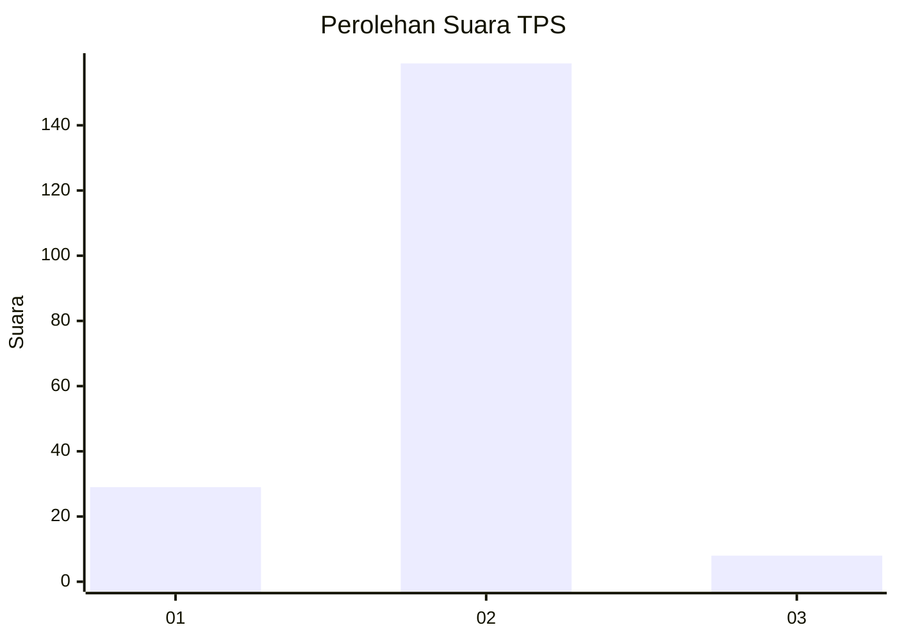
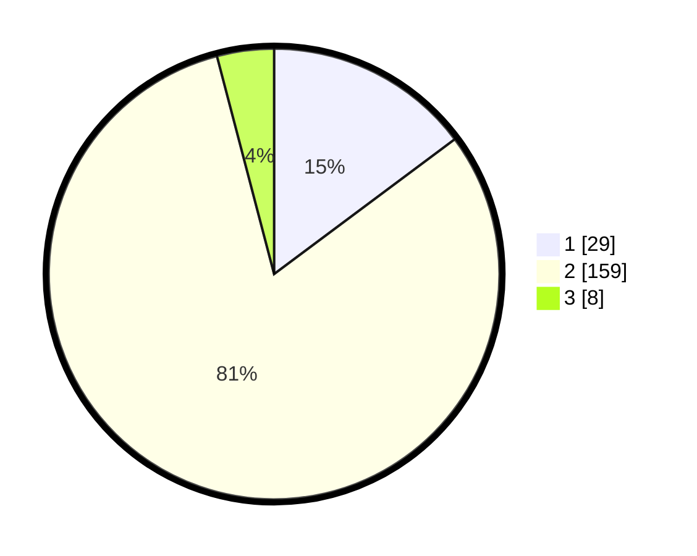

# Hasil

## Grafik

## Tabel

| No. | Nama Paslon    | Suara | Suara (raw) | Persentase |
|:--- |:-------------- | -----:| -----------:| ----------:|
| 1   | ANIES MUHAIMIN | 29    | [29][p-1]   | 14,80      |
| 2   | PRABOWO GIBRAN | 159   | [159][p-2]  | 81,12      |
| 3   | GANJAR MAHFUD  | 8     | [8][p-3]    | 4,08       |

[p-1]: https://github.com/gigit-pemilu/pemilu-2024/blob/main/pilpres/hitung-suara/sub/35-jawa-timur/sub/11-bondowoso/sub/03-tlogosari/sub/2002-gunosari/sub/005-tps/sub/paslon-1.txt
[p-2]: https://github.com/gigit-pemilu/pemilu-2024/blob/main/pilpres/hitung-suara/sub/35-jawa-timur/sub/11-bondowoso/sub/03-tlogosari/sub/2002-gunosari/sub/005-tps/sub/paslon-2.txt
[p-3]: https://github.com/gigit-pemilu/pemilu-2024/blob/main/pilpres/hitung-suara/sub/35-jawa-timur/sub/11-bondowoso/sub/03-tlogosari/sub/2002-gunosari/sub/005-tps/sub/paslon-3.txt

## Foto C Plano

https://sirekap-obj-formc.kpu.go.id/25c3/pemilu/ppwp/35/11/03/20/02/3511032002005-20240214-212849--b3010cc8-3213-439c-8853-a0a074230fec.jpg

https://sirekap-obj-formc.kpu.go.id/25c3/pemilu/ppwp/35/11/03/20/02/3511032002005-20240214-231719--1f5866b2-f1a4-4d80-9d88-4f31d7134d7e.jpg

https://sirekap-obj-formc.kpu.go.id/25c3/pemilu/ppwp/35/11/03/20/02/3511032002005-20240214-201739--d814a3cf-882e-47e7-872a-87b39c00ba70.jpg

## Metadata

| Key        | Value               |
| ---------- | ------------------- |
| Time Stamp | 2024-02-16 08:30:27 |

