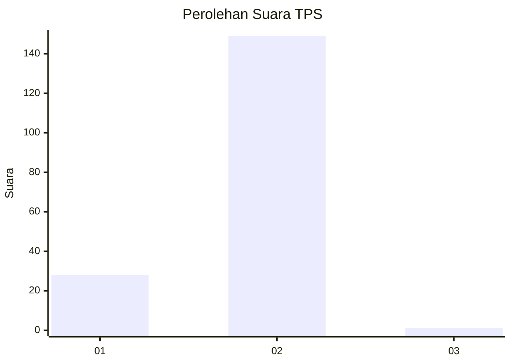
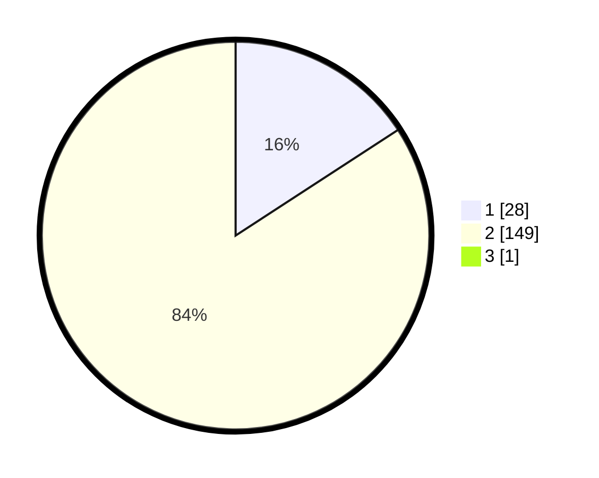

# Hasil

## Grafik

## Tabel

| No. | Nama Paslon    | Suara | Suara (raw) | Persentase |
|:--- |:-------------- | -----:| -----------:| ----------:|
| 1   | ANIES MUHAIMIN | 28    | [28][p-1]   | 15,73      |
| 2   | PRABOWO GIBRAN | 149   | [149][p-2]  | 83,71      |
| 3   | GANJAR MAHFUD  | 1     | [1][p-3]    | 0,56       |

[p-1]: https://github.com/gigit-pemilu/pemilu-2024/blob/main/pilpres/hitung-suara/sub/35-jawa-timur/sub/11-bondowoso/sub/03-tlogosari/sub/2003-trotosari/sub/001-tps/sub/paslon-1.txt
[p-2]: https://github.com/gigit-pemilu/pemilu-2024/blob/main/pilpres/hitung-suara/sub/35-jawa-timur/sub/11-bondowoso/sub/03-tlogosari/sub/2003-trotosari/sub/001-tps/sub/paslon-2.txt
[p-3]: https://github.com/gigit-pemilu/pemilu-2024/blob/main/pilpres/hitung-suara/sub/35-jawa-timur/sub/11-bondowoso/sub/03-tlogosari/sub/2003-trotosari/sub/001-tps/sub/paslon-3.txt

## Foto C Plano

https://sirekap-obj-formc.kpu.go.id/bb2c/pemilu/ppwp/35/11/03/20/03/3511032003001-20240215-004604--b6ddfbb7-036b-4626-b871-ba35b4453f28.jpg

https://sirekap-obj-formc.kpu.go.id/bb2c/pemilu/ppwp/35/11/03/20/03/3511032003001-20240214-214245--c459326a-6b72-4932-a6d9-7681cfc5f322.jpg

https://sirekap-obj-formc.kpu.go.id/bb2c/pemilu/ppwp/35/11/03/20/03/3511032003001-20240214-214644--8b88c49e-d5a1-48b0-ad88-4d97ab437ca9.jpg

## Metadata

| Key        | Value               |
| ---------- | ------------------- |
| Time Stamp | 2024-02-16 08:00:28 |

