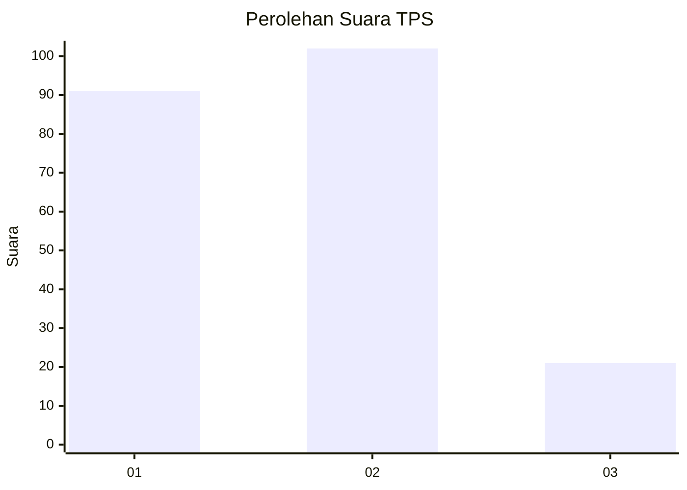
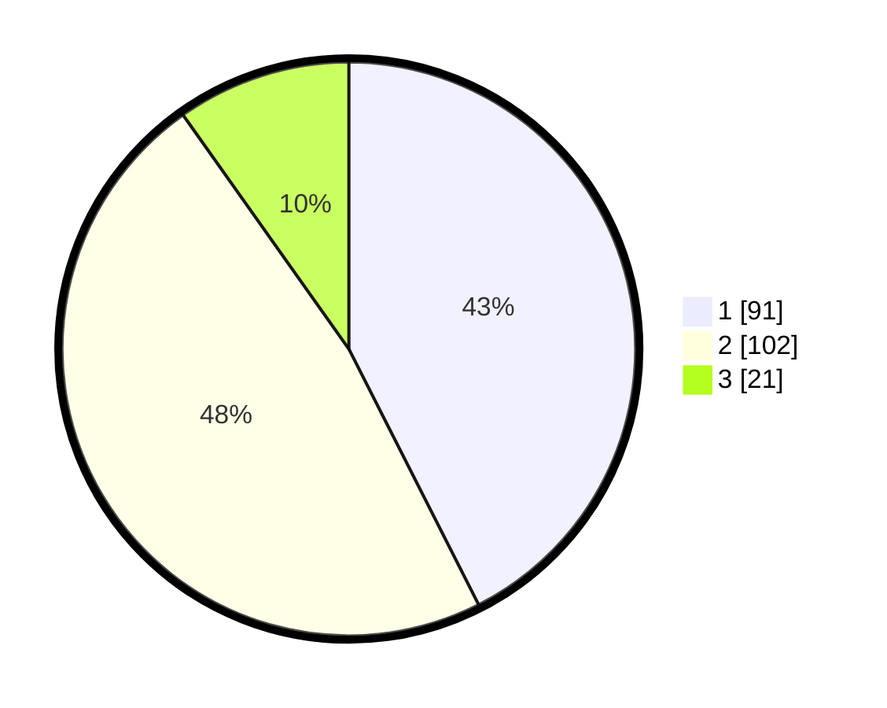

# Hasil

## Grafik

## Tabel

| No. | Nama Paslon    | Suara | Suara (raw) | Persentase |
|:--- |:-------------- | -----:| -----------:| ----------:|
| 1   | ANIES MUHAIMIN | 91    | [91][p-1]   | 42,52      |
| 2   | PRABOWO GIBRAN | 102   | [102][p-2]  | 47,66      |
| 3   | GANJAR MAHFUD  | 21    | [21][p-3]   | 9,81       |

[p-1]: https://github.com/gigit-pemilu/pemilu-2024/blob/main/pilpres/hitung-suara/sub/35-jawa-timur/sub/11-bondowoso/sub/03-tlogosari/sub/2005-sulek/sub/005-tps/sub/paslon-1.txt
[p-2]: https://github.com/gigit-pemilu/pemilu-2024/blob/main/pilpres/hitung-suara/sub/35-jawa-timur/sub/11-bondowoso/sub/03-tlogosari/sub/2005-sulek/sub/005-tps/sub/paslon-2.txt
[p-3]: https://github.com/gigit-pemilu/pemilu-2024/blob/main/pilpres/hitung-suara/sub/35-jawa-timur/sub/11-bondowoso/sub/03-tlogosari/sub/2005-sulek/sub/005-tps/sub/paslon-3.txt

## Foto C Plano

https://sirekap-obj-formc.kpu.go.id/5edb/pemilu/ppwp/35/11/03/20/05/3511032005005-20240215-013017--d4941ec5-2e28-4c46-b597-003d4b0cc4fa.jpg

https://sirekap-obj-formc.kpu.go.id/5edb/pemilu/ppwp/35/11/03/20/05/3511032005005-20240215-013215--11683f32-5737-4e18-89c6-d06073662c37.jpg

https://sirekap-obj-formc.kpu.go.id/5edb/pemilu/ppwp/35/11/03/20/05/3511032005005-20240215-013329--196e557c-7867-4c1a-bae9-a1611ed41a6f.jpg

## Metadata

| Key        | Value               |
| ---------- | ------------------- |
| Time Stamp | 2024-02-16 08:00:28 |

