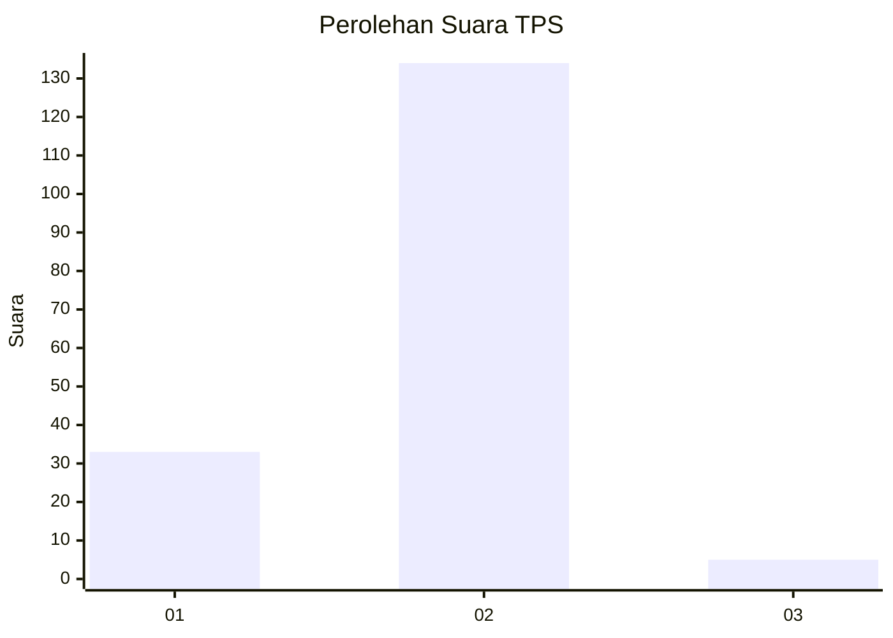
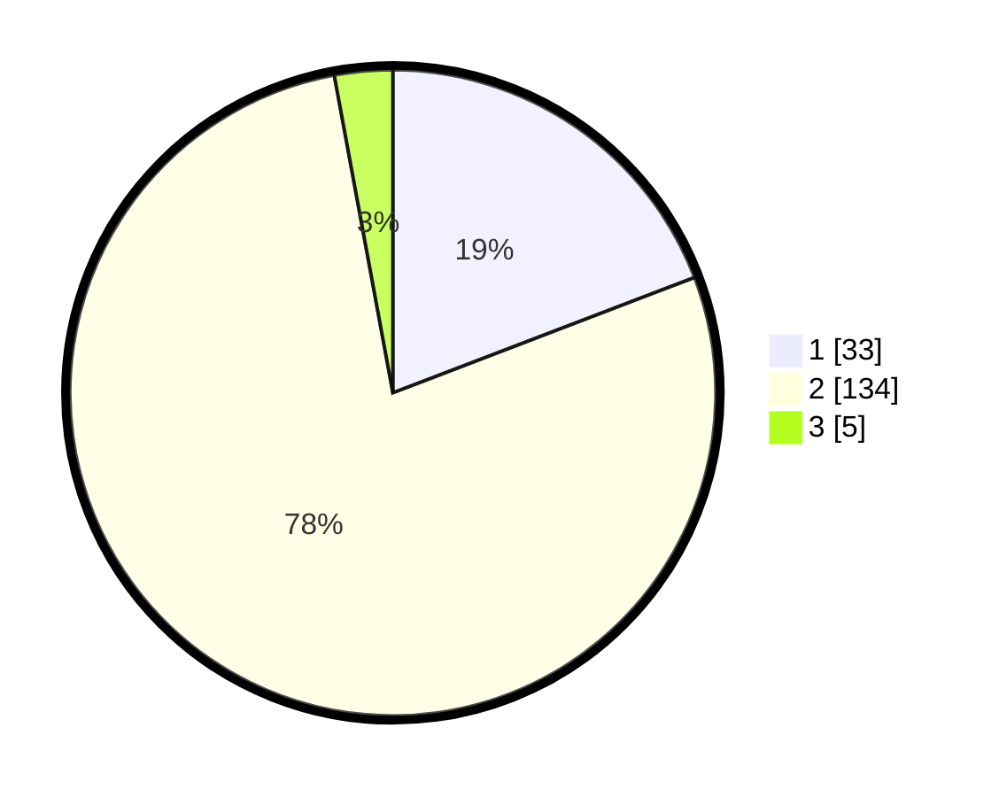

# Hasil

## Grafik

## Tabel

| No. | Nama Paslon    | Suara | Suara (raw) | Persentase |
|:--- |:-------------- | -----:| -----------:| ----------:|
| 1   | ANIES MUHAIMIN | 33    | [33][p-1]   | 19,19      |
| 2   | PRABOWO GIBRAN | 134   | [134][p-2]  | 77,91      |
| 3   | GANJAR MAHFUD  | 5     | [5][p-3]    | 2,91       |

[p-1]: https://github.com/gigit-pemilu/pemilu-2024-35-jawa-timur/blob/main/pilpres/hitung-suara/sub/35-jawa-timur/sub/11-bondowoso/sub/03-tlogosari/sub/2006-tlogosari/sub/009-tps/sub/paslon-1.txt
[p-2]: https://github.com/gigit-pemilu/pemilu-2024-35-jawa-timur/blob/main/pilpres/hitung-suara/sub/35-jawa-timur/sub/11-bondowoso/sub/03-tlogosari/sub/2006-tlogosari/sub/009-tps/sub/paslon-2.txt
[p-3]: https://github.com/gigit-pemilu/pemilu-2024-35-jawa-timur/blob/main/pilpres/hitung-suara/sub/35-jawa-timur/sub/11-bondowoso/sub/03-tlogosari/sub/2006-tlogosari/sub/009-tps/sub/paslon-3.txt

## Foto C Plano

https://sirekap-obj-formc.kpu.go.id/3e4b/pemilu/ppwp/35/11/03/20/06/3511032006009-20240214-235943--2e4e958a-566b-4e31-aa34-43c604cd103d.jpg

https://sirekap-obj-formc.kpu.go.id/3e4b/pemilu/ppwp/35/11/03/20/06/3511032006009-20240214-235942--7bd4a233-c20e-4b5c-b9b7-08be0153aa7b.jpg

https://sirekap-obj-formc.kpu.go.id/3e4b/pemilu/ppwp/35/11/03/20/06/3511032006009-20240214-235940--e933f77b-693f-41cc-8110-f76e47d7b216.jpg

## Metadata

| Key        | Value               |
| ---------- | ------------------- |
| Time Stamp | 2024-02-16 09:00:28 |

