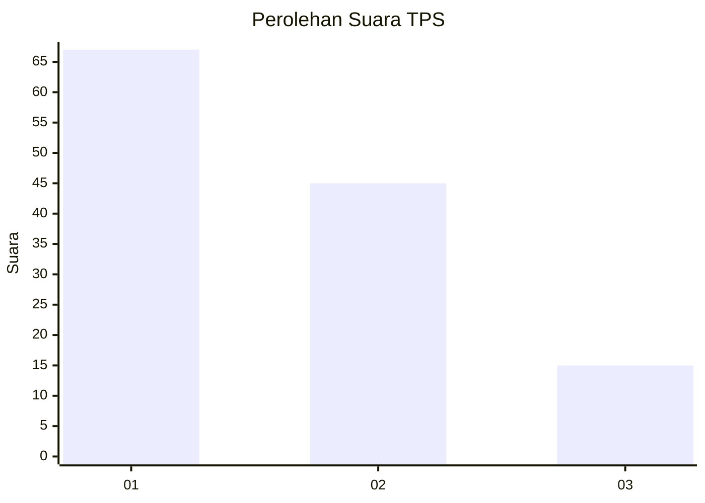
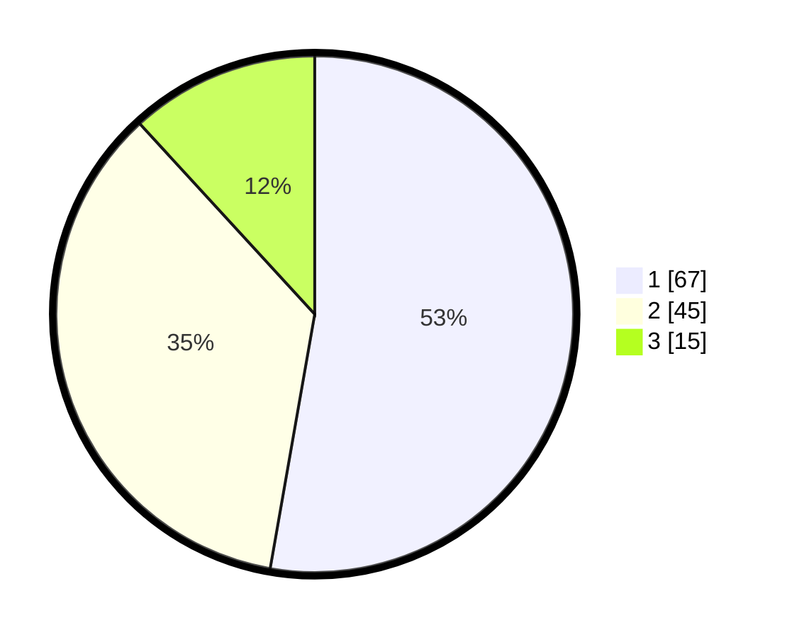

# Hasil

## Grafik

## Tabel

| No. | Nama Paslon    | Suara | Suara (raw) | Persentase |
|:--- |:-------------- | -----:| -----------:| ----------:|
| 1   | ANIES MUHAIMIN | 67    | [67][p-1]   | 52,76      |
| 2   | PRABOWO GIBRAN | 45    | [45][p-2]   | 35,43      |
| 3   | GANJAR MAHFUD  | 15    | [15][p-3]   | 11,81      |

[p-1]: https://github.com/gigit-pemilu/pemilu-2024/blob/main/pilpres/hitung-suara/sub/35-jawa-timur/sub/11-bondowoso/sub/03-tlogosari/sub/2006-tlogosari/sub/011-tps/sub/paslon-1.txt
[p-2]: https://github.com/gigit-pemilu/pemilu-2024/blob/main/pilpres/hitung-suara/sub/35-jawa-timur/sub/11-bondowoso/sub/03-tlogosari/sub/2006-tlogosari/sub/011-tps/sub/paslon-2.txt
[p-3]: https://github.com/gigit-pemilu/pemilu-2024/blob/main/pilpres/hitung-suara/sub/35-jawa-timur/sub/11-bondowoso/sub/03-tlogosari/sub/2006-tlogosari/sub/011-tps/sub/paslon-3.txt

## Foto C Plano

https://sirekap-obj-formc.kpu.go.id/603a/pemilu/ppwp/35/11/03/20/06/3511032006011-20240214-224135--34e59636-acea-4fc2-b759-86142a18bca8.jpg

https://sirekap-obj-formc.kpu.go.id/603a/pemilu/ppwp/35/11/03/20/06/3511032006011-20240214-224307--6ffad8d9-c4b2-4b0c-aebe-8984ac408f55.jpg

https://sirekap-obj-formc.kpu.go.id/603a/pemilu/ppwp/35/11/03/20/06/3511032006011-20240214-224424--655c380c-fadb-4e5f-908a-b2c21b96de51.jpg

## Metadata

| Key        | Value               |
| ---------- | ------------------- |
| Time Stamp | 2024-02-15 12:00:28 |

