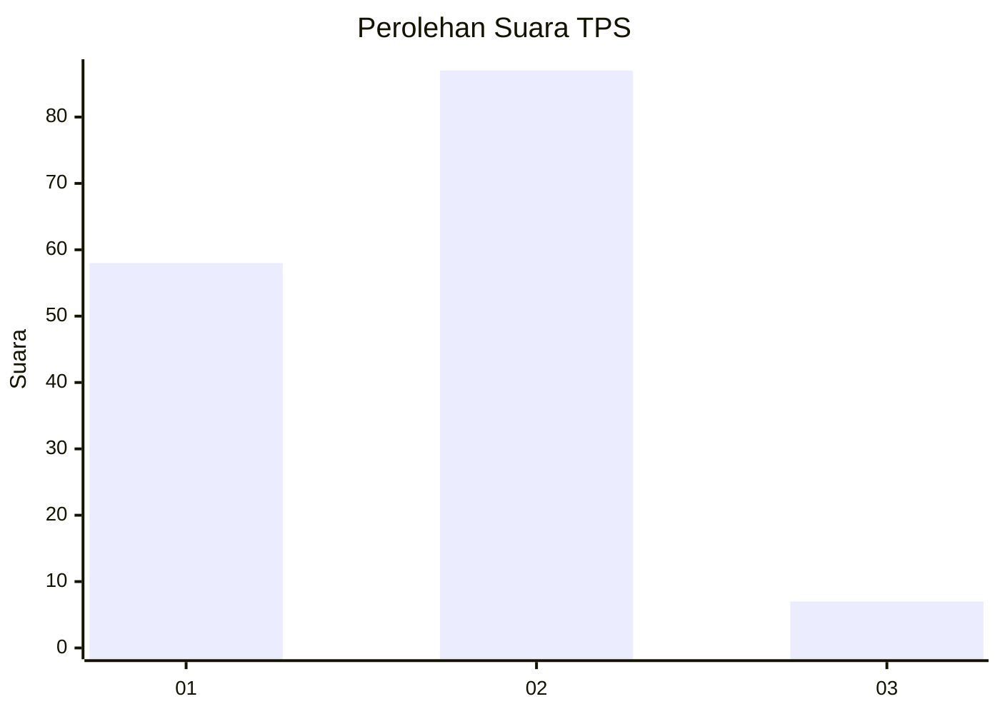
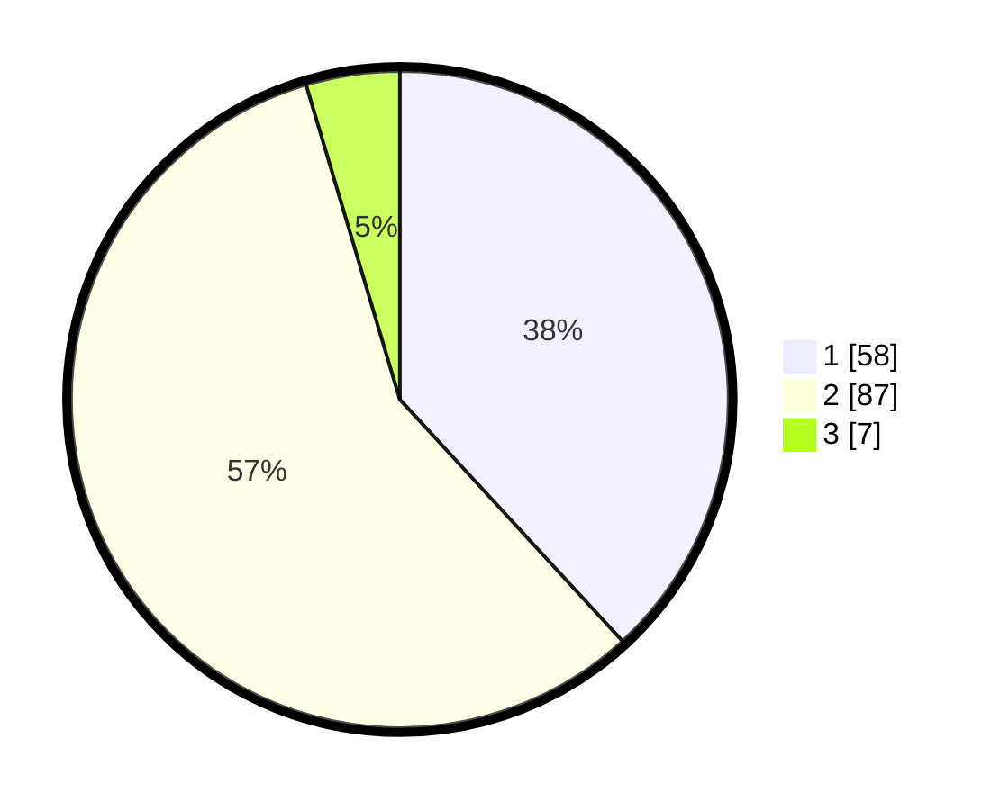

# Hasil

## Grafik

## Tabel

| No. | Nama Paslon    | Suara | Suara (raw) | Persentase |
|:--- |:-------------- | -----:| -----------:| ----------:|
| 1   | ANIES MUHAIMIN | 58    | [58][p-1]   | 38,16      |
| 2   | PRABOWO GIBRAN | 87    | [87][p-2]   | 57,24      |
| 3   | GANJAR MAHFUD  | 7     | [7][p-3]    | 4,61       |

[p-1]: https://github.com/gigit-pemilu/pemilu-2024/blob/main/pilpres/hitung-suara/sub/35-jawa-timur/sub/11-bondowoso/sub/03-tlogosari/sub/2006-tlogosari/sub/012-tps/sub/paslon-1.txt
[p-2]: https://github.com/gigit-pemilu/pemilu-2024/blob/main/pilpres/hitung-suara/sub/35-jawa-timur/sub/11-bondowoso/sub/03-tlogosari/sub/2006-tlogosari/sub/012-tps/sub/paslon-2.txt
[p-3]: https://github.com/gigit-pemilu/pemilu-2024/blob/main/pilpres/hitung-suara/sub/35-jawa-timur/sub/11-bondowoso/sub/03-tlogosari/sub/2006-tlogosari/sub/012-tps/sub/paslon-3.txt

## Foto C Plano

https://sirekap-obj-formc.kpu.go.id/fc94/pemilu/ppwp/35/11/03/20/06/3511032006012-20240214-215724--837678e8-5a45-413d-8e8a-cd0df2f26f12.jpg

https://sirekap-obj-formc.kpu.go.id/fc94/pemilu/ppwp/35/11/03/20/06/3511032006012-20240214-215730--9011ba5e-502b-4f5c-b61c-5c60fbb2ea9e.jpg

https://sirekap-obj-formc.kpu.go.id/fc94/pemilu/ppwp/35/11/03/20/06/3511032006012-20240214-215743--ad9324e4-00f8-49e7-a807-52ed66879efd.jpg

## Metadata

| Key        | Value               |
| ---------- | ------------------- |
| Time Stamp | 2024-02-16 09:00:28 |

