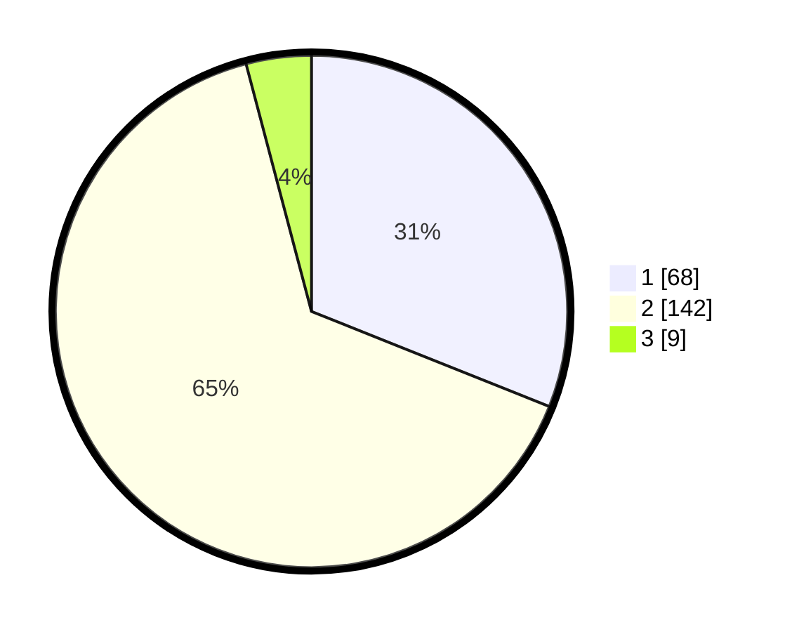

# Hasil

## Grafik

## Tabel

| No. | Nama Paslon    | Suara | Suara (raw) | Persentase |
|:--- |:-------------- | -----:| -----------:| ----------:|
| 1   | ANIES MUHAIMIN | 68    | [68][p-1]   | 31,05      |
| 2   | PRABOWO GIBRAN | 142   | [142][p-2]  | 64,84      |
| 3   | GANJAR MAHFUD  | 9     | [9][p-3]    | 4,11       |

[p-1]: https://github.com/gigit-pemilu/pemilu-2024-35-jawa-timur/blob/main/pilpres/hitung-suara/sub/35-jawa-timur/sub/11-bondowoso/sub/03-tlogosari/sub/2008-patemon/sub/003-tps/sub/paslon-1.txt
[p-2]: https://github.com/gigit-pemilu/pemilu-2024-35-jawa-timur/blob/main/pilpres/hitung-suara/sub/35-jawa-timur/sub/11-bondowoso/sub/03-tlogosari/sub/2008-patemon/sub/003-tps/sub/paslon-2.txt
[p-3]: https://github.com/gigit-pemilu/pemilu-2024-35-jawa-timur/blob/main/pilpres/hitung-suara/sub/35-jawa-timur/sub/11-bondowoso/sub/03-tlogosari/sub/2008-patemon/sub/003-tps/sub/paslon-3.txt

## Foto C Plano

https://sirekap-obj-formc.kpu.go.id/142f/pemilu/ppwp/35/11/03/20/08/3511032008003-20240215-031310--4e053be7-0e23-4c62-83ff-ed368e5cc461.jpg

https://sirekap-obj-formc.kpu.go.id/142f/pemilu/ppwp/35/11/03/20/08/3511032008003-20240215-031313--0c5d3c1e-7c5f-43e4-9759-c9326ef00e73.jpg

https://sirekap-obj-formc.kpu.go.id/142f/pemilu/ppwp/35/11/03/20/08/3511032008003-20240215-031316--85b8bf8b-d23a-4714-8512-489d9f4727c9.jpg

## Metadata

| Key        | Value               |
| ---------- | ------------------- |
| Time Stamp | 2024-02-16 00:30:27 |

