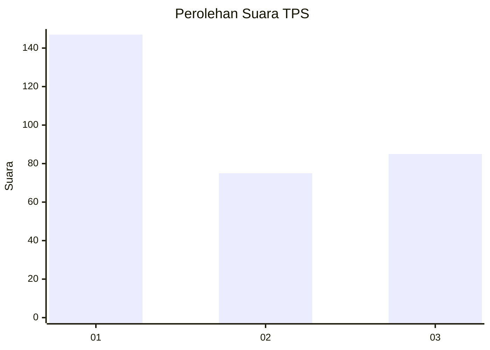
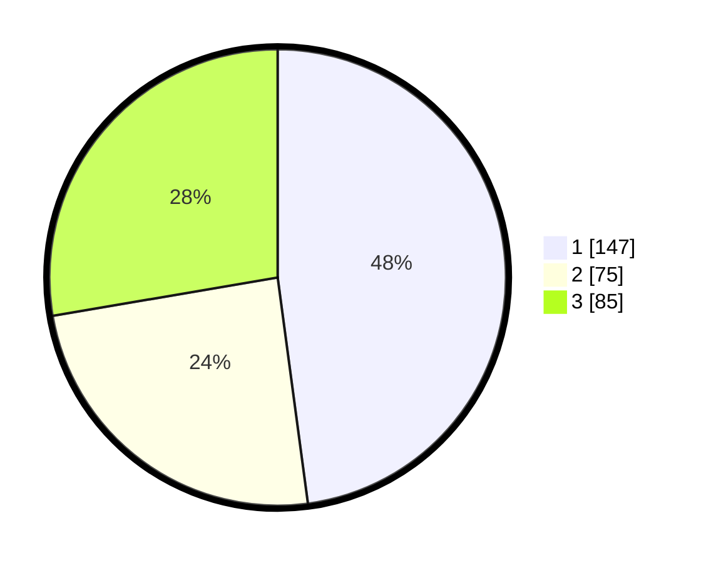

# Hasil

## Grafik

## Tabel

| No. | Nama Paslon    | Suara | Suara (raw) | Persentase |
|:--- |:-------------- | -----:| -----------:| ----------:|
| 1   | ANIES MUHAIMIN | 147   | [147][p-1]  | 47,88      |
| 2   | PRABOWO GIBRAN | 75    | [75][p-2]   | 24,43      |
| 3   | GANJAR MAHFUD  | 85    | [85][p-3]   | 27,69      |

[p-1]: https://github.com/gigit-pemilu/pemilu-2024/blob/main/pilpres/hitung-suara/sub/35-jawa-timur/sub/11-bondowoso/sub/03-tlogosari/sub/2008-patemon/sub/006-tps/sub/paslon-1.txt
[p-2]: https://github.com/gigit-pemilu/pemilu-2024/blob/main/pilpres/hitung-suara/sub/35-jawa-timur/sub/11-bondowoso/sub/03-tlogosari/sub/2008-patemon/sub/006-tps/sub/paslon-2.txt
[p-3]: https://github.com/gigit-pemilu/pemilu-2024/blob/main/pilpres/hitung-suara/sub/35-jawa-timur/sub/11-bondowoso/sub/03-tlogosari/sub/2008-patemon/sub/006-tps/sub/paslon-3.txt

## Foto C Plano

https://sirekap-obj-formc.kpu.go.id/29ea/pemilu/ppwp/35/11/03/20/08/3511032008006-20240215-103237--97cb0192-e9db-4914-92d5-b8103c16408e.jpg

https://sirekap-obj-formc.kpu.go.id/29ea/pemilu/ppwp/35/11/03/20/08/3511032008006-20240214-224943--3c62456d-ad9b-4d99-bd41-bc85dddc0ca5.jpg

https://sirekap-obj-formc.kpu.go.id/29ea/pemilu/ppwp/35/11/03/20/08/3511032008006-20240214-225645--2479ee01-c39d-446a-9cf7-cbec2aee76a5.jpg

## Metadata

| Key        | Value               |
| ---------- | ------------------- |
| Time Stamp | 2024-02-15 22:30:27 |

