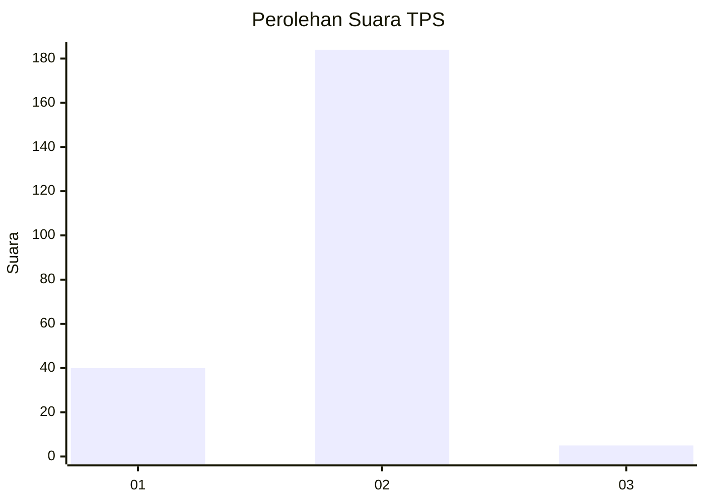
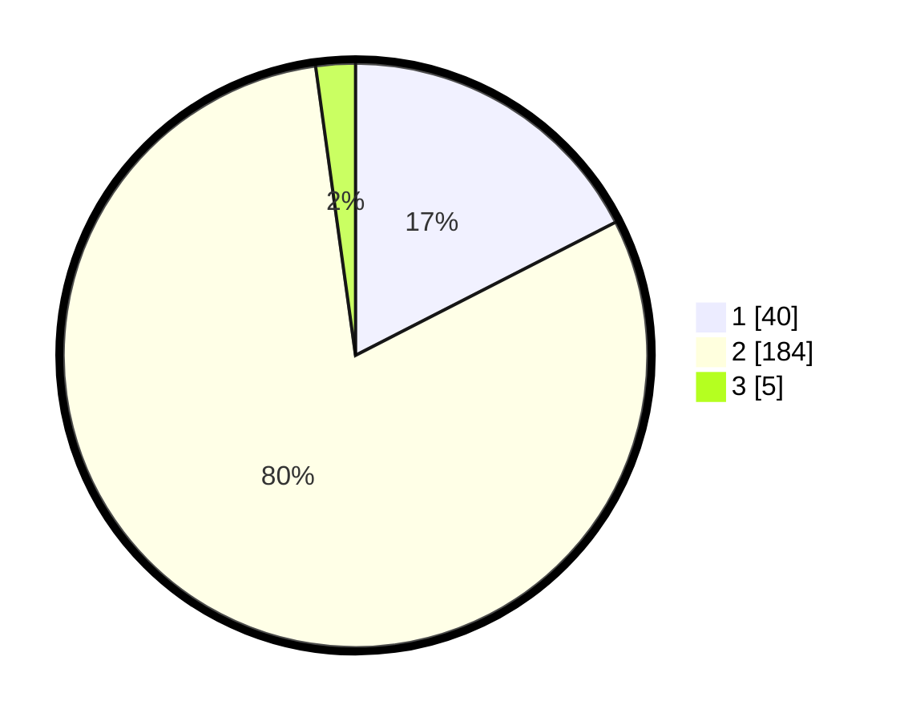

# Hasil

## Grafik

## Tabel

| No. | Nama Paslon    | Suara | Suara (raw) | Persentase |
|:--- |:-------------- | -----:| -----------:| ----------:|
| 1   | ANIES MUHAIMIN | 40    | [40][p-1]   | 17,47      |
| 2   | PRABOWO GIBRAN | 184   | [184][p-2]  | 80,35      |
| 3   | GANJAR MAHFUD  | 5     | [5][p-3]    | 2,18       |

[p-1]: https://github.com/gigit-pemilu/pemilu-2024/blob/main/pilpres/hitung-suara/sub/35-jawa-timur/sub/11-bondowoso/sub/03-tlogosari/sub/2009-jebung-lor/sub/005-tps/sub/paslon-1.txt
[p-2]: https://github.com/gigit-pemilu/pemilu-2024/blob/main/pilpres/hitung-suara/sub/35-jawa-timur/sub/11-bondowoso/sub/03-tlogosari/sub/2009-jebung-lor/sub/005-tps/sub/paslon-2.txt
[p-3]: https://github.com/gigit-pemilu/pemilu-2024/blob/main/pilpres/hitung-suara/sub/35-jawa-timur/sub/11-bondowoso/sub/03-tlogosari/sub/2009-jebung-lor/sub/005-tps/sub/paslon-3.txt

## Foto C Plano

https://sirekap-obj-formc.kpu.go.id/91e2/pemilu/ppwp/35/11/03/20/09/3511032009005-20240219-214958--8e658533-54f6-4e81-bba8-d8c590522234.jpg

https://sirekap-obj-formc.kpu.go.id/91e2/pemilu/ppwp/35/11/03/20/09/3511032009005-20240219-215259--57e91ef1-729b-4867-829a-1401aa49c833.jpg

https://sirekap-obj-formc.kpu.go.id/91e2/pemilu/ppwp/35/11/03/20/09/3511032009005-20240219-220458--2dd445f1-83d1-4a2d-bf5a-f807f75707e1.jpg

## Metadata

| Key        | Value               |
| ---------- | ------------------- |
| Time Stamp | 2024-02-19 23:00:00 |

