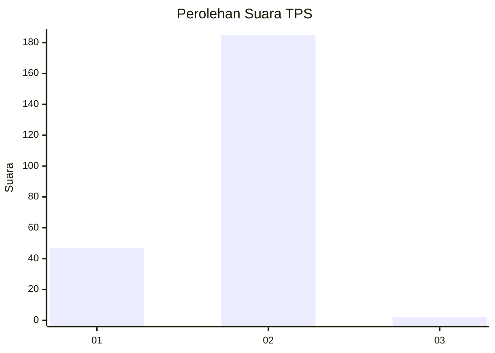
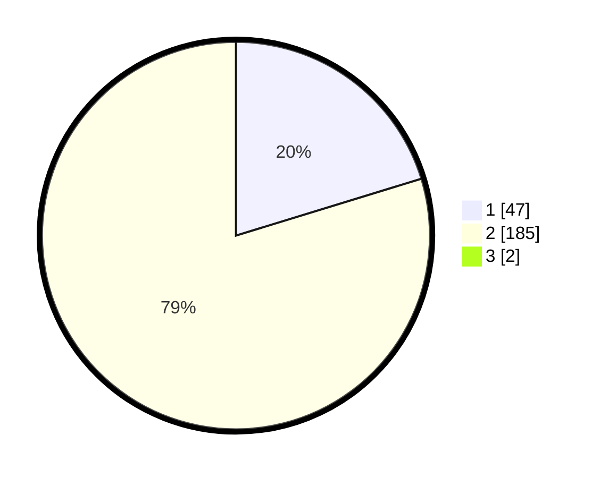

# Hasil

## Grafik

## Tabel

| No. | Nama Paslon    | Suara | Suara (raw) | Persentase |
|:--- |:-------------- | -----:| -----------:| ----------:|
| 1   | ANIES MUHAIMIN | 47    | [47][p-1]   | 20,09      |
| 2   | PRABOWO GIBRAN | 185   | [185][p-2]  | 79,06      |
| 3   | GANJAR MAHFUD  | 2     | [2][p-3]    | 0,85       |

[p-1]: https://github.com/gigit-pemilu/pemilu-2024/blob/main/pilpres/hitung-suara/sub/35-jawa-timur/sub/11-bondowoso/sub/03-tlogosari/sub/2010-brambang-darussalam/sub/005-tps/sub/paslon-1.txt
[p-2]: https://github.com/gigit-pemilu/pemilu-2024/blob/main/pilpres/hitung-suara/sub/35-jawa-timur/sub/11-bondowoso/sub/03-tlogosari/sub/2010-brambang-darussalam/sub/005-tps/sub/paslon-2.txt
[p-3]: https://github.com/gigit-pemilu/pemilu-2024/blob/main/pilpres/hitung-suara/sub/35-jawa-timur/sub/11-bondowoso/sub/03-tlogosari/sub/2010-brambang-darussalam/sub/005-tps/sub/paslon-3.txt

## Foto C Plano

https://sirekap-obj-formc.kpu.go.id/f589/pemilu/ppwp/35/11/03/20/10/3511032010005-20240214-214427--137cbd38-1cec-48b1-8245-85e7111e948f.jpg

https://sirekap-obj-formc.kpu.go.id/f589/pemilu/ppwp/35/11/03/20/10/3511032010005-20240215-074126--102b35d9-cc6d-4ec0-af39-c74ecc280ba7.jpg

https://sirekap-obj-formc.kpu.go.id/f589/pemilu/ppwp/35/11/03/20/10/3511032010005-20240215-074147--9d3bdf20-3afa-4089-bd64-2f32c5ca793a.jpg

## Metadata

| Key        | Value               |
| ---------- | ------------------- |
| Time Stamp | 2024-02-16 09:00:28 |

