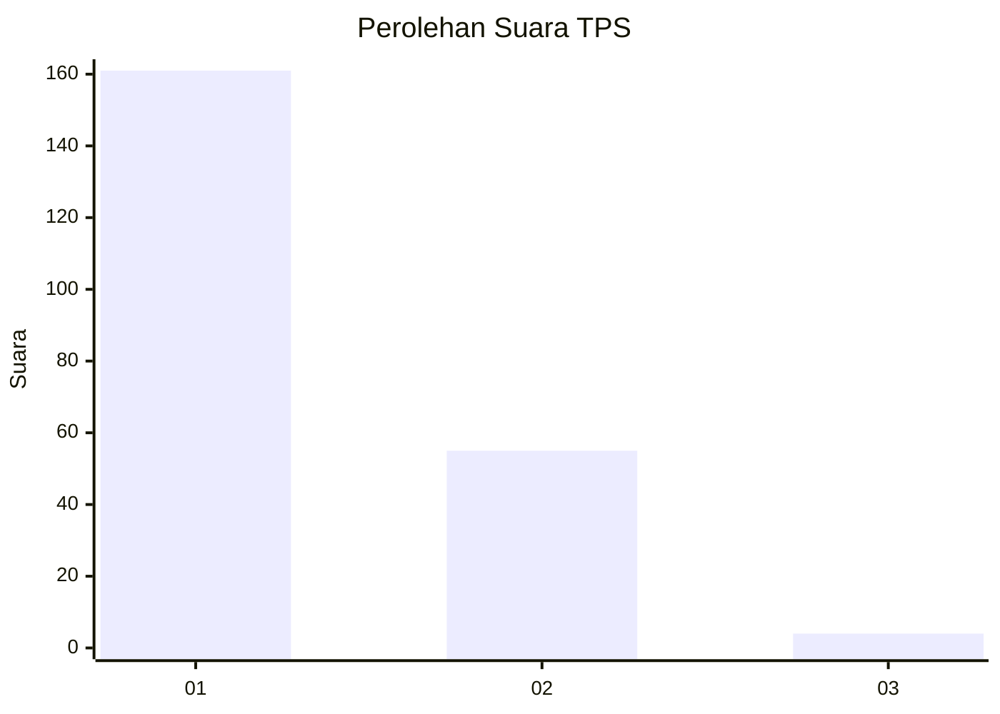
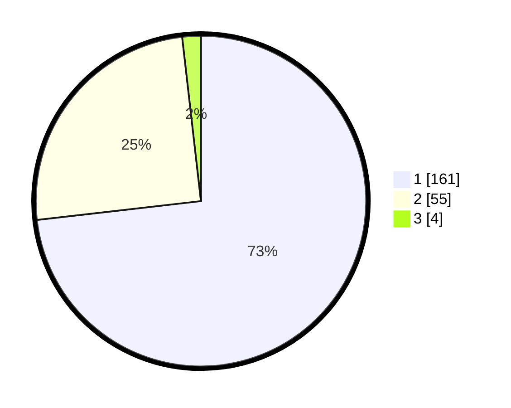

# Hasil

## Grafik

## Tabel

| No. | Nama Paslon    | Suara | Suara (raw) | Persentase |
|:--- |:-------------- | -----:| -----------:| ----------:|
| 1   | ANIES MUHAIMIN | 161   | [161][p-1]  | 73,18      |
| 2   | PRABOWO GIBRAN | 55    | [55][p-2]   | 25,00      |
| 3   | GANJAR MAHFUD  | 4     | [4][p-3]    | 1,82       |

[p-1]: https://github.com/gigit-pemilu/pemilu-2024/blob/main/pilpres/hitung-suara/sub/35-jawa-timur/sub/11-bondowoso/sub/04-sukosari/sub/2002-nogosari/sub/010-tps/sub/paslon-1.txt
[p-2]: https://github.com/gigit-pemilu/pemilu-2024/blob/main/pilpres/hitung-suara/sub/35-jawa-timur/sub/11-bondowoso/sub/04-sukosari/sub/2002-nogosari/sub/010-tps/sub/paslon-2.txt
[p-3]: https://github.com/gigit-pemilu/pemilu-2024/blob/main/pilpres/hitung-suara/sub/35-jawa-timur/sub/11-bondowoso/sub/04-sukosari/sub/2002-nogosari/sub/010-tps/sub/paslon-3.txt

## Foto C Plano

https://sirekap-obj-formc.kpu.go.id/4fd8/pemilu/ppwp/35/11/04/20/02/3511042002010-20240216-152537--7fa09f44-091d-4d41-931d-26fecdc75009.jpg

https://sirekap-obj-formc.kpu.go.id/4fd8/pemilu/ppwp/35/11/04/20/02/3511042002010-20240216-152710--bdca1b56-e4ef-489f-9145-5f62f03adc2f.jpg

https://sirekap-obj-formc.kpu.go.id/4fd8/pemilu/ppwp/35/11/04/20/02/3511042002010-20240216-152816--258dd9df-da80-4952-890f-701238927f5c.jpg

## Metadata

| Key        | Value               |
| ---------- | ------------------- |
| Time Stamp | 2024-02-16 21:01:00 |

