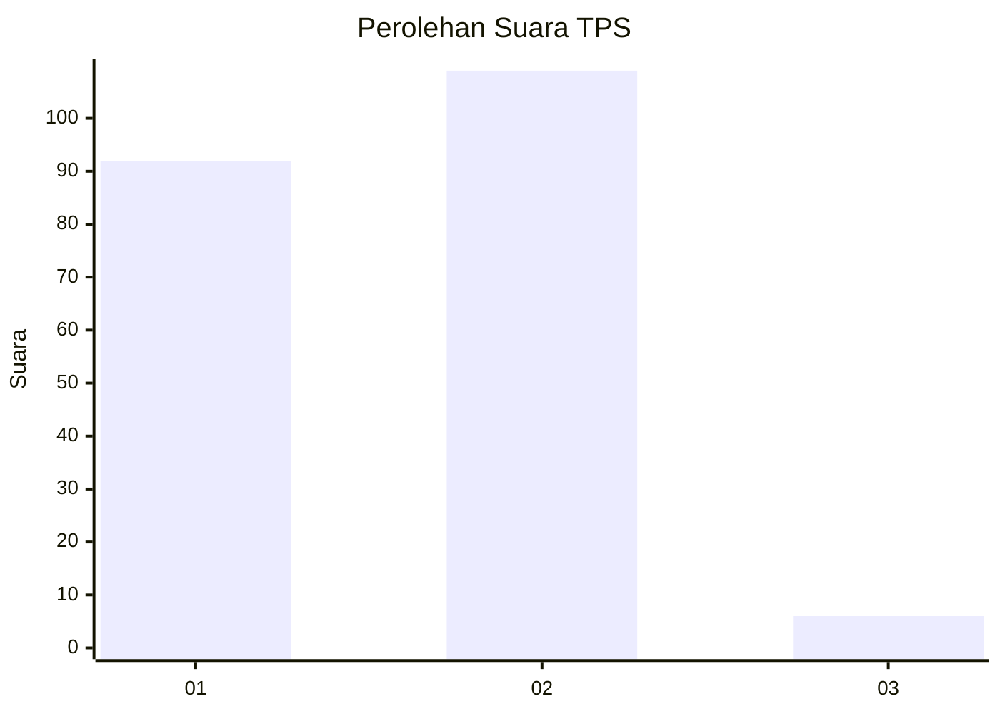
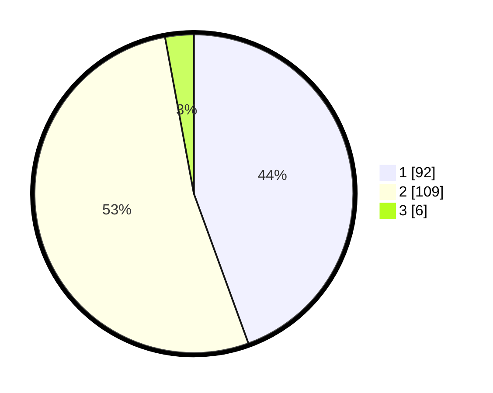

# Hasil

## Grafik

## Tabel

| No. | Nama Paslon    | Suara | Suara (raw) | Persentase |
|:--- |:-------------- | -----:| -----------:| ----------:|
| 1   | ANIES MUHAIMIN | 92    | [92][p-1]   | 44,44      |
| 2   | PRABOWO GIBRAN | 109   | [109][p-2]  | 52,66      |
| 3   | GANJAR MAHFUD  | 6     | [6][p-3]    | 2,90       |

[p-1]: https://github.com/gigit-pemilu/pemilu-2024-35-jawa-timur/blob/main/pilpres/hitung-suara/sub/35-jawa-timur/sub/11-bondowoso/sub/04-sukosari/sub/2003-pecalongan/sub/001-tps/sub/paslon-1.txt
[p-2]: https://github.com/gigit-pemilu/pemilu-2024-35-jawa-timur/blob/main/pilpres/hitung-suara/sub/35-jawa-timur/sub/11-bondowoso/sub/04-sukosari/sub/2003-pecalongan/sub/001-tps/sub/paslon-2.txt
[p-3]: https://github.com/gigit-pemilu/pemilu-2024-35-jawa-timur/blob/main/pilpres/hitung-suara/sub/35-jawa-timur/sub/11-bondowoso/sub/04-sukosari/sub/2003-pecalongan/sub/001-tps/sub/paslon-3.txt

## Foto C Plano

https://sirekap-obj-formc.kpu.go.id/f879/pemilu/ppwp/35/11/04/20/03/3511042003001-20240214-155124--1f5b5376-bbec-4ade-a49a-78eaffeb63d8.jpg

https://sirekap-obj-formc.kpu.go.id/f879/pemilu/ppwp/35/11/04/20/03/3511042003001-20240215-024138--29d94ef3-9e34-4d81-be09-d936eecf9a51.jpg

https://sirekap-obj-formc.kpu.go.id/f879/pemilu/ppwp/35/11/04/20/03/3511042003001-20240214-160154--ee5a435b-8ef1-420e-a57a-dd9a8904aba8.jpg

## Metadata

| Key        | Value               |
| ---------- | ------------------- |
| Time Stamp | 2024-02-15 16:00:26 |

