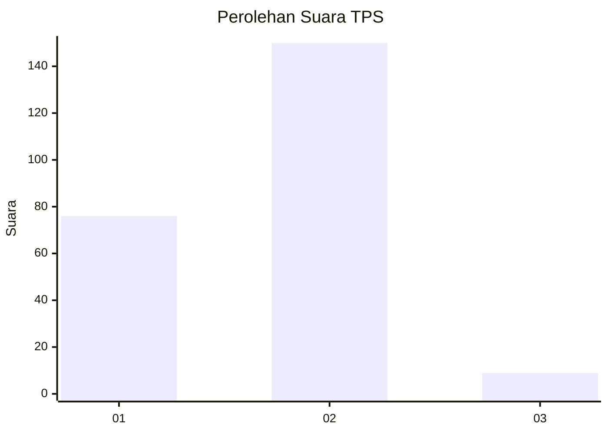
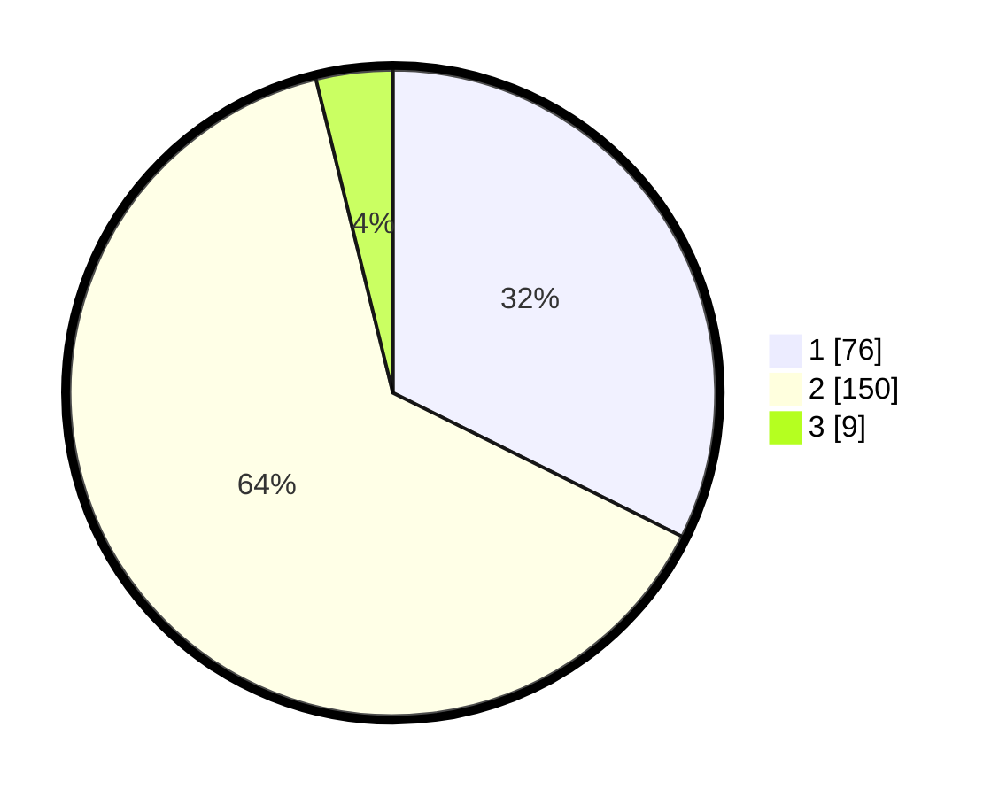

# Hasil

## Grafik

## Tabel

| No. | Nama Paslon    | Suara | Suara (raw) | Persentase |
|:--- |:-------------- | -----:| -----------:| ----------:|
| 1   | ANIES MUHAIMIN | 76    | [76][p-1]   | 32,34      |
| 2   | PRABOWO GIBRAN | 150   | [150][p-2]  | 63,83      |
| 3   | GANJAR MAHFUD  | 9     | [9][p-3]    | 3,83       |

[p-1]: https://github.com/gigit-pemilu/pemilu-2024-35-jawa-timur/blob/main/pilpres/hitung-suara/sub/35-jawa-timur/sub/11-bondowoso/sub/04-sukosari/sub/2003-pecalongan/sub/002-tps/sub/paslon-1.txt
[p-2]: https://github.com/gigit-pemilu/pemilu-2024-35-jawa-timur/blob/main/pilpres/hitung-suara/sub/35-jawa-timur/sub/11-bondowoso/sub/04-sukosari/sub/2003-pecalongan/sub/002-tps/sub/paslon-2.txt
[p-3]: https://github.com/gigit-pemilu/pemilu-2024-35-jawa-timur/blob/main/pilpres/hitung-suara/sub/35-jawa-timur/sub/11-bondowoso/sub/04-sukosari/sub/2003-pecalongan/sub/002-tps/sub/paslon-3.txt

## Foto C Plano

https://sirekap-obj-formc.kpu.go.id/7510/pemilu/ppwp/35/11/04/20/03/3511042003002-20240217-123805--16e32164-6241-43b5-8390-49b683b3ab04.jpg

https://sirekap-obj-formc.kpu.go.id/7510/pemilu/ppwp/35/11/04/20/03/3511042003002-20240217-124000--0d5af783-f4b1-4ae8-8060-93d7fa2d90c4.jpg

https://sirekap-obj-formc.kpu.go.id/7510/pemilu/ppwp/35/11/04/20/03/3511042003002-20240217-124135--dbc626f3-94f3-40e5-a10e-ec2938ba8cb3.jpg

## Metadata

| Key        | Value               |
| ---------- | ------------------- |
| Time Stamp | 2024-02-19 10:00:00 |

