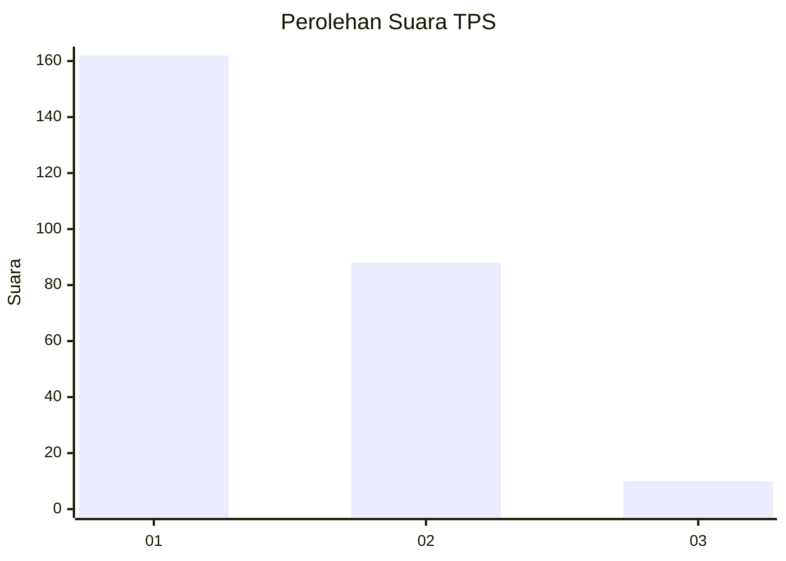
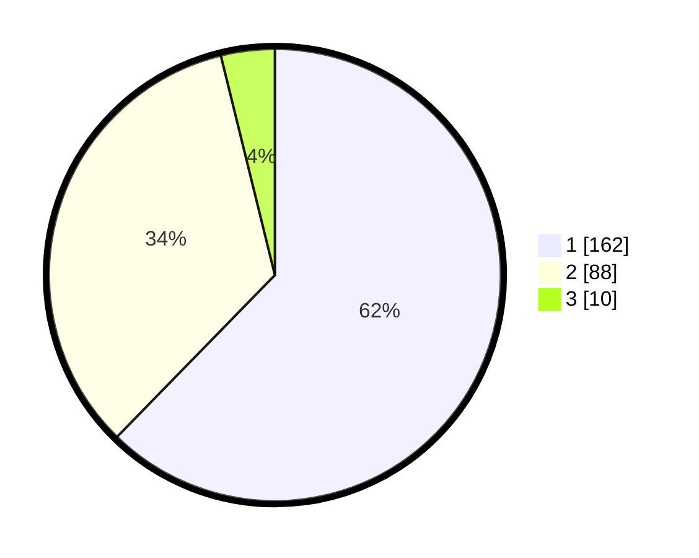

# Hasil

## Grafik

## Tabel

| No. | Nama Paslon    | Suara | Suara (raw) | Persentase |
|:--- |:-------------- | -----:| -----------:| ----------:|
| 1   | ANIES MUHAIMIN | 162   | [162][p-1]  | 62,31      |
| 2   | PRABOWO GIBRAN | 88    | [88][p-2]   | 33,85      |
| 3   | GANJAR MAHFUD  | 10    | [10][p-3]   | 3,85       |

[p-1]: https://github.com/gigit-pemilu/pemilu-2024-35-jawa-timur/blob/main/pilpres/hitung-suara/sub/35-jawa-timur/sub/11-bondowoso/sub/04-sukosari/sub/2004-kerang/sub/002-tps/sub/paslon-1.txt
[p-2]: https://github.com/gigit-pemilu/pemilu-2024-35-jawa-timur/blob/main/pilpres/hitung-suara/sub/35-jawa-timur/sub/11-bondowoso/sub/04-sukosari/sub/2004-kerang/sub/002-tps/sub/paslon-2.txt
[p-3]: https://github.com/gigit-pemilu/pemilu-2024-35-jawa-timur/blob/main/pilpres/hitung-suara/sub/35-jawa-timur/sub/11-bondowoso/sub/04-sukosari/sub/2004-kerang/sub/002-tps/sub/paslon-3.txt

## Foto C Plano

https://sirekap-obj-formc.kpu.go.id/78f5/pemilu/ppwp/35/11/04/20/04/3511042004002-20240214-222258--a11981a2-40d1-423c-b03f-5c623d14abeb.jpg

https://sirekap-obj-formc.kpu.go.id/78f5/pemilu/ppwp/35/11/04/20/04/3511042004002-20240214-222404--7e1fd9c1-e2d6-4e9b-abc0-0be45f4aa857.jpg

https://sirekap-obj-formc.kpu.go.id/78f5/pemilu/ppwp/35/11/04/20/04/3511042004002-20240214-223953--e1065d66-40be-4839-a5d8-2c785109b7f8.jpg

## Metadata

| Key        | Value               |
| ---------- | ------------------- |
| Time Stamp | 2024-02-15 16:00:26 |

