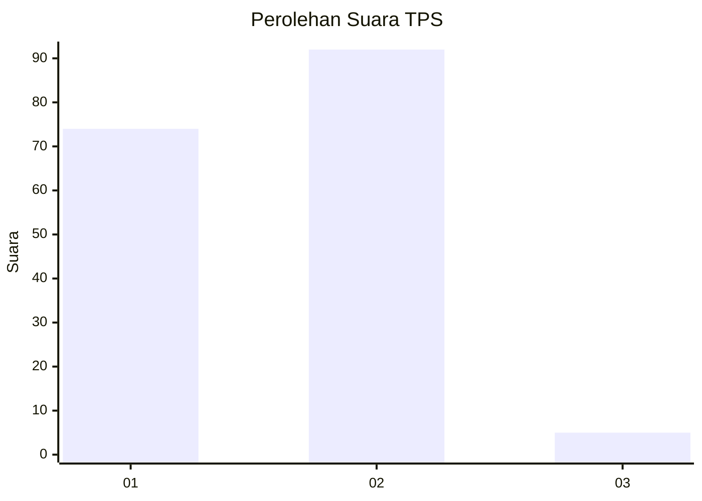
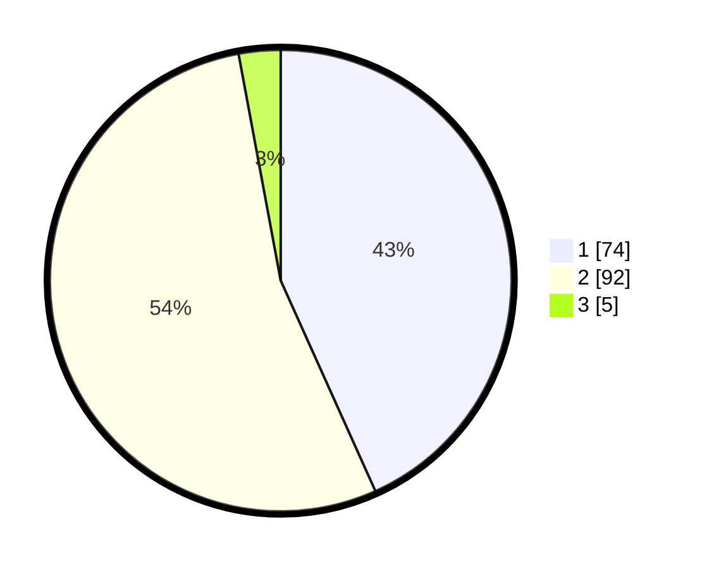

# Hasil

## Grafik

## Tabel

| No. | Nama Paslon    | Suara | Suara (raw) | Persentase |
|:--- |:-------------- | -----:| -----------:| ----------:|
| 1   | ANIES MUHAIMIN | 74    | [74][p-1]   | 43,27      |
| 2   | PRABOWO GIBRAN | 92    | [92][p-2]   | 53,80      |
| 3   | GANJAR MAHFUD  | 5     | [5][p-3]    | 2,92       |

[p-1]: https://github.com/gigit-pemilu/pemilu-2024/blob/main/pilpres/hitung-suara/sub/35-jawa-timur/sub/11-bondowoso/sub/05-pujer/sub/2005-maskuning-wetan/sub/004-tps/sub/paslon-1.txt
[p-2]: https://github.com/gigit-pemilu/pemilu-2024/blob/main/pilpres/hitung-suara/sub/35-jawa-timur/sub/11-bondowoso/sub/05-pujer/sub/2005-maskuning-wetan/sub/004-tps/sub/paslon-2.txt
[p-3]: https://github.com/gigit-pemilu/pemilu-2024/blob/main/pilpres/hitung-suara/sub/35-jawa-timur/sub/11-bondowoso/sub/05-pujer/sub/2005-maskuning-wetan/sub/004-tps/sub/paslon-3.txt

## Foto C Plano

https://sirekap-obj-formc.kpu.go.id/8bd2/pemilu/ppwp/35/11/05/20/05/3511052005004-20240217-163231--6ad55d2c-bfff-4a54-bf5b-1206dc6e0c30.jpg

https://sirekap-obj-formc.kpu.go.id/8bd2/pemilu/ppwp/35/11/05/20/05/3511052005004-20240217-164544--42f29498-c3eb-4291-899e-1017234cf49b.jpg

https://sirekap-obj-formc.kpu.go.id/8bd2/pemilu/ppwp/35/11/05/20/05/3511052005004-20240217-164828--90dbe0d1-0cc2-4076-8e75-b2e244122b95.jpg

## Metadata

| Key        | Value               |
| ---------- | ------------------- |
| Time Stamp | 2024-02-17 16:52:47 |

