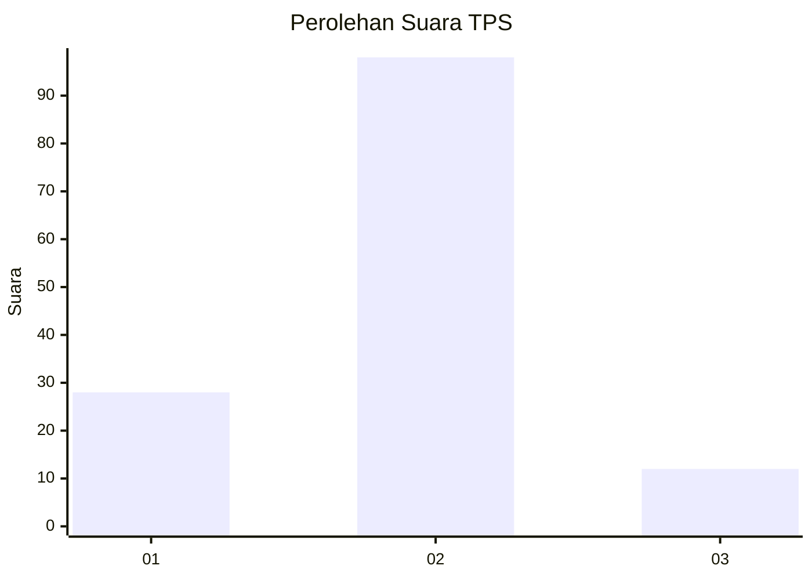
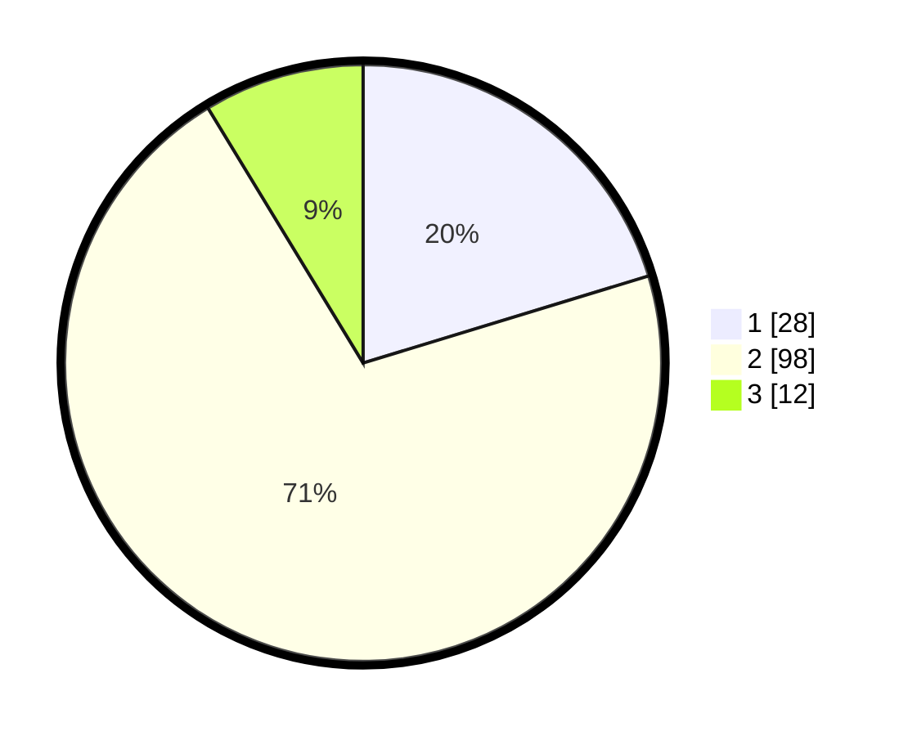

# Hasil

## Grafik

## Tabel

| No. | Nama Paslon    | Suara | Suara (raw) | Persentase |
|:--- |:-------------- | -----:| -----------:| ----------:|
| 1   | ANIES MUHAIMIN | 28    | [28][p-1]   | 20,29      |
| 2   | PRABOWO GIBRAN | 98    | [98][p-2]   | 71,01      |
| 3   | GANJAR MAHFUD  | 12    | [12][p-3]   | 8,70       |

[p-1]: https://github.com/gigit-pemilu/pemilu-2024-35-jawa-timur/blob/main/pilpres/hitung-suara/sub/35-jawa-timur/sub/11-bondowoso/sub/05-pujer/sub/2005-maskuning-wetan/sub/009-tps/sub/paslon-1.txt
[p-2]: https://github.com/gigit-pemilu/pemilu-2024-35-jawa-timur/blob/main/pilpres/hitung-suara/sub/35-jawa-timur/sub/11-bondowoso/sub/05-pujer/sub/2005-maskuning-wetan/sub/009-tps/sub/paslon-2.txt
[p-3]: https://github.com/gigit-pemilu/pemilu-2024-35-jawa-timur/blob/main/pilpres/hitung-suara/sub/35-jawa-timur/sub/11-bondowoso/sub/05-pujer/sub/2005-maskuning-wetan/sub/009-tps/sub/paslon-3.txt

## Foto C Plano

https://sirekap-obj-formc.kpu.go.id/6952/pemilu/ppwp/35/11/05/20/05/3511052005009-20240214-205416--f4c463fb-122d-4b5f-a932-8c48412d8506.jpg

https://sirekap-obj-formc.kpu.go.id/6952/pemilu/ppwp/35/11/05/20/05/3511052005009-20240217-164733--dbd51e40-5d1d-4dbe-8536-497c04d7ad2b.jpg

https://sirekap-obj-formc.kpu.go.id/6952/pemilu/ppwp/35/11/05/20/05/3511052005009-20240217-165753--df5cdc3d-c01a-4de3-bf1f-45ea5ad53341.jpg

## Metadata

| Key        | Value               |
| ---------- | ------------------- |
| Time Stamp | 2024-02-19 15:00:00 |

