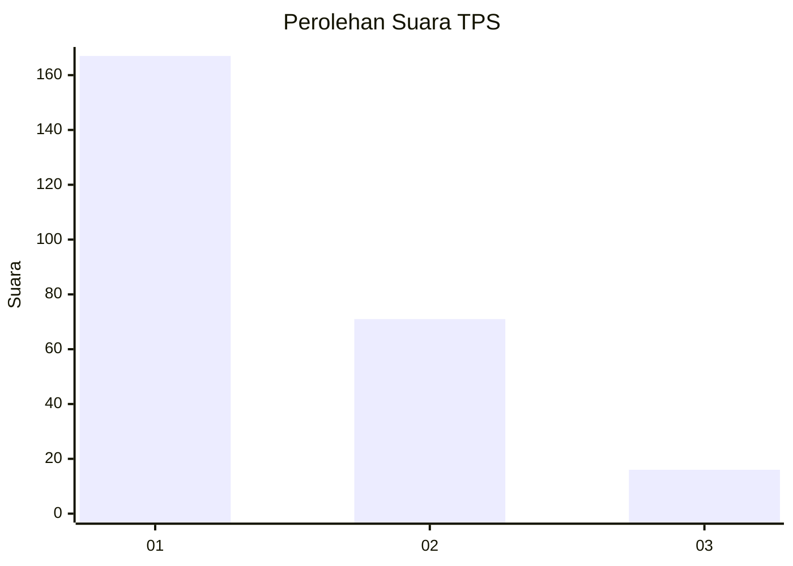
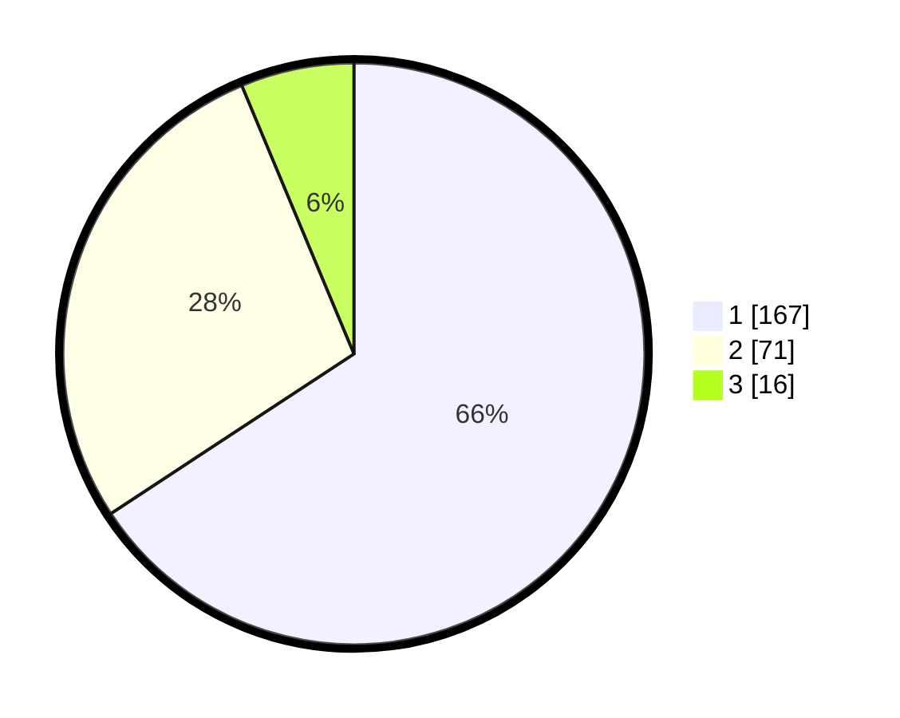

# Hasil

## Grafik

## Tabel

| No. | Nama Paslon    | Suara | Suara (raw) | Persentase |
|:--- |:-------------- | -----:| -----------:| ----------:|
| 1   | ANIES MUHAIMIN | 167   | [167][p-1]  | 65,75      |
| 2   | PRABOWO GIBRAN | 71    | [71][p-2]   | 27,95      |
| 3   | GANJAR MAHFUD  | 16    | [16][p-3]   | 6,30       |

[p-1]: https://github.com/gigit-pemilu/pemilu-2024/blob/main/pilpres/hitung-suara/sub/35-jawa-timur/sub/11-bondowoso/sub/05-pujer/sub/2006-mengok/sub/002-tps/sub/paslon-1.txt
[p-2]: https://github.com/gigit-pemilu/pemilu-2024/blob/main/pilpres/hitung-suara/sub/35-jawa-timur/sub/11-bondowoso/sub/05-pujer/sub/2006-mengok/sub/002-tps/sub/paslon-2.txt
[p-3]: https://github.com/gigit-pemilu/pemilu-2024/blob/main/pilpres/hitung-suara/sub/35-jawa-timur/sub/11-bondowoso/sub/05-pujer/sub/2006-mengok/sub/002-tps/sub/paslon-3.txt

## Foto C Plano

https://sirekap-obj-formc.kpu.go.id/f3f2/pemilu/ppwp/35/11/05/20/06/3511052006002-20240217-211413--0fd56761-e3da-4143-8e1e-989bb4e0e78b.jpg

https://sirekap-obj-formc.kpu.go.id/f3f2/pemilu/ppwp/35/11/05/20/06/3511052006002-20240217-211518--7f9a4015-1162-448a-9a02-97f07e9757a7.jpg

https://sirekap-obj-formc.kpu.go.id/f3f2/pemilu/ppwp/35/11/05/20/06/3511052006002-20240217-211622--59fb8a60-9051-4e90-88fc-f8a8772a2f4b.jpg

## Metadata

| Key        | Value               |
| ---------- | ------------------- |
| Time Stamp | 2024-02-19 10:00:00 |

