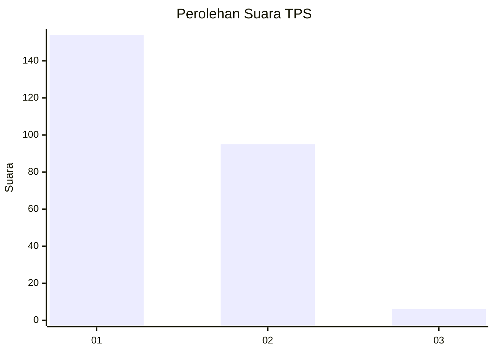
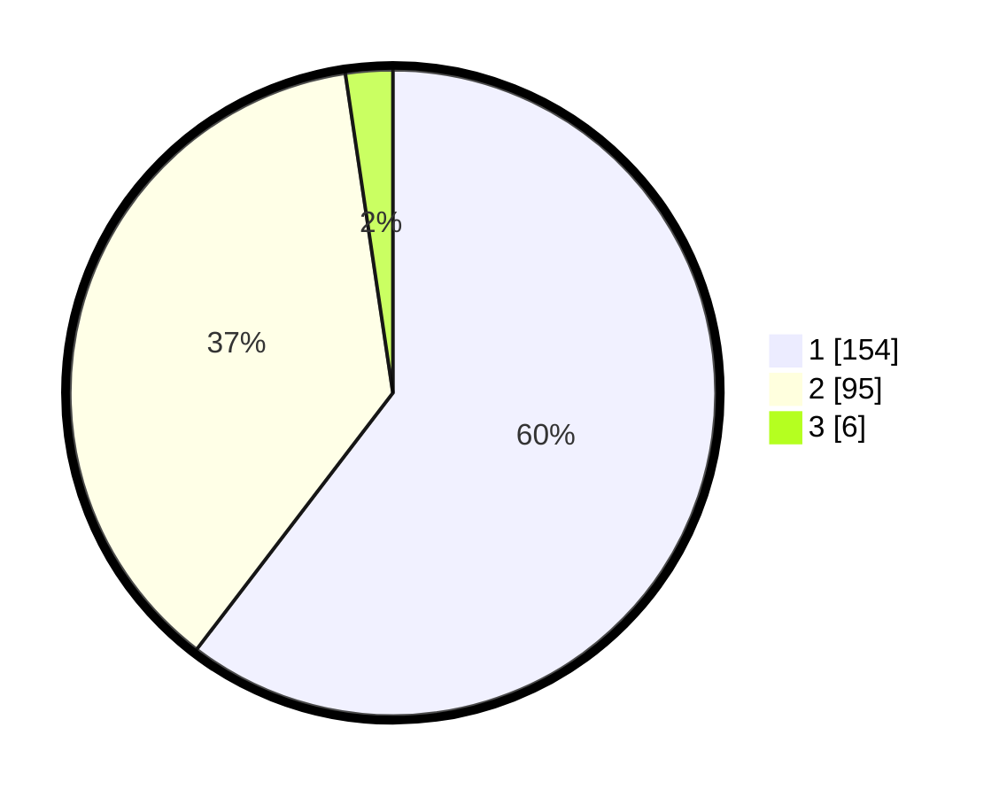

# Hasil

## Grafik

## Tabel

| No. | Nama Paslon    | Suara | Suara (raw) | Persentase |
|:--- |:-------------- | -----:| -----------:| ----------:|
| 1   | ANIES MUHAIMIN | 154   | [154][p-1]  | 60,39      |
| 2   | PRABOWO GIBRAN | 95    | [95][p-2]   | 37,25      |
| 3   | GANJAR MAHFUD  | 6     | [6][p-3]    | 2,35       |

[p-1]: https://github.com/gigit-pemilu/pemilu-2024-35-jawa-timur/blob/main/pilpres/hitung-suara/sub/35-jawa-timur/sub/11-bondowoso/sub/05-pujer/sub/2006-mengok/sub/004-tps/sub/paslon-1.txt
[p-2]: https://github.com/gigit-pemilu/pemilu-2024-35-jawa-timur/blob/main/pilpres/hitung-suara/sub/35-jawa-timur/sub/11-bondowoso/sub/05-pujer/sub/2006-mengok/sub/004-tps/sub/paslon-2.txt
[p-3]: https://github.com/gigit-pemilu/pemilu-2024-35-jawa-timur/blob/main/pilpres/hitung-suara/sub/35-jawa-timur/sub/11-bondowoso/sub/05-pujer/sub/2006-mengok/sub/004-tps/sub/paslon-3.txt

## Foto C Plano

https://sirekap-obj-formc.kpu.go.id/2f57/pemilu/ppwp/35/11/05/20/06/3511052006004-20240215-011052--59f15f16-a009-4c9f-84ce-7a64fe3dbeb2.jpg

https://sirekap-obj-formc.kpu.go.id/2f57/pemilu/ppwp/35/11/05/20/06/3511052006004-20240215-011244--6bc90b4c-88c2-4259-9ee3-fd0a489187d9.jpg

https://sirekap-obj-formc.kpu.go.id/2f57/pemilu/ppwp/35/11/05/20/06/3511052006004-20240217-195932--c5428702-2ad9-4373-9b29-fde4a1f86506.jpg

## Metadata

| Key        | Value               |
| ---------- | ------------------- |
| Time Stamp | 2024-02-19 06:16:00 |

