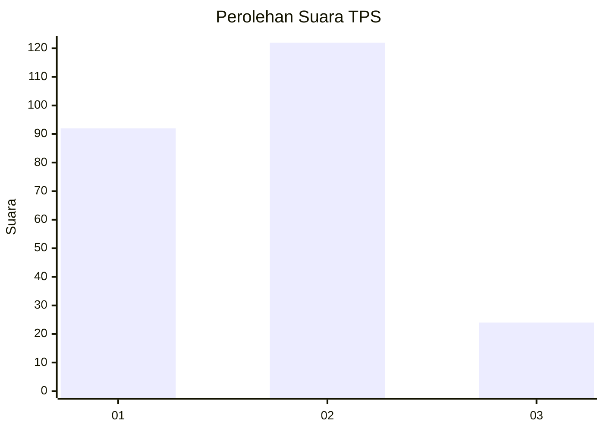
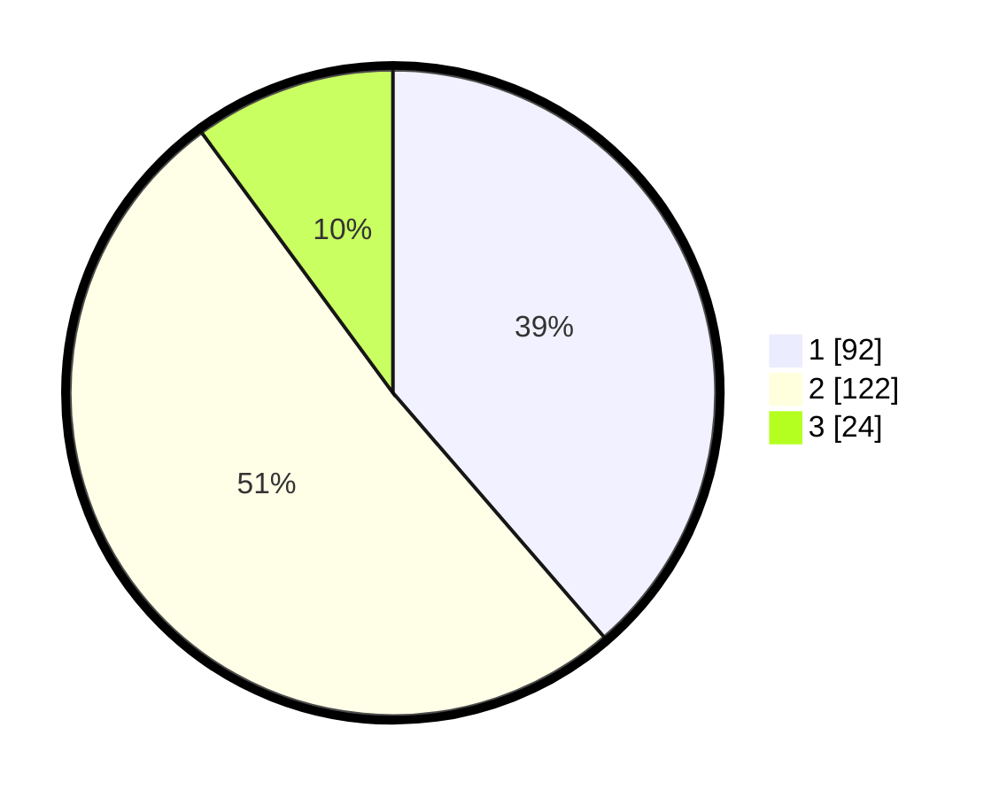

# Hasil

## Grafik

## Tabel

| No. | Nama Paslon    | Suara | Suara (raw) | Persentase |
|:--- |:-------------- | -----:| -----------:| ----------:|
| 1   | ANIES MUHAIMIN | 92    | [92][p-1]   | 38,66      |
| 2   | PRABOWO GIBRAN | 122   | [122][p-2]  | 51,26      |
| 3   | GANJAR MAHFUD  | 24    | [24][p-3]   | 10,08      |

[p-1]: https://github.com/gigit-pemilu/pemilu-2024-35-jawa-timur/blob/main/pilpres/hitung-suara/sub/35-jawa-timur/sub/11-bondowoso/sub/05-pujer/sub/2007-padasan/sub/002-tps/sub/paslon-1.txt
[p-2]: https://github.com/gigit-pemilu/pemilu-2024-35-jawa-timur/blob/main/pilpres/hitung-suara/sub/35-jawa-timur/sub/11-bondowoso/sub/05-pujer/sub/2007-padasan/sub/002-tps/sub/paslon-2.txt
[p-3]: https://github.com/gigit-pemilu/pemilu-2024-35-jawa-timur/blob/main/pilpres/hitung-suara/sub/35-jawa-timur/sub/11-bondowoso/sub/05-pujer/sub/2007-padasan/sub/002-tps/sub/paslon-3.txt

## Foto C Plano

https://sirekap-obj-formc.kpu.go.id/8539/pemilu/ppwp/35/11/05/20/07/3511052007002-20240214-223220--e3607617-ce97-42c9-819c-4148b6db7831.jpg

https://sirekap-obj-formc.kpu.go.id/8539/pemilu/ppwp/35/11/05/20/07/3511052007002-20240214-223415--07d73b17-e552-44c7-a6cf-4862f33a8cf3.jpg

https://sirekap-obj-formc.kpu.go.id/8539/pemilu/ppwp/35/11/05/20/07/3511052007002-20240214-223527--e6f2010b-5617-43fb-8313-0271efbb14cb.jpg

## Metadata

| Key        | Value               |
| ---------- | ------------------- |
| Time Stamp | 2024-02-16 09:00:28 |

