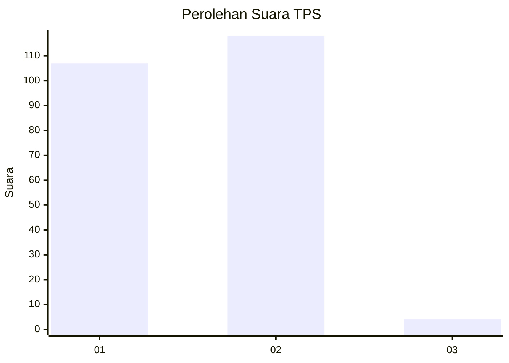
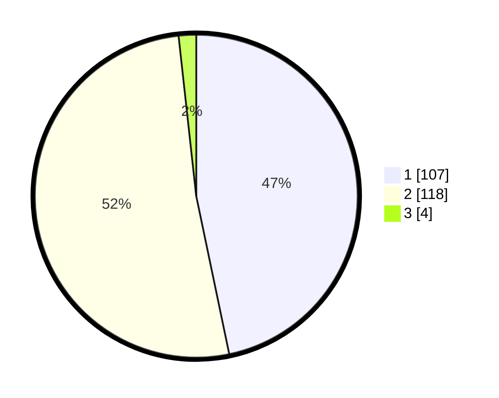

# Hasil

## Grafik

## Tabel

| No. | Nama Paslon    | Suara | Suara (raw) | Persentase |
|:--- |:-------------- | -----:| -----------:| ----------:|
| 1   | ANIES MUHAIMIN | 107   | [107][p-1]  | 46,72      |
| 2   | PRABOWO GIBRAN | 118   | [118][p-2]  | 51,53      |
| 3   | GANJAR MAHFUD  | 4     | [4][p-3]    | 1,75       |

[p-1]: https://github.com/gigit-pemilu/pemilu-2024/blob/main/pilpres/hitung-suara/sub/35-jawa-timur/sub/11-bondowoso/sub/05-pujer/sub/2009-randu-cangkring/sub/002-tps/sub/paslon-1.txt
[p-2]: https://github.com/gigit-pemilu/pemilu-2024/blob/main/pilpres/hitung-suara/sub/35-jawa-timur/sub/11-bondowoso/sub/05-pujer/sub/2009-randu-cangkring/sub/002-tps/sub/paslon-2.txt
[p-3]: https://github.com/gigit-pemilu/pemilu-2024/blob/main/pilpres/hitung-suara/sub/35-jawa-timur/sub/11-bondowoso/sub/05-pujer/sub/2009-randu-cangkring/sub/002-tps/sub/paslon-3.txt

## Foto C Plano

https://sirekap-obj-formc.kpu.go.id/ff0a/pemilu/ppwp/35/11/05/20/09/3511052009002-20240215-004606--7966b6b2-20b0-4903-bf6f-027123aae586.jpg

https://sirekap-obj-formc.kpu.go.id/ff0a/pemilu/ppwp/35/11/05/20/09/3511052009002-20240215-005803--5bcc6eb0-10f8-4541-9d64-330cf0001bf2.jpg

https://sirekap-obj-formc.kpu.go.id/ff0a/pemilu/ppwp/35/11/05/20/09/3511052009002-20240215-005952--8dfc8100-47f4-4325-a65d-00dfec0982b7.jpg

## Metadata

| Key        | Value               |
| ---------- | ------------------- |
| Time Stamp | 2024-02-19 18:00:00 |

