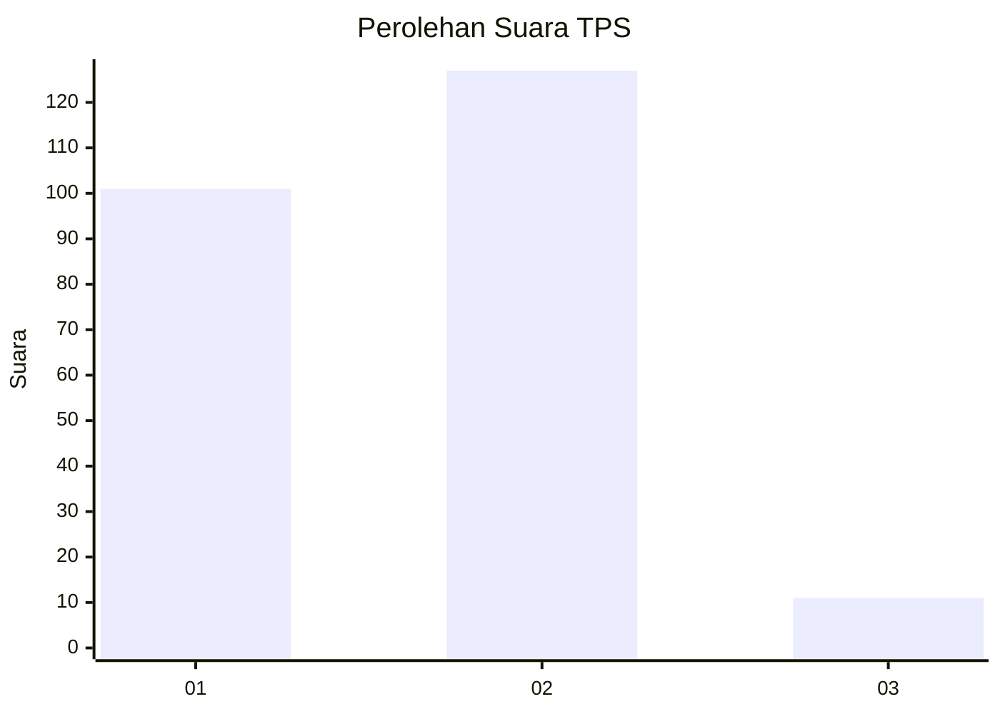
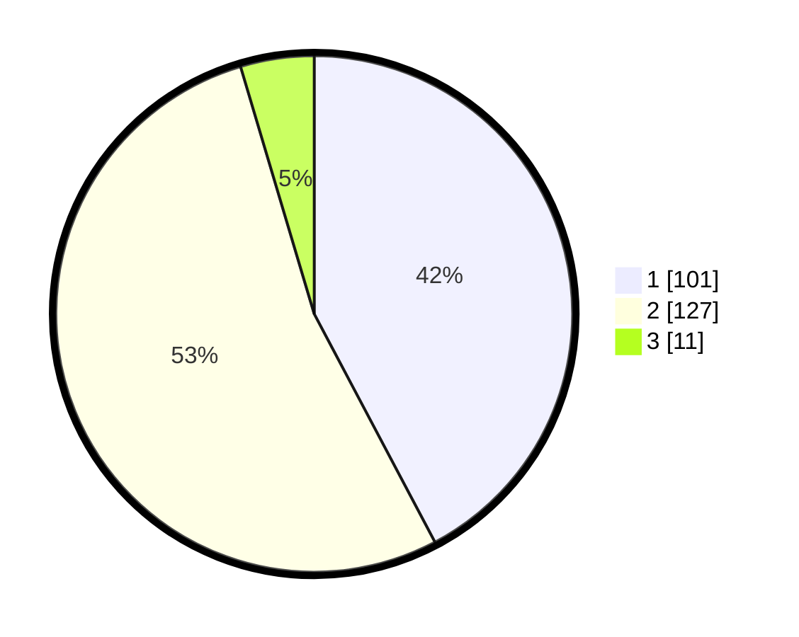

# Hasil

## Grafik

## Tabel

| No. | Nama Paslon    | Suara | Suara (raw) | Persentase |
|:--- |:-------------- | -----:| -----------:| ----------:|
| 1   | ANIES MUHAIMIN | 101   | [101][p-1]  | 42,26      |
| 2   | PRABOWO GIBRAN | 127   | [127][p-2]  | 53,14      |
| 3   | GANJAR MAHFUD  | 11    | [11][p-3]   | 4,60       |

[p-1]: https://github.com/gigit-pemilu/pemilu-2024/blob/main/pilpres/hitung-suara/sub/35-jawa-timur/sub/11-bondowoso/sub/05-pujer/sub/2009-randu-cangkring/sub/006-tps/sub/paslon-1.txt
[p-2]: https://github.com/gigit-pemilu/pemilu-2024/blob/main/pilpres/hitung-suara/sub/35-jawa-timur/sub/11-bondowoso/sub/05-pujer/sub/2009-randu-cangkring/sub/006-tps/sub/paslon-2.txt
[p-3]: https://github.com/gigit-pemilu/pemilu-2024/blob/main/pilpres/hitung-suara/sub/35-jawa-timur/sub/11-bondowoso/sub/05-pujer/sub/2009-randu-cangkring/sub/006-tps/sub/paslon-3.txt

## Foto C Plano

https://sirekap-obj-formc.kpu.go.id/c463/pemilu/ppwp/35/11/05/20/09/3511052009006-20240214-230654--d054102b-bcc5-40cc-bcf9-e36155ed8bc8.jpg

https://sirekap-obj-formc.kpu.go.id/c463/pemilu/ppwp/35/11/05/20/09/3511052009006-20240214-231502--a2de52b2-c231-4d83-9cf2-50b39ed87c6f.jpg

https://sirekap-obj-formc.kpu.go.id/c463/pemilu/ppwp/35/11/05/20/09/3511052009006-20240214-231207--cae94aca-e8fb-475b-8a5f-9ee8f3dc1780.jpg

## Metadata

| Key        | Value               |
| ---------- | ------------------- |
| Time Stamp | 2024-02-16 09:00:28 |

