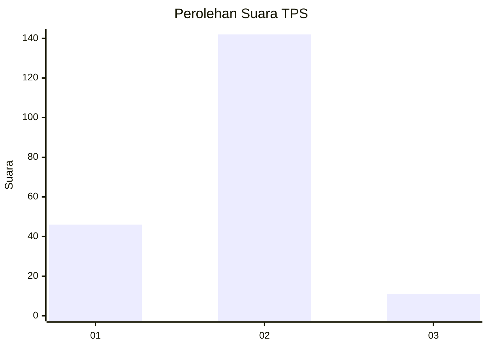
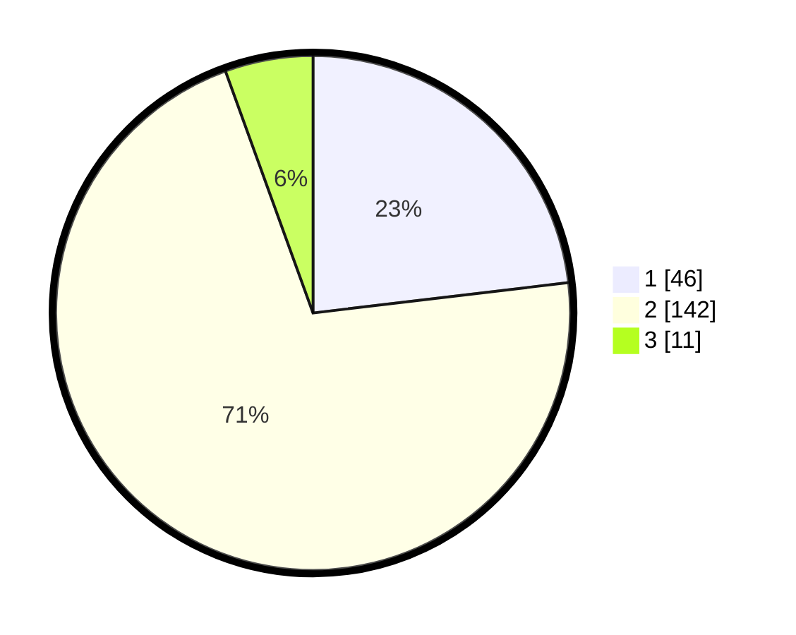

# Hasil

## Grafik

## Tabel

| No. | Nama Paslon    | Suara | Suara (raw) | Persentase |
|:--- |:-------------- | -----:| -----------:| ----------:|
| 1   | ANIES MUHAIMIN | 46    | [46][p-1]   | 23,12      |
| 2   | PRABOWO GIBRAN | 142   | [142][p-2]  | 71,36      |
| 3   | GANJAR MAHFUD  | 11    | [11][p-3]   | 5,53       |

[p-1]: https://github.com/gigit-pemilu/pemilu-2024/blob/main/pilpres/hitung-suara/sub/35-jawa-timur/sub/11-bondowoso/sub/05-pujer/sub/2011-sukowono/sub/001-tps/sub/paslon-1.txt
[p-2]: https://github.com/gigit-pemilu/pemilu-2024/blob/main/pilpres/hitung-suara/sub/35-jawa-timur/sub/11-bondowoso/sub/05-pujer/sub/2011-sukowono/sub/001-tps/sub/paslon-2.txt
[p-3]: https://github.com/gigit-pemilu/pemilu-2024/blob/main/pilpres/hitung-suara/sub/35-jawa-timur/sub/11-bondowoso/sub/05-pujer/sub/2011-sukowono/sub/001-tps/sub/paslon-3.txt

## Foto C Plano

https://sirekap-obj-formc.kpu.go.id/050f/pemilu/ppwp/35/11/05/20/11/3511052011001-20240217-120153--4a847f28-c4ea-4f78-bf24-654c7e32a64f.jpg

https://sirekap-obj-formc.kpu.go.id/050f/pemilu/ppwp/35/11/05/20/11/3511052011001-20240217-120527--0f2717c3-2271-49c5-bd12-5291e64224e8.jpg

https://sirekap-obj-formc.kpu.go.id/050f/pemilu/ppwp/35/11/05/20/11/3511052011001-20240217-120654--1dfa1b87-989d-4e3f-af59-e46b3cabc9b4.jpg

## Metadata

| Key        | Value               |
| ---------- | ------------------- |
| Time Stamp | 2024-02-19 15:00:00 |

## DATA PEMILIH TETAP

Jumlah pemilih dalam DPT: **270**.
 * L: **440**.
 * P: **430**.

## DATA PENGGUNA HAK PILIH

Jumlah pengguna hak pilih dalam DPT: **202**.
 * L: **700**.
 * P: **700**.

Jumlah pengguna hak pilih dalam DPTb: **4**.
 * L: **8**.
 * P: **800**.

Jumlah pengguna hak pilih dalam DPK: **3**.
 * L: **2**.
 * P: **87**.

Jumlah pengguna hak pilih: **205**.
 * L: **704**.
 * P: **701**.

## JUMLAH SUARA SAH DAN TIDAK SAH

JUMLAH SELURUH SUARA SAH: **199**.

JUMLAH SUARA TIDAK SAH: **6**.

JUMLAH SELURUH SUARA SAH DAN SUARA TIDAK SAH: **205**.

