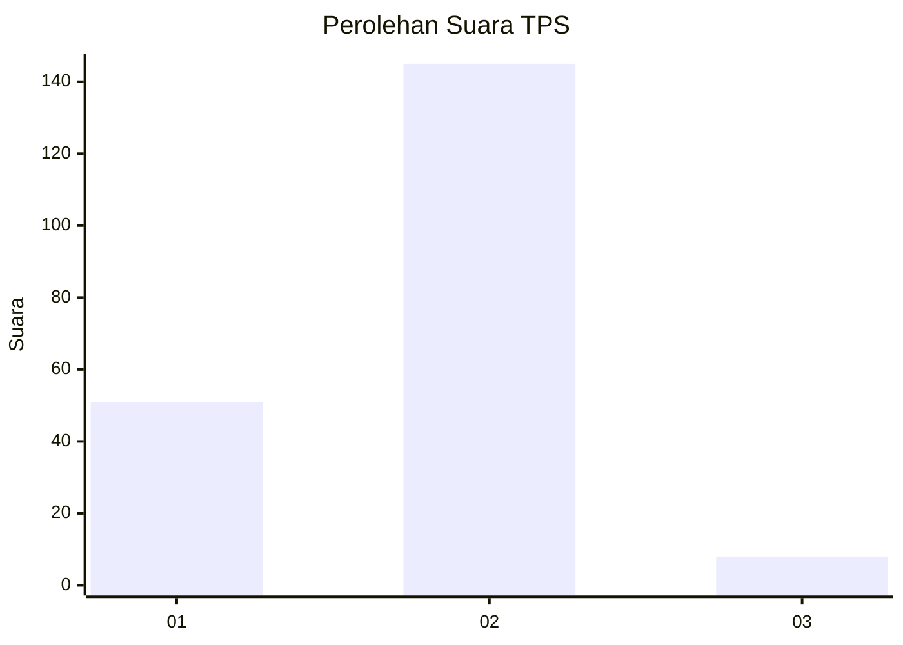
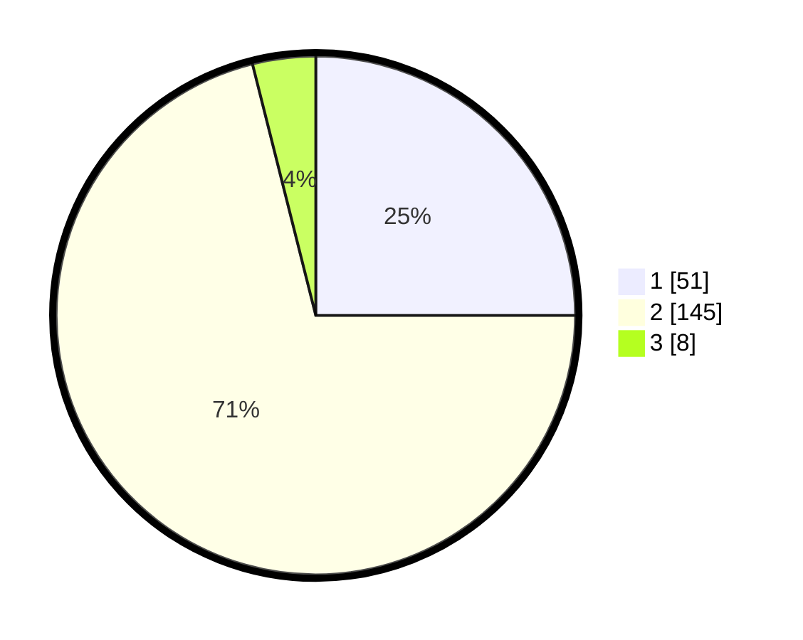

# Hasil

## Grafik

## Tabel

| No. | Nama Paslon    | Suara | Suara (raw) | Persentase |
|:--- |:-------------- | -----:| -----------:| ----------:|
| 1   | ANIES MUHAIMIN | 51    | [51][p-1]   | 25,00      |
| 2   | PRABOWO GIBRAN | 145   | [145][p-2]  | 71,08      |
| 3   | GANJAR MAHFUD  | 8     | [8][p-3]    | 3,92       |

[p-1]: https://github.com/gigit-pemilu/pemilu-2024/blob/main/pilpres/hitung-suara/sub/35-jawa-timur/sub/11-bondowoso/sub/05-pujer/sub/2011-sukowono/sub/005-tps/sub/paslon-1.txt
[p-2]: https://github.com/gigit-pemilu/pemilu-2024/blob/main/pilpres/hitung-suara/sub/35-jawa-timur/sub/11-bondowoso/sub/05-pujer/sub/2011-sukowono/sub/005-tps/sub/paslon-2.txt
[p-3]: https://github.com/gigit-pemilu/pemilu-2024/blob/main/pilpres/hitung-suara/sub/35-jawa-timur/sub/11-bondowoso/sub/05-pujer/sub/2011-sukowono/sub/005-tps/sub/paslon-3.txt

## Foto C Plano

https://sirekap-obj-formc.kpu.go.id/61ba/pemilu/ppwp/35/11/05/20/11/3511052011005-20240218-204407--06e0c4a6-6239-45c7-9e6b-d92f893e22d8.jpg

https://sirekap-obj-formc.kpu.go.id/61ba/pemilu/ppwp/35/11/05/20/11/3511052011005-20240218-202726--846e281b-c2d9-4fb2-98ef-1a93bb9f2015.jpg

https://sirekap-obj-formc.kpu.go.id/61ba/pemilu/ppwp/35/11/05/20/11/3511052011005-20240218-203019--3fadca61-8aa6-4e0b-8df6-d181781e344b.jpg

## Metadata

| Key        | Value               |
| ---------- | ------------------- |
| Time Stamp | 2024-02-19 10:00:00 |

