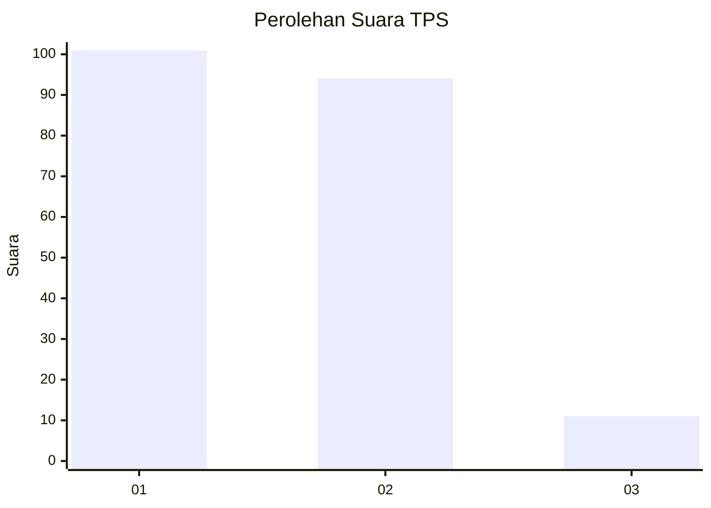
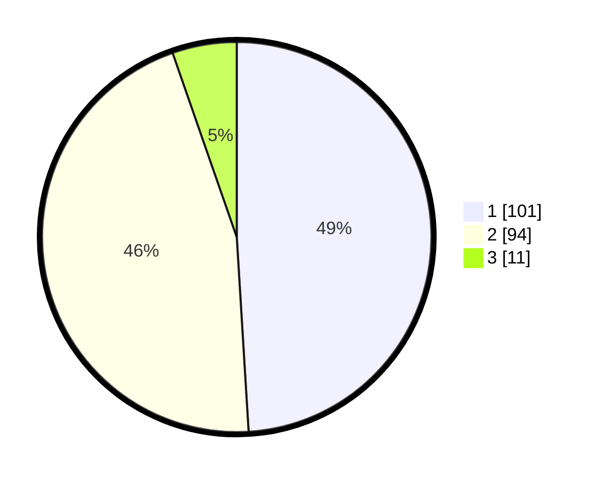

# Hasil

## Grafik

## Tabel

| No. | Nama Paslon    | Suara | Suara (raw) | Persentase |
|:--- |:-------------- | -----:| -----------:| ----------:|
| 1   | ANIES MUHAIMIN | 101   | [101][p-1]  | 49,03      |
| 2   | PRABOWO GIBRAN | 94    | [94][p-2]   | 45,63      |
| 3   | GANJAR MAHFUD  | 11    | [11][p-3]   | 5,34       |

[p-1]: https://github.com/gigit-pemilu/pemilu-2024-35-jawa-timur/blob/main/pilpres/hitung-suara/sub/35-jawa-timur/sub/11-bondowoso/sub/06-grujugan/sub/2007-wonosari/sub/003-tps/sub/paslon-1.txt
[p-2]: https://github.com/gigit-pemilu/pemilu-2024-35-jawa-timur/blob/main/pilpres/hitung-suara/sub/35-jawa-timur/sub/11-bondowoso/sub/06-grujugan/sub/2007-wonosari/sub/003-tps/sub/paslon-2.txt
[p-3]: https://github.com/gigit-pemilu/pemilu-2024-35-jawa-timur/blob/main/pilpres/hitung-suara/sub/35-jawa-timur/sub/11-bondowoso/sub/06-grujugan/sub/2007-wonosari/sub/003-tps/sub/paslon-3.txt

## Foto C Plano

https://sirekap-obj-formc.kpu.go.id/70ab/pemilu/ppwp/35/11/06/20/07/3511062007003-20240214-221716--d20751e1-0330-4f69-b914-f991ba568c18.jpg

https://sirekap-obj-formc.kpu.go.id/70ab/pemilu/ppwp/35/11/06/20/07/3511062007003-20240214-222007--c8551820-2a28-41a1-8d60-7e44453ebc31.jpg

https://sirekap-obj-formc.kpu.go.id/70ab/pemilu/ppwp/35/11/06/20/07/3511062007003-20240215-045032--2a1ef855-7228-4392-8762-30d7121a7da7.jpg

## Metadata

| Key        | Value               |
| ---------- | ------------------- |
| Time Stamp | 2024-02-15 15:00:29 |

