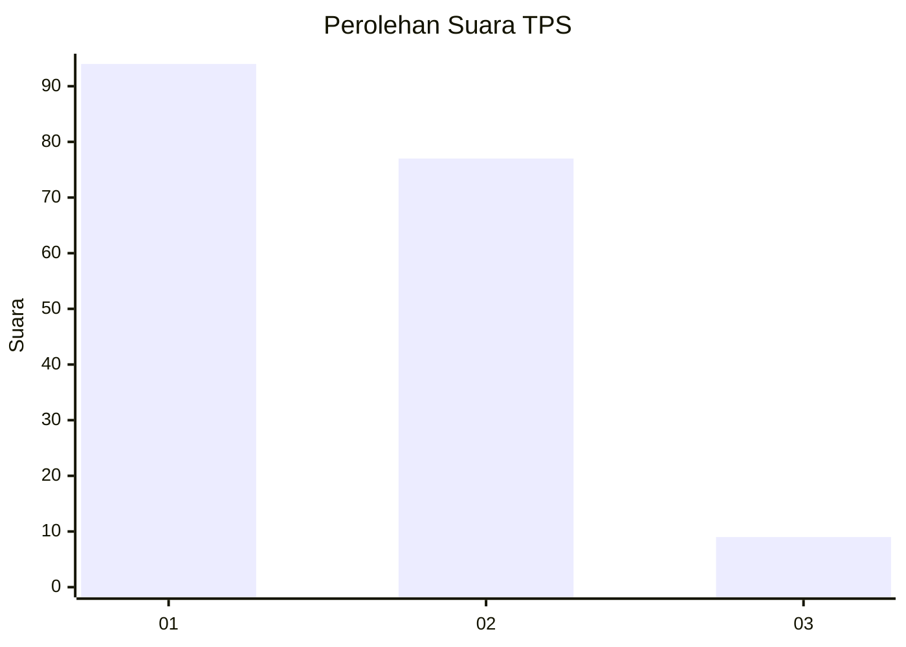
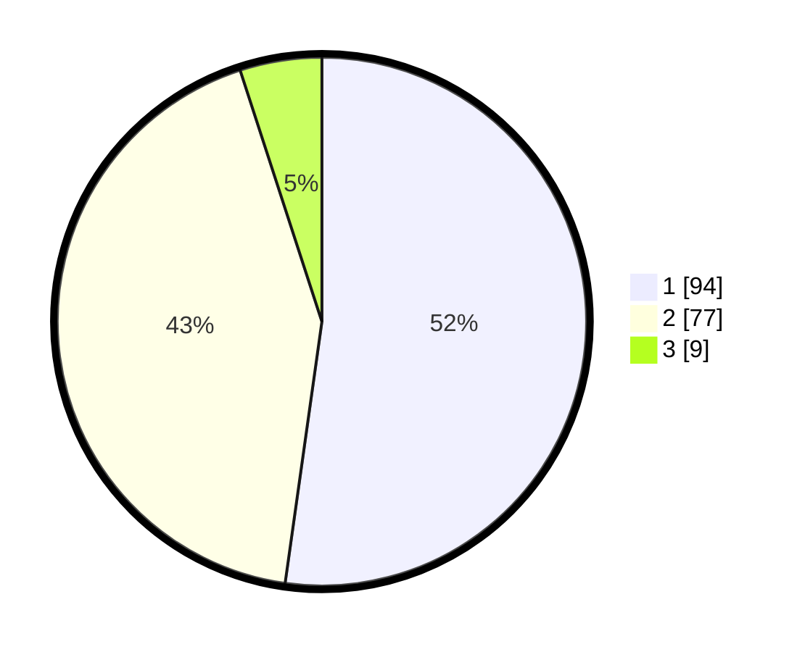

# Hasil

## Grafik

## Tabel

| No. | Nama Paslon    | Suara | Suara (raw) | Persentase |
|:--- |:-------------- | -----:| -----------:| ----------:|
| 1   | ANIES MUHAIMIN | 94    | [94][p-1]   | 52,22      |
| 2   | PRABOWO GIBRAN | 77    | [77][p-2]   | 42,78      |
| 3   | GANJAR MAHFUD  | 9     | [9][p-3]    | 5,00       |

[p-1]: https://github.com/gigit-pemilu/pemilu-2024-35-jawa-timur/blob/main/pilpres/hitung-suara/sub/35-jawa-timur/sub/11-bondowoso/sub/06-grujugan/sub/2007-wonosari/sub/004-tps/sub/paslon-1.txt
[p-2]: https://github.com/gigit-pemilu/pemilu-2024-35-jawa-timur/blob/main/pilpres/hitung-suara/sub/35-jawa-timur/sub/11-bondowoso/sub/06-grujugan/sub/2007-wonosari/sub/004-tps/sub/paslon-2.txt
[p-3]: https://github.com/gigit-pemilu/pemilu-2024-35-jawa-timur/blob/main/pilpres/hitung-suara/sub/35-jawa-timur/sub/11-bondowoso/sub/06-grujugan/sub/2007-wonosari/sub/004-tps/sub/paslon-3.txt

## Foto C Plano

https://sirekap-obj-formc.kpu.go.id/6609/pemilu/ppwp/35/11/06/20/07/3511062007004-20240214-233537--4e3bba24-3daf-41e9-b5c3-53087b57a881.jpg

https://sirekap-obj-formc.kpu.go.id/6609/pemilu/ppwp/35/11/06/20/07/3511062007004-20240215-020057--e76481de-ebac-4358-b0a1-29b9af82b450.jpg

https://sirekap-obj-formc.kpu.go.id/6609/pemilu/ppwp/35/11/06/20/07/3511062007004-20240214-233948--9a5ead7e-dd07-4155-9ed5-5e5fec996985.jpg

## Metadata

| Key        | Value               |
| ---------- | ------------------- |
| Time Stamp | 2024-02-15 15:00:29 |

