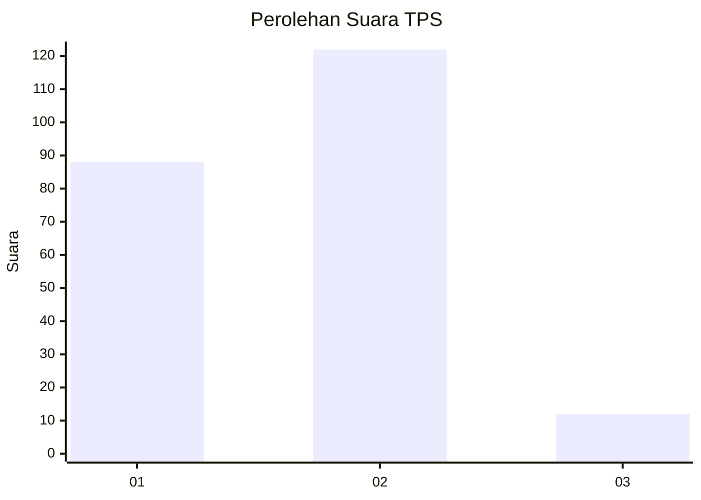
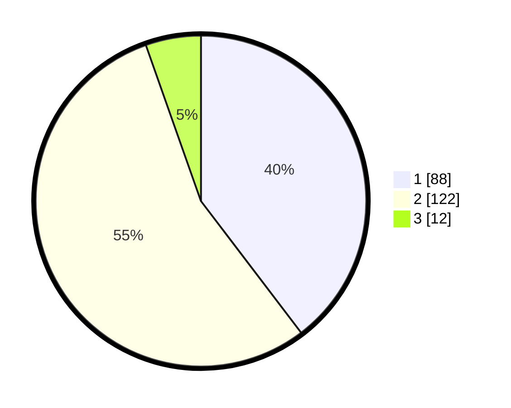

# Hasil

## Grafik

## Tabel

| No. | Nama Paslon    | Suara | Suara (raw) | Persentase |
|:--- |:-------------- | -----:| -----------:| ----------:|
| 1   | ANIES MUHAIMIN | 88    | [88][p-1]   | 39,64      |
| 2   | PRABOWO GIBRAN | 122   | [122][p-2]  | 54,95      |
| 3   | GANJAR MAHFUD  | 12    | [12][p-3]   | 5,41       |

[p-1]: https://github.com/gigit-pemilu/pemilu-2024-35-jawa-timur/blob/main/pilpres/hitung-suara/sub/35-jawa-timur/sub/11-bondowoso/sub/06-grujugan/sub/2009-dawuhan/sub/006-tps/sub/paslon-1.txt
[p-2]: https://github.com/gigit-pemilu/pemilu-2024-35-jawa-timur/blob/main/pilpres/hitung-suara/sub/35-jawa-timur/sub/11-bondowoso/sub/06-grujugan/sub/2009-dawuhan/sub/006-tps/sub/paslon-2.txt
[p-3]: https://github.com/gigit-pemilu/pemilu-2024-35-jawa-timur/blob/main/pilpres/hitung-suara/sub/35-jawa-timur/sub/11-bondowoso/sub/06-grujugan/sub/2009-dawuhan/sub/006-tps/sub/paslon-3.txt

## Foto C Plano

https://sirekap-obj-formc.kpu.go.id/fa37/pemilu/ppwp/35/11/06/20/09/3511062009006-20240214-220236--4dd4f4df-9286-4b00-9392-a8940f5f20e2.jpg

https://sirekap-obj-formc.kpu.go.id/fa37/pemilu/ppwp/35/11/06/20/09/3511062009006-20240214-220253--9a7fab3f-7070-4127-98d0-6e45ca05c8ce.jpg

https://sirekap-obj-formc.kpu.go.id/fa37/pemilu/ppwp/35/11/06/20/09/3511062009006-20240214-220302--bfb40492-3921-4f55-8b15-6c84f29be5a5.jpg

## Metadata

| Key        | Value               |
| ---------- | ------------------- |
| Time Stamp | 2024-02-24 22:31:28 |

