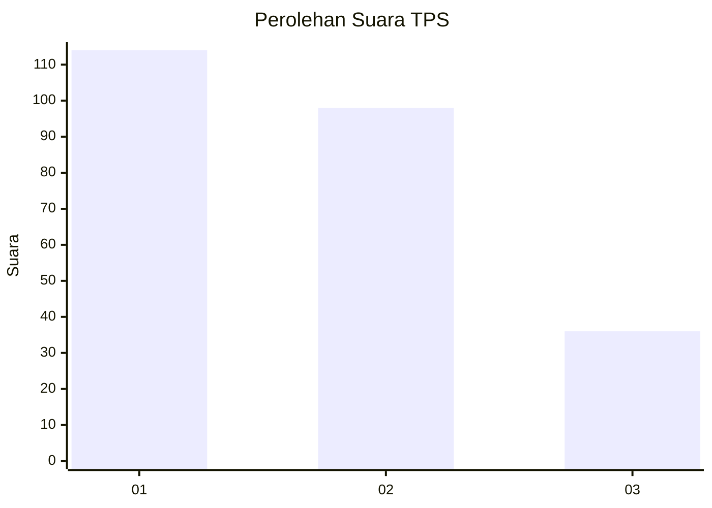
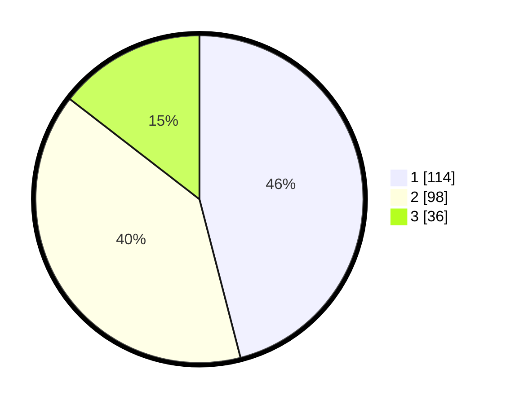

# Hasil

## Grafik

## Tabel

| No. | Nama Paslon    | Suara | Suara (raw) | Persentase |
|:--- |:-------------- | -----:| -----------:| ----------:|
| 1   | ANIES MUHAIMIN | 114   | [114][p-1]  | 45,97      |
| 2   | PRABOWO GIBRAN | 98    | [98][p-2]   | 39,52      |
| 3   | GANJAR MAHFUD  | 36    | [36][p-3]   | 14,52      |

[p-1]: https://github.com/gigit-pemilu/pemilu-2024/blob/main/pilpres/hitung-suara/sub/35-jawa-timur/sub/11-bondowoso/sub/07-curahdami/sub/2003-kupang/sub/001-tps/sub/paslon-1.txt
[p-2]: https://github.com/gigit-pemilu/pemilu-2024/blob/main/pilpres/hitung-suara/sub/35-jawa-timur/sub/11-bondowoso/sub/07-curahdami/sub/2003-kupang/sub/001-tps/sub/paslon-2.txt
[p-3]: https://github.com/gigit-pemilu/pemilu-2024/blob/main/pilpres/hitung-suara/sub/35-jawa-timur/sub/11-bondowoso/sub/07-curahdami/sub/2003-kupang/sub/001-tps/sub/paslon-3.txt

## Foto C Plano

https://sirekap-obj-formc.kpu.go.id/f174/pemilu/ppwp/35/11/07/20/03/3511072003001-20240214-160100--830099d5-da6d-4ea1-9be0-e721e7d5101c.jpg

https://sirekap-obj-formc.kpu.go.id/f174/pemilu/ppwp/35/11/07/20/03/3511072003001-20240214-155335--3c32a2cd-315b-4e1d-be9a-ffad329392a6.jpg

https://sirekap-obj-formc.kpu.go.id/f174/pemilu/ppwp/35/11/07/20/03/3511072003001-20240214-155445--55923fcd-06c2-45da-8e70-2f83b517c8f6.jpg

## Metadata

| Key        | Value               |
| ---------- | ------------------- |
| Time Stamp | 2024-02-14 21:46:01 |

