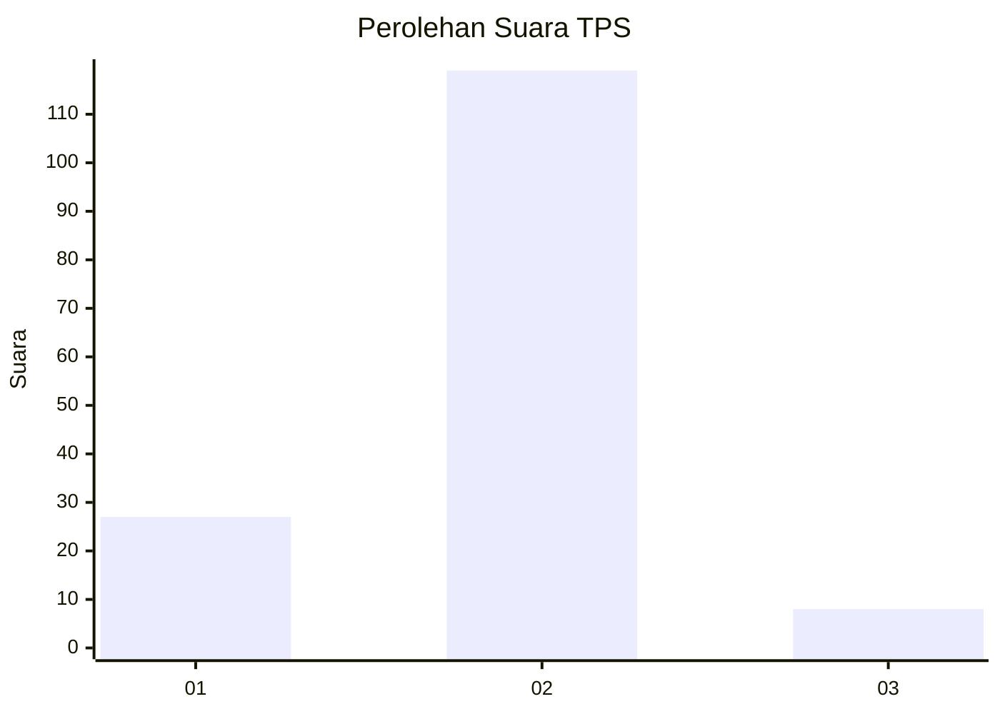
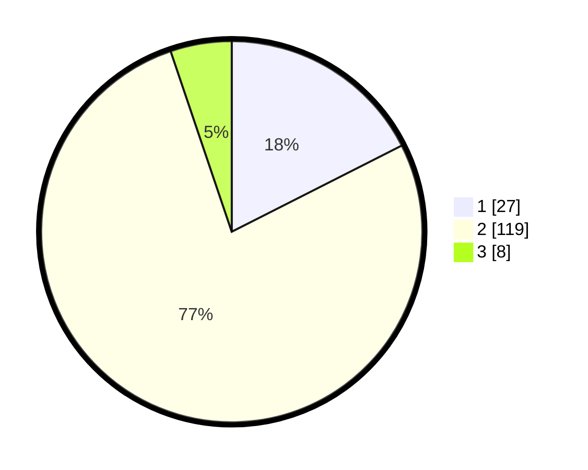

# Hasil

## Grafik

## Tabel

| No. | Nama Paslon    | Suara | Suara (raw) | Persentase |
|:--- |:-------------- | -----:| -----------:| ----------:|
| 1   | ANIES MUHAIMIN | 27    | [27][p-1]   | 17,53      |
| 2   | PRABOWO GIBRAN | 119   | [119][p-2]  | 77,27      |
| 3   | GANJAR MAHFUD  | 8     | [8][p-3]    | 5,19       |

[p-1]: https://github.com/gigit-pemilu/pemilu-2024-35-jawa-timur/blob/main/pilpres/hitung-suara/sub/35-jawa-timur/sub/11-bondowoso/sub/07-curahdami/sub/2011-locare/sub/006-tps/sub/paslon-1.txt
[p-2]: https://github.com/gigit-pemilu/pemilu-2024-35-jawa-timur/blob/main/pilpres/hitung-suara/sub/35-jawa-timur/sub/11-bondowoso/sub/07-curahdami/sub/2011-locare/sub/006-tps/sub/paslon-2.txt
[p-3]: https://github.com/gigit-pemilu/pemilu-2024-35-jawa-timur/blob/main/pilpres/hitung-suara/sub/35-jawa-timur/sub/11-bondowoso/sub/07-curahdami/sub/2011-locare/sub/006-tps/sub/paslon-3.txt

## Foto C Plano

https://sirekap-obj-formc.kpu.go.id/06ee/pemilu/ppwp/35/11/07/20/11/3511072011006-20240217-133448--90bf4f02-ed60-4590-8021-7208354399b8.jpg

https://sirekap-obj-formc.kpu.go.id/06ee/pemilu/ppwp/35/11/07/20/11/3511072011006-20240217-111823--a87af646-be6a-417e-ae22-f43ebee88747.jpg

https://sirekap-obj-formc.kpu.go.id/06ee/pemilu/ppwp/35/11/07/20/11/3511072011006-20240214-141640--23bf47a4-4b6e-48be-8f58-96aaf3006d74.jpg

## Metadata

| Key        | Value               |
| ---------- | ------------------- |
| Time Stamp | 2024-02-17 13:37:34 |

