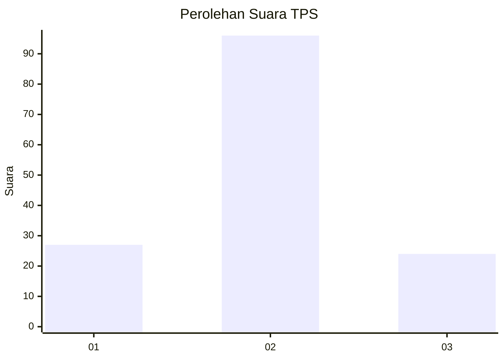
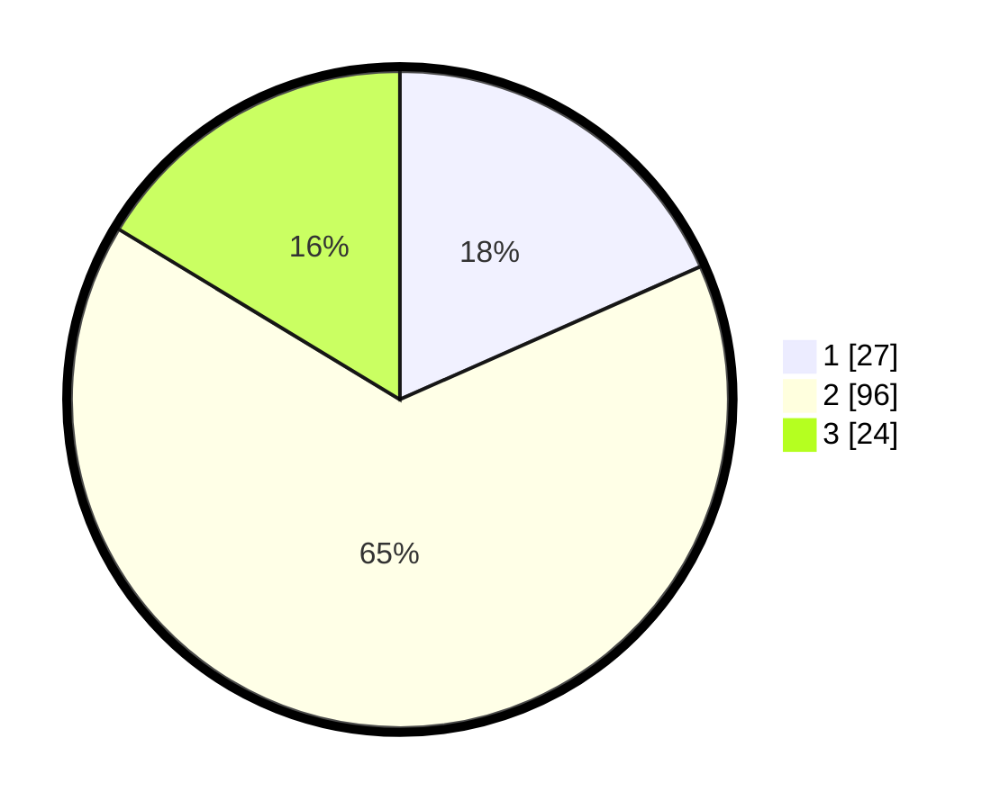

# Hasil

## Grafik

## Tabel

| No. | Nama Paslon    | Suara | Suara (raw) | Persentase |
|:--- |:-------------- | -----:| -----------:| ----------:|
| 1   | ANIES MUHAIMIN | 27    | [27][p-1]   | 18,37      |
| 2   | PRABOWO GIBRAN | 96    | [96][p-2]   | 65,31      |
| 3   | GANJAR MAHFUD  | 24    | [24][p-3]   | 16,33      |

[p-1]: https://github.com/gigit-pemilu/pemilu-2024/blob/main/pilpres/hitung-suara/sub/35-jawa-timur/sub/11-bondowoso/sub/08-tenggarang/sub/1011-tenggarang/sub/005-tps/sub/paslon-1.txt
[p-2]: https://github.com/gigit-pemilu/pemilu-2024/blob/main/pilpres/hitung-suara/sub/35-jawa-timur/sub/11-bondowoso/sub/08-tenggarang/sub/1011-tenggarang/sub/005-tps/sub/paslon-2.txt
[p-3]: https://github.com/gigit-pemilu/pemilu-2024/blob/main/pilpres/hitung-suara/sub/35-jawa-timur/sub/11-bondowoso/sub/08-tenggarang/sub/1011-tenggarang/sub/005-tps/sub/paslon-3.txt

## Foto C Plano

https://sirekap-obj-formc.kpu.go.id/e35e/pemilu/ppwp/35/11/08/10/11/3511081011005-20240215-011756--ec7c8920-b01e-480f-a24d-2f0914a7d767.jpg

https://sirekap-obj-formc.kpu.go.id/e35e/pemilu/ppwp/35/11/08/10/11/3511081011005-20240215-011852--e8cb3fda-a038-4f7c-b4fe-07ca2c52fba5.jpg

https://sirekap-obj-formc.kpu.go.id/e35e/pemilu/ppwp/35/11/08/10/11/3511081011005-20240215-011958--119e510d-f3af-4716-8d57-a97fdca9354d.jpg

## Metadata

| Key        | Value               |
| ---------- | ------------------- |
| Time Stamp | 2024-02-16 22:01:00 |

