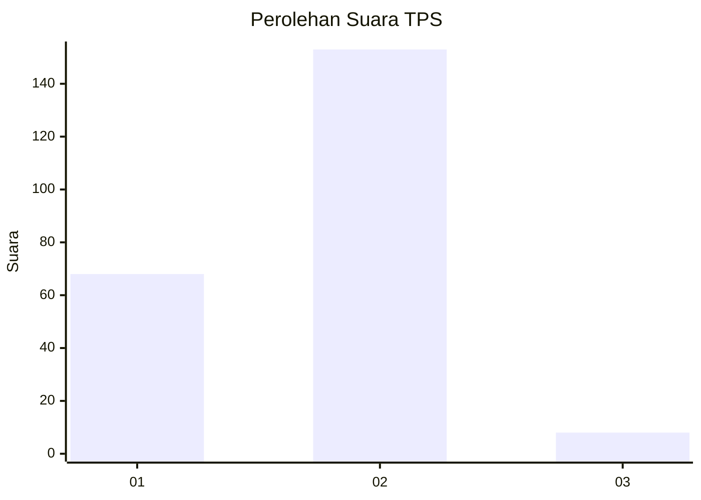
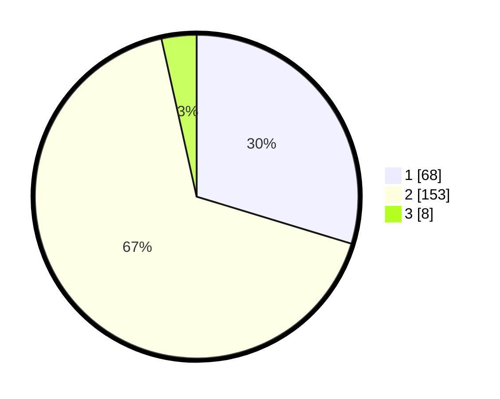

# Hasil

## Grafik

## Tabel

| No. | Nama Paslon    | Suara | Suara (raw) | Persentase |
|:--- |:-------------- | -----:| -----------:| ----------:|
| 1   | ANIES MUHAIMIN | 68    | [68][p-1]   | 29,69      |
| 2   | PRABOWO GIBRAN | 153   | [153][p-2]  | 66,81      |
| 3   | GANJAR MAHFUD  | 8     | [8][p-3]    | 3,49       |

[p-1]: https://github.com/gigit-pemilu/pemilu-2024-35-jawa-timur/blob/main/pilpres/hitung-suara/sub/35-jawa-timur/sub/11-bondowoso/sub/08-tenggarang/sub/2003-pekalangan/sub/007-tps/sub/paslon-1.txt
[p-2]: https://github.com/gigit-pemilu/pemilu-2024-35-jawa-timur/blob/main/pilpres/hitung-suara/sub/35-jawa-timur/sub/11-bondowoso/sub/08-tenggarang/sub/2003-pekalangan/sub/007-tps/sub/paslon-2.txt
[p-3]: https://github.com/gigit-pemilu/pemilu-2024-35-jawa-timur/blob/main/pilpres/hitung-suara/sub/35-jawa-timur/sub/11-bondowoso/sub/08-tenggarang/sub/2003-pekalangan/sub/007-tps/sub/paslon-3.txt

## Foto C Plano

https://sirekap-obj-formc.kpu.go.id/638a/pemilu/ppwp/35/11/08/20/03/3511082003007-20240217-114709--52be84db-81ee-48db-8399-6b352e7b26b4.jpg

https://sirekap-obj-formc.kpu.go.id/638a/pemilu/ppwp/35/11/08/20/03/3511082003007-20240217-113714--eeb12398-5e69-45a5-8062-710e8169b6f4.jpg

https://sirekap-obj-formc.kpu.go.id/638a/pemilu/ppwp/35/11/08/20/03/3511082003007-20240217-113842--659d0bd6-5178-4e38-b693-f67d6f29d880.jpg

## Metadata

| Key        | Value               |
| ---------- | ------------------- |
| Time Stamp | 2024-02-19 06:16:00 |

