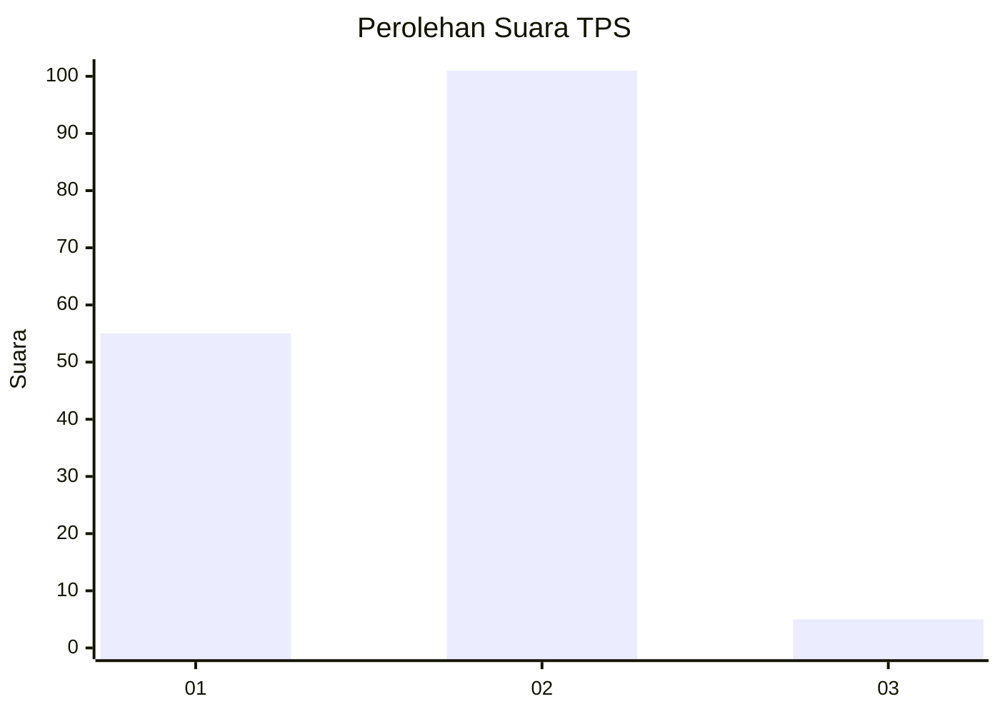
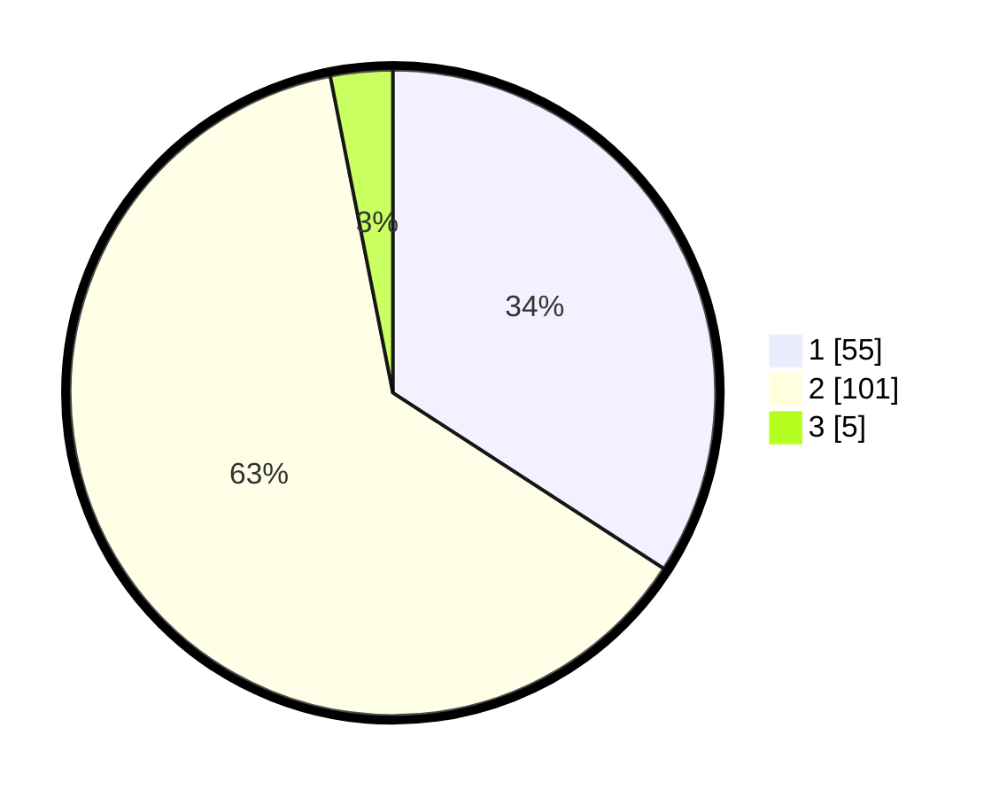

# Hasil

## Grafik

## Tabel

| No. | Nama Paslon    | Suara | Suara (raw) | Persentase |
|:--- |:-------------- | -----:| -----------:| ----------:|
| 1   | ANIES MUHAIMIN | 55    | [55][p-1]   | 34,16      |
| 2   | PRABOWO GIBRAN | 101   | [101][p-2]  | 62,73      |
| 3   | GANJAR MAHFUD  | 5     | [5][p-3]    | 3,11       |

[p-1]: https://github.com/gigit-pemilu/pemilu-2024-35-jawa-timur/blob/main/pilpres/hitung-suara/sub/35-jawa-timur/sub/11-bondowoso/sub/08-tenggarang/sub/2003-pekalangan/sub/010-tps/sub/paslon-1.txt
[p-2]: https://github.com/gigit-pemilu/pemilu-2024-35-jawa-timur/blob/main/pilpres/hitung-suara/sub/35-jawa-timur/sub/11-bondowoso/sub/08-tenggarang/sub/2003-pekalangan/sub/010-tps/sub/paslon-2.txt
[p-3]: https://github.com/gigit-pemilu/pemilu-2024-35-jawa-timur/blob/main/pilpres/hitung-suara/sub/35-jawa-timur/sub/11-bondowoso/sub/08-tenggarang/sub/2003-pekalangan/sub/010-tps/sub/paslon-3.txt

## Foto C Plano

https://sirekap-obj-formc.kpu.go.id/7890/pemilu/ppwp/35/11/08/20/03/3511082003010-20240214-232541--917987c7-77de-4c44-af16-98eaf4b2e391.jpg

https://sirekap-obj-formc.kpu.go.id/7890/pemilu/ppwp/35/11/08/20/03/3511082003010-20240214-232842--1cf6ae0a-41ce-4ad2-a3e6-3812a90b0723.jpg

https://sirekap-obj-formc.kpu.go.id/7890/pemilu/ppwp/35/11/08/20/03/3511082003010-20240214-232948--1ed7c8b5-7779-4ce1-bbd6-176535f0570a.jpg

## Metadata

| Key        | Value               |
| ---------- | ------------------- |
| Time Stamp | 2024-02-17 05:30:02 |

