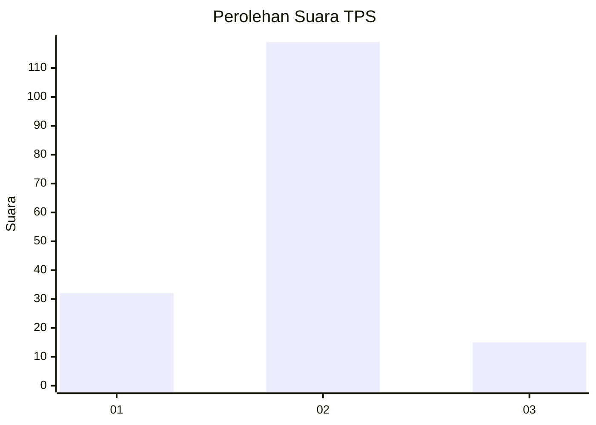
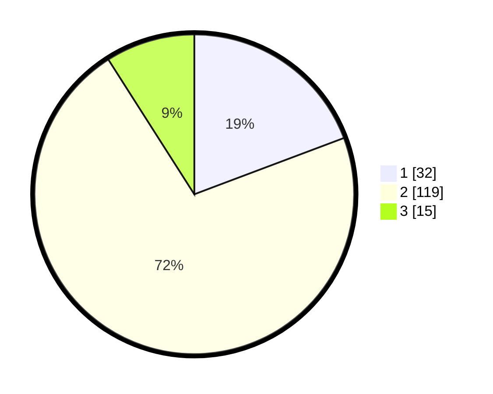

# Hasil

## Grafik

## Tabel

| No. | Nama Paslon    | Suara | Suara (raw) | Persentase |
|:--- |:-------------- | -----:| -----------:| ----------:|
| 1   | ANIES MUHAIMIN | 32    | [32][p-1]   | 19,28      |
| 2   | PRABOWO GIBRAN | 119   | [119][p-2]  | 71,69      |
| 3   | GANJAR MAHFUD  | 15    | [15][p-3]   | 9,04       |

[p-1]: https://github.com/gigit-pemilu/pemilu-2024-35-jawa-timur/blob/main/pilpres/hitung-suara/sub/35-jawa-timur/sub/11-bondowoso/sub/08-tenggarang/sub/2005-sumber-salam/sub/001-tps/sub/paslon-1.txt
[p-2]: https://github.com/gigit-pemilu/pemilu-2024-35-jawa-timur/blob/main/pilpres/hitung-suara/sub/35-jawa-timur/sub/11-bondowoso/sub/08-tenggarang/sub/2005-sumber-salam/sub/001-tps/sub/paslon-2.txt
[p-3]: https://github.com/gigit-pemilu/pemilu-2024-35-jawa-timur/blob/main/pilpres/hitung-suara/sub/35-jawa-timur/sub/11-bondowoso/sub/08-tenggarang/sub/2005-sumber-salam/sub/001-tps/sub/paslon-3.txt

## Foto C Plano

https://sirekap-obj-formc.kpu.go.id/8db4/pemilu/ppwp/35/11/08/20/05/3511082005001-20240214-215621--a1bd1c62-fa90-48c6-b286-c4d127d8650d.jpg

https://sirekap-obj-formc.kpu.go.id/8db4/pemilu/ppwp/35/11/08/20/05/3511082005001-20240214-215940--193f61be-b691-463b-bd36-d2381b7fe54c.jpg

https://sirekap-obj-formc.kpu.go.id/8db4/pemilu/ppwp/35/11/08/20/05/3511082005001-20240214-220101--ada8c117-6f10-4b2d-8929-235a79bbe91a.jpg

## Metadata

| Key        | Value               |
| ---------- | ------------------- |
| Time Stamp | 2024-02-16 01:30:27 |

