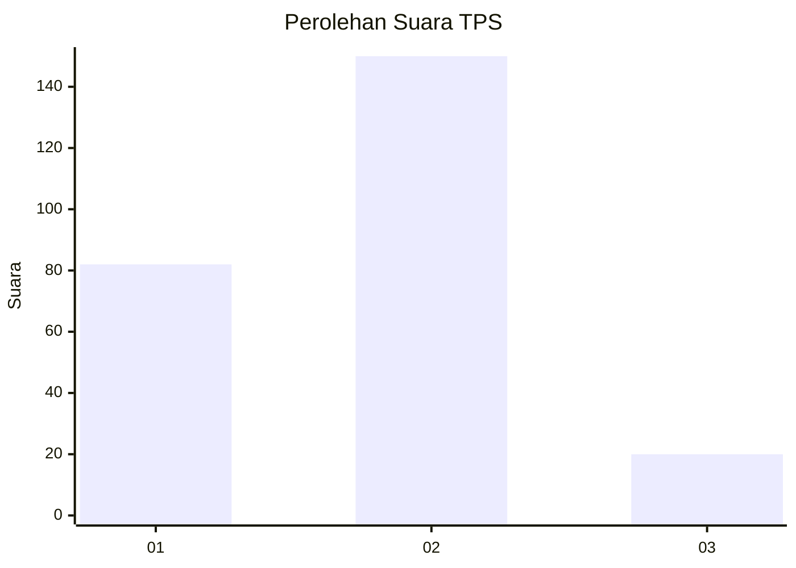
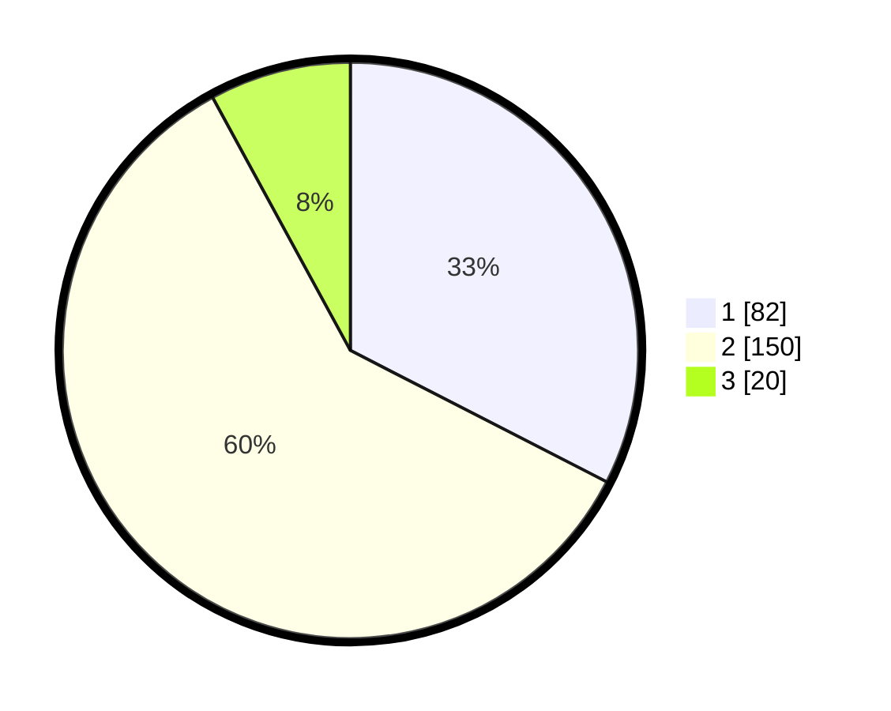

# Hasil

## Grafik

## Tabel

| No. | Nama Paslon    | Suara | Suara (raw) | Persentase |
|:--- |:-------------- | -----:| -----------:| ----------:|
| 1   | ANIES MUHAIMIN | 82    | [82][p-1]   | 32,54      |
| 2   | PRABOWO GIBRAN | 150   | [150][p-2]  | 59,52      |
| 3   | GANJAR MAHFUD  | 20    | [20][p-3]   | 7,94       |

[p-1]: https://github.com/gigit-pemilu/pemilu-2024-35-jawa-timur/blob/main/pilpres/hitung-suara/sub/35-jawa-timur/sub/11-bondowoso/sub/08-tenggarang/sub/2005-sumber-salam/sub/006-tps/sub/paslon-1.txt
[p-2]: https://github.com/gigit-pemilu/pemilu-2024-35-jawa-timur/blob/main/pilpres/hitung-suara/sub/35-jawa-timur/sub/11-bondowoso/sub/08-tenggarang/sub/2005-sumber-salam/sub/006-tps/sub/paslon-2.txt
[p-3]: https://github.com/gigit-pemilu/pemilu-2024-35-jawa-timur/blob/main/pilpres/hitung-suara/sub/35-jawa-timur/sub/11-bondowoso/sub/08-tenggarang/sub/2005-sumber-salam/sub/006-tps/sub/paslon-3.txt

## Foto C Plano

https://sirekap-obj-formc.kpu.go.id/f649/pemilu/ppwp/35/11/08/20/05/3511082005006-20240219-000751--b32d5c62-d74b-486b-b5d2-845bc345125d.jpg

https://sirekap-obj-formc.kpu.go.id/f649/pemilu/ppwp/35/11/08/20/05/3511082005006-20240219-000141--02c5f7fd-45d2-446b-8a94-25a577457a6e.jpg

https://sirekap-obj-formc.kpu.go.id/f649/pemilu/ppwp/35/11/08/20/05/3511082005006-20240219-000249--292d7b98-5e9a-4bb8-9cc2-fc33dbf10b9f.jpg

## Metadata

| Key        | Value               |
| ---------- | ------------------- |
| Time Stamp | 2024-02-19 10:00:00 |

