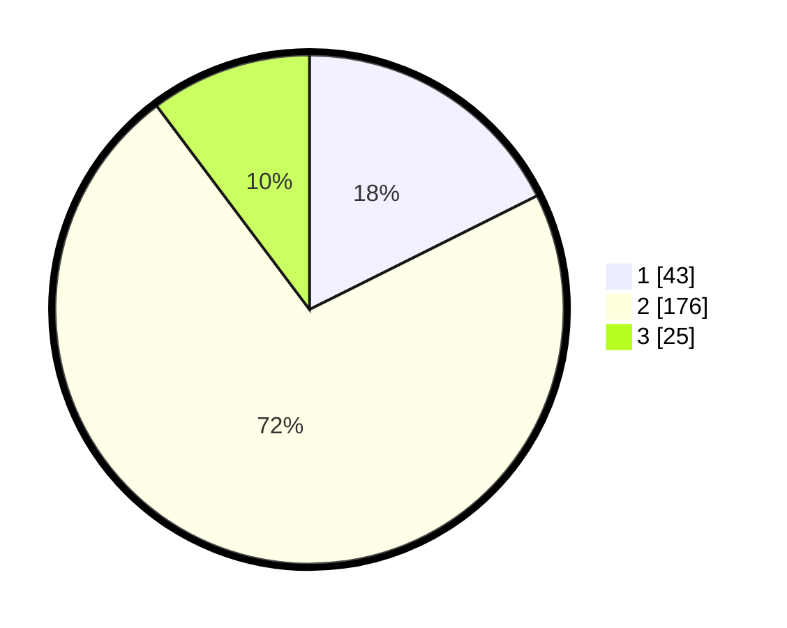

# Hasil

## Grafik

## Tabel

| No. | Nama Paslon    | Suara | Suara (raw) | Persentase |
|:--- |:-------------- | -----:| -----------:| ----------:|
| 1   | ANIES MUHAIMIN | 43    | [43][p-1]   | 17,62      |
| 2   | PRABOWO GIBRAN | 176   | [176][p-2]  | 72,13      |
| 3   | GANJAR MAHFUD  | 25    | [25][p-3]   | 10,25      |

[p-1]: https://github.com/gigit-pemilu/pemilu-2024-35-jawa-timur/blob/main/pilpres/hitung-suara/sub/35-jawa-timur/sub/11-bondowoso/sub/08-tenggarang/sub/2006-koncer-kidul/sub/007-tps/sub/paslon-1.txt
[p-2]: https://github.com/gigit-pemilu/pemilu-2024-35-jawa-timur/blob/main/pilpres/hitung-suara/sub/35-jawa-timur/sub/11-bondowoso/sub/08-tenggarang/sub/2006-koncer-kidul/sub/007-tps/sub/paslon-2.txt
[p-3]: https://github.com/gigit-pemilu/pemilu-2024-35-jawa-timur/blob/main/pilpres/hitung-suara/sub/35-jawa-timur/sub/11-bondowoso/sub/08-tenggarang/sub/2006-koncer-kidul/sub/007-tps/sub/paslon-3.txt

## Foto C Plano

https://sirekap-obj-formc.kpu.go.id/d6a6/pemilu/ppwp/35/11/08/20/06/3511082006007-20240214-192922--982d95b4-510a-4308-b91c-65f53f035d78.jpg

https://sirekap-obj-formc.kpu.go.id/d6a6/pemilu/ppwp/35/11/08/20/06/3511082006007-20240214-192939--3c72f252-497d-43b3-849d-592386695dda.jpg

https://sirekap-obj-formc.kpu.go.id/d6a6/pemilu/ppwp/35/11/08/20/06/3511082006007-20240214-192957--61f4ec7e-e4b8-4ff8-9253-8d04873be3ea.jpg

## Metadata

| Key        | Value               |
| ---------- | ------------------- |
| Time Stamp | 2024-02-14 21:46:01 |

