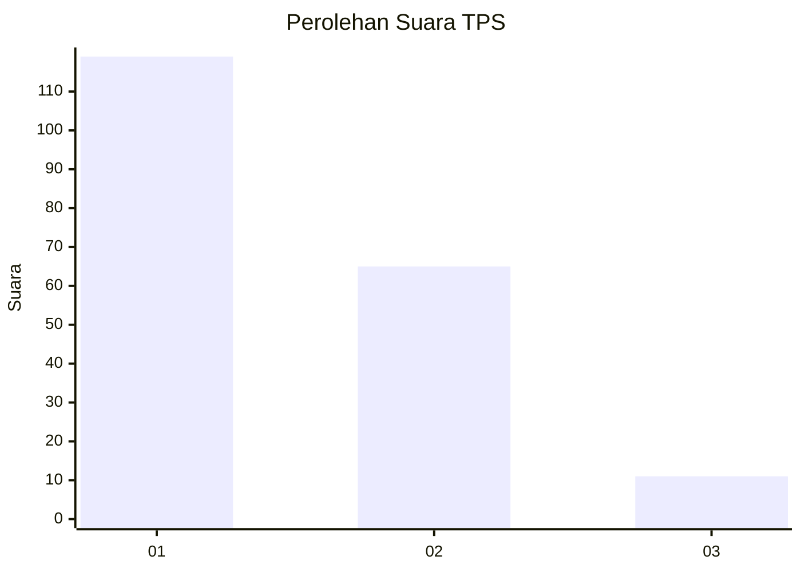
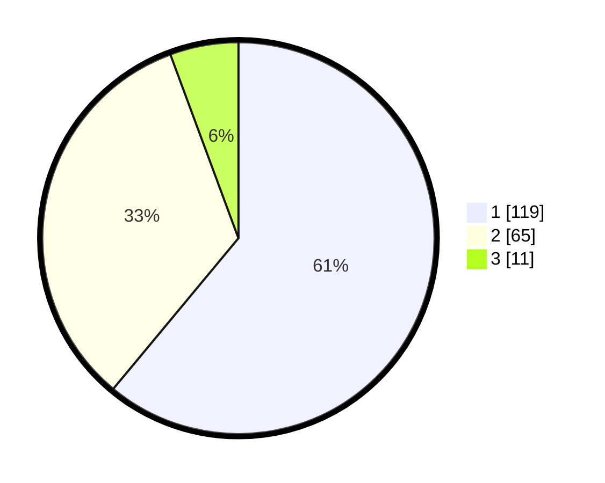

# Hasil

## Grafik

## Tabel

| No. | Nama Paslon    | Suara | Suara (raw) | Persentase |
|:--- |:-------------- | -----:| -----------:| ----------:|
| 1   | ANIES MUHAIMIN | 119   | [119][p-1]  | 61,03      |
| 2   | PRABOWO GIBRAN | 65    | [65][p-2]   | 33,33      |
| 3   | GANJAR MAHFUD  | 11    | [11][p-3]   | 5,64       |

[p-1]: https://github.com/gigit-pemilu/pemilu-2024-35-jawa-timur/blob/main/pilpres/hitung-suara/sub/35-jawa-timur/sub/11-bondowoso/sub/08-tenggarang/sub/2006-koncer-kidul/sub/008-tps/sub/paslon-1.txt
[p-2]: https://github.com/gigit-pemilu/pemilu-2024-35-jawa-timur/blob/main/pilpres/hitung-suara/sub/35-jawa-timur/sub/11-bondowoso/sub/08-tenggarang/sub/2006-koncer-kidul/sub/008-tps/sub/paslon-2.txt
[p-3]: https://github.com/gigit-pemilu/pemilu-2024-35-jawa-timur/blob/main/pilpres/hitung-suara/sub/35-jawa-timur/sub/11-bondowoso/sub/08-tenggarang/sub/2006-koncer-kidul/sub/008-tps/sub/paslon-3.txt

## Foto C Plano

https://sirekap-obj-formc.kpu.go.id/235b/pemilu/ppwp/35/11/08/20/06/3511082006008-20240214-155228--656b55a8-5431-43bc-8a4d-79877f546789.jpg

https://sirekap-obj-formc.kpu.go.id/235b/pemilu/ppwp/35/11/08/20/06/3511082006008-20240214-160117--240ae09d-b252-48a6-a70c-938ef31566ac.jpg

https://sirekap-obj-formc.kpu.go.id/235b/pemilu/ppwp/35/11/08/20/06/3511082006008-20240214-160056--38856cf4-4498-4f79-bfb9-2f14aa92ce29.jpg

## Metadata

| Key        | Value               |
| ---------- | ------------------- |
| Time Stamp | 2024-02-19 06:16:00 |

