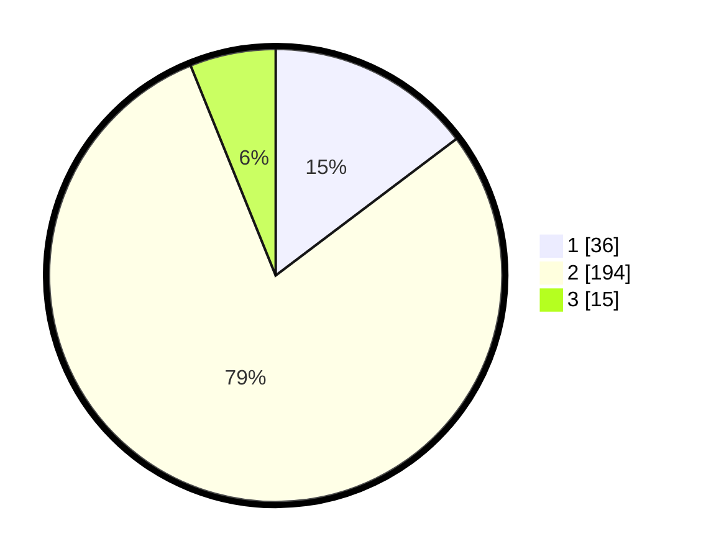

# Hasil

## Grafik

## Tabel

| No. | Nama Paslon    | Suara | Suara (raw) | Persentase |
|:--- |:-------------- | -----:| -----------:| ----------:|
| 1   | ANIES MUHAIMIN | 36    | [36][p-1]   | 14,69      |
| 2   | PRABOWO GIBRAN | 194   | [194][p-2]  | 79,18      |
| 3   | GANJAR MAHFUD  | 15    | [15][p-3]   | 6,12       |

[p-1]: https://github.com/gigit-pemilu/pemilu-2024-35-jawa-timur/blob/main/pilpres/hitung-suara/sub/35-jawa-timur/sub/11-bondowoso/sub/08-tenggarang/sub/2006-koncer-kidul/sub/012-tps/sub/paslon-1.txt
[p-2]: https://github.com/gigit-pemilu/pemilu-2024-35-jawa-timur/blob/main/pilpres/hitung-suara/sub/35-jawa-timur/sub/11-bondowoso/sub/08-tenggarang/sub/2006-koncer-kidul/sub/012-tps/sub/paslon-2.txt
[p-3]: https://github.com/gigit-pemilu/pemilu-2024-35-jawa-timur/blob/main/pilpres/hitung-suara/sub/35-jawa-timur/sub/11-bondowoso/sub/08-tenggarang/sub/2006-koncer-kidul/sub/012-tps/sub/paslon-3.txt

## Foto C Plano

https://sirekap-obj-formc.kpu.go.id/ff6b/pemilu/ppwp/35/11/08/20/06/3511082006012-20240214-155105--fc522741-2ba6-4da8-aa6a-845829d948ec.jpg

https://sirekap-obj-formc.kpu.go.id/ff6b/pemilu/ppwp/35/11/08/20/06/3511082006012-20240214-155028--fe9df460-f586-490b-8190-6c64f9be8132.jpg

https://sirekap-obj-formc.kpu.go.id/ff6b/pemilu/ppwp/35/11/08/20/06/3511082006012-20240214-155244--6aa7fc5e-8caa-486a-808d-f21ea7bc69b6.jpg

## Metadata

| Key        | Value               |
| ---------- | ------------------- |
| Time Stamp | 2024-02-14 21:46:01 |

