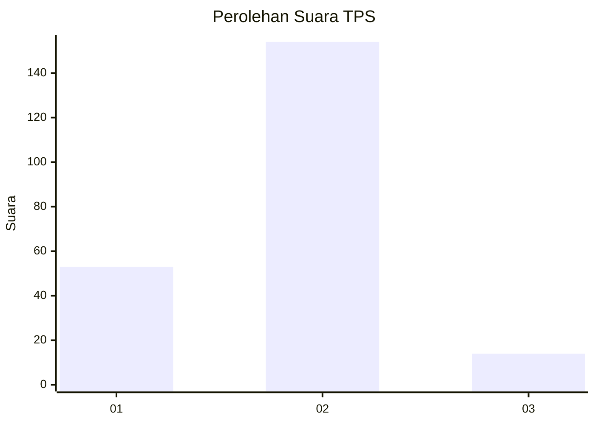

# Hasil

## Grafik

## Tabel

| No. | Nama Paslon    | Suara | Suara (raw) | Persentase |
|:--- |:-------------- | -----:| -----------:| ----------:|
| 1   | ANIES MUHAIMIN | 53    | [53][p-1]   | 23,98      |
| 2   | PRABOWO GIBRAN | 154   | [154][p-2]  | 69,68      |
| 3   | GANJAR MAHFUD  | 14    | [14][p-3]   | 6,33       |

[p-1]: https://github.com/gigit-pemilu/pemilu-2024/blob/main/pilpres/hitung-suara/sub/35-jawa-timur/sub/11-bondowoso/sub/08-tenggarang/sub/2007-bataan/sub/001-tps/sub/paslon-1.txt
[p-2]: https://github.com/gigit-pemilu/pemilu-2024/blob/main/pilpres/hitung-suara/sub/35-jawa-timur/sub/11-bondowoso/sub/08-tenggarang/sub/2007-bataan/sub/001-tps/sub/paslon-2.txt
[p-3]: https://github.com/gigit-pemilu/pemilu-2024/blob/main/pilpres/hitung-suara/sub/35-jawa-timur/sub/11-bondowoso/sub/08-tenggarang/sub/2007-bataan/sub/001-tps/sub/paslon-3.txt

## Foto C Plano

https://sirekap-obj-formc.kpu.go.id/8ee1/pemilu/ppwp/35/11/08/20/07/3511082007001-20240214-160055--fb6fbdb4-5806-40c2-b93c-4533c83723b7.jpg

https://sirekap-obj-formc.kpu.go.id/8ee1/pemilu/ppwp/35/11/08/20/07/3511082007001-20240214-160117--aff9b24f-cef7-4a9d-a237-24e1e4a43a83.jpg

https://sirekap-obj-formc.kpu.go.id/8ee1/pemilu/ppwp/35/11/08/20/07/3511082007001-20240214-235431--b7750520-a019-466f-aabf-ff8b4c2fbfd5.jpg

## Metadata

| Key        | Value               |
| ---------- | ------------------- |
| Time Stamp | 2024-02-19 06:16:00 |

