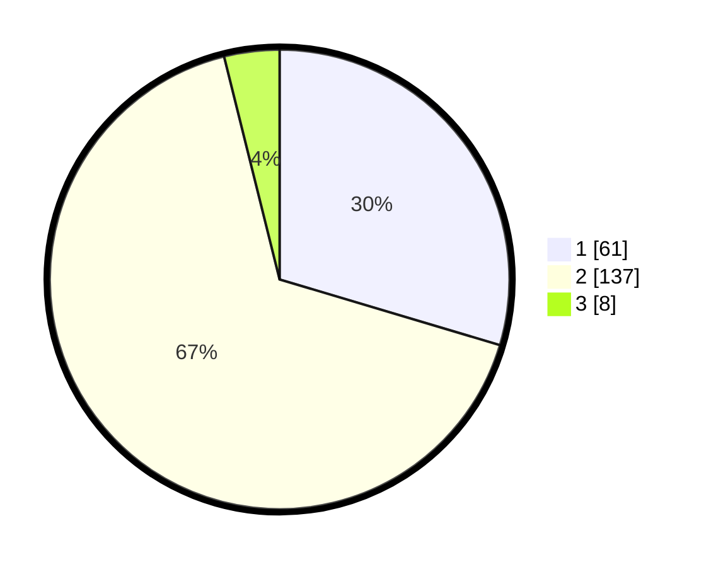

# Hasil

## Grafik

## Tabel

| No. | Nama Paslon    | Suara | Suara (raw) | Persentase |
|:--- |:-------------- | -----:| -----------:| ----------:|
| 1   | ANIES MUHAIMIN | 61    | [61][p-1]   | 29,61      |
| 2   | PRABOWO GIBRAN | 137   | [137][p-2]  | 66,50      |
| 3   | GANJAR MAHFUD  | 8     | [8][p-3]    | 3,88       |

[p-1]: https://github.com/gigit-pemilu/pemilu-2024/blob/main/pilpres/hitung-suara/sub/35-jawa-timur/sub/11-bondowoso/sub/08-tenggarang/sub/2010-tangsil-kulon/sub/003-tps/sub/paslon-1.txt
[p-2]: https://github.com/gigit-pemilu/pemilu-2024/blob/main/pilpres/hitung-suara/sub/35-jawa-timur/sub/11-bondowoso/sub/08-tenggarang/sub/2010-tangsil-kulon/sub/003-tps/sub/paslon-2.txt
[p-3]: https://github.com/gigit-pemilu/pemilu-2024/blob/main/pilpres/hitung-suara/sub/35-jawa-timur/sub/11-bondowoso/sub/08-tenggarang/sub/2010-tangsil-kulon/sub/003-tps/sub/paslon-3.txt

## Foto C Plano

https://sirekap-obj-formc.kpu.go.id/2dbe/pemilu/ppwp/35/11/08/20/10/3511082010003-20240215-023244--02e8e7f7-7df9-41cd-9b7d-c5a6d512dd2f.jpg

https://sirekap-obj-formc.kpu.go.id/2dbe/pemilu/ppwp/35/11/08/20/10/3511082010003-20240215-024420--5e20de36-9d8a-4c70-a9ce-85211dd887df.jpg

https://sirekap-obj-formc.kpu.go.id/2dbe/pemilu/ppwp/35/11/08/20/10/3511082010003-20240215-024535--b30d5ab2-c5fe-4027-905e-8d4b513534cb.jpg

## Metadata

| Key        | Value               |
| ---------- | ------------------- |
| Time Stamp | 2024-02-19 06:16:00 |

