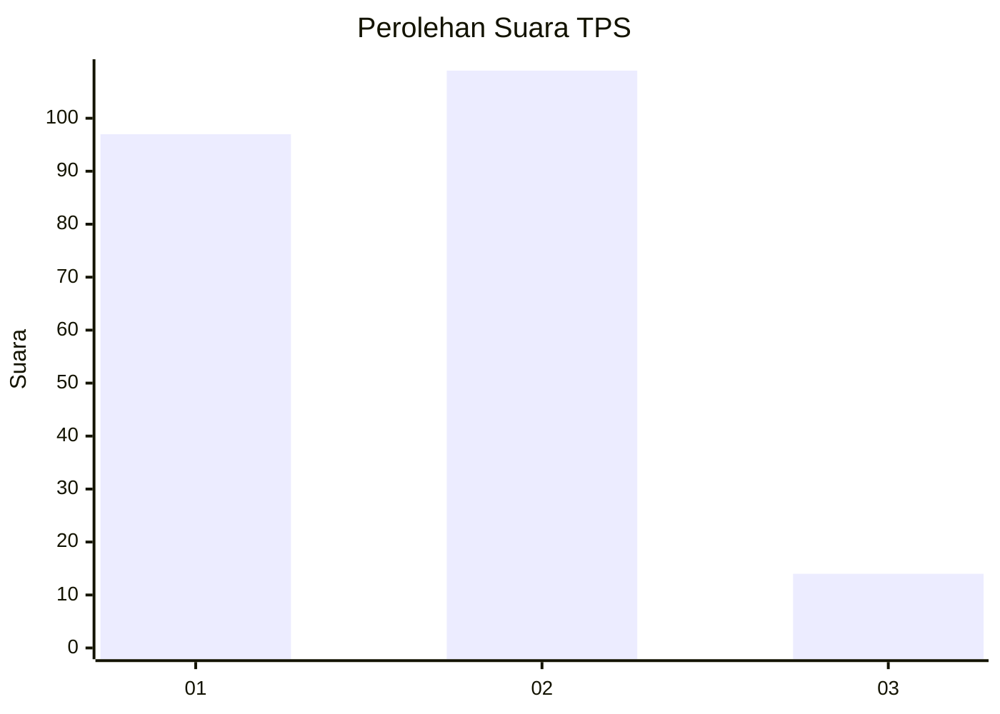
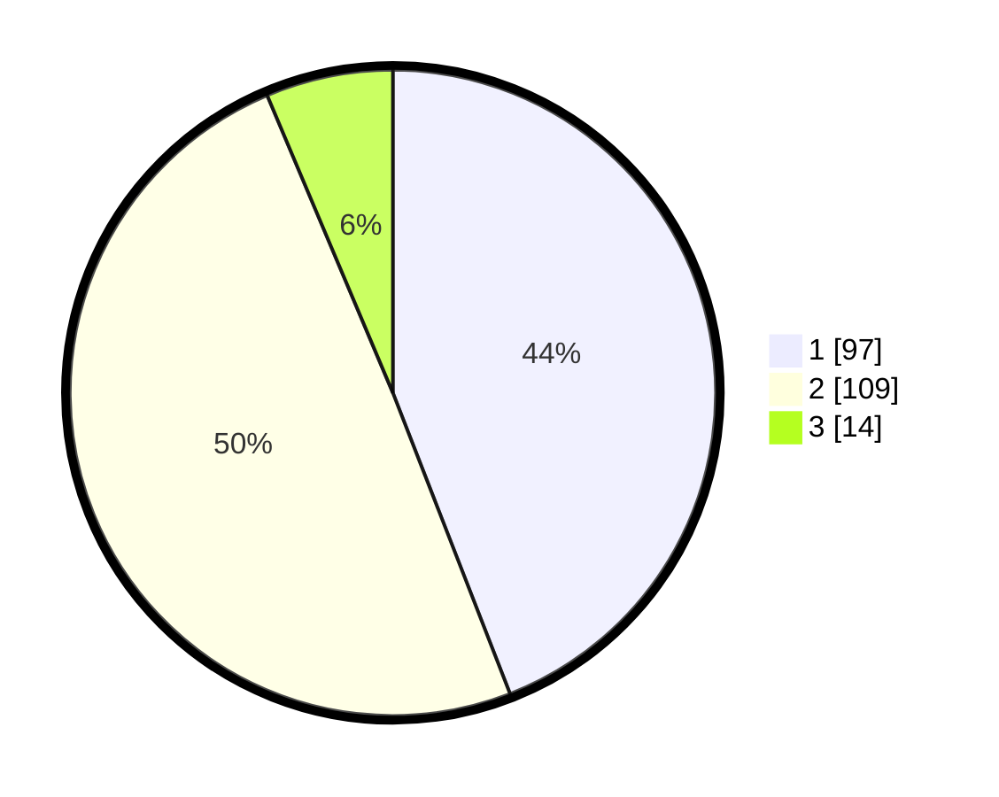

# Hasil

## Grafik

## Tabel

| No. | Nama Paslon    | Suara | Suara (raw) | Persentase |
|:--- |:-------------- | -----:| -----------:| ----------:|
| 1   | ANIES MUHAIMIN | 97    | [97][p-1]   | 44,09      |
| 2   | PRABOWO GIBRAN | 109   | [109][p-2]  | 49,55      |
| 3   | GANJAR MAHFUD  | 14    | [14][p-3]   | 6,36       |

[p-1]: https://github.com/gigit-pemilu/pemilu-2024-35-jawa-timur/blob/main/pilpres/hitung-suara/sub/35-jawa-timur/sub/11-bondowoso/sub/09-wonosari/sub/2001-lombok-kulon/sub/001-tps/sub/paslon-1.txt
[p-2]: https://github.com/gigit-pemilu/pemilu-2024-35-jawa-timur/blob/main/pilpres/hitung-suara/sub/35-jawa-timur/sub/11-bondowoso/sub/09-wonosari/sub/2001-lombok-kulon/sub/001-tps/sub/paslon-2.txt
[p-3]: https://github.com/gigit-pemilu/pemilu-2024-35-jawa-timur/blob/main/pilpres/hitung-suara/sub/35-jawa-timur/sub/11-bondowoso/sub/09-wonosari/sub/2001-lombok-kulon/sub/001-tps/sub/paslon-3.txt

## Foto C Plano

https://sirekap-obj-formc.kpu.go.id/83b8/pemilu/ppwp/35/11/09/20/01/3511092001001-20240220-090925--d64e5ff4-fbf1-4e62-ae42-ae297078845f.jpg

https://sirekap-obj-formc.kpu.go.id/83b8/pemilu/ppwp/35/11/09/20/01/3511092001001-20240220-091007--2c5f18a9-68d0-453c-bc92-506e411034fe.jpg

https://sirekap-obj-formc.kpu.go.id/83b8/pemilu/ppwp/35/11/09/20/01/3511092001001-20240220-091058--aae57f95-aae2-4309-834b-34efe5bb64d7.jpg

## Metadata

| Key        | Value               |
| ---------- | ------------------- |
| Time Stamp | 2024-02-24 22:31:28 |

