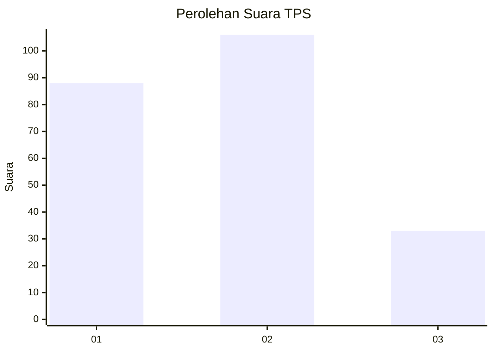
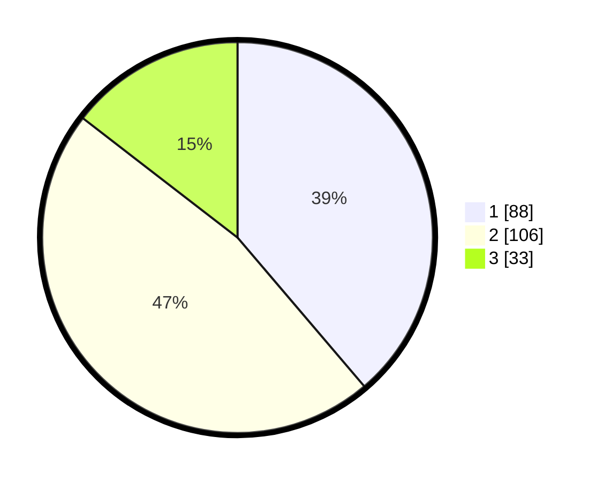

# Hasil

## Grafik

## Tabel

| No. | Nama Paslon    | Suara | Suara (raw) | Persentase |
|:--- |:-------------- | -----:| -----------:| ----------:|
| 1   | ANIES MUHAIMIN | 88    | [88][p-1]   | 38,77      |
| 2   | PRABOWO GIBRAN | 106   | [106][p-2]  | 46,70      |
| 3   | GANJAR MAHFUD  | 33    | [33][p-3]   | 14,54      |

[p-1]: https://github.com/gigit-pemilu/pemilu-2024-35-jawa-timur/blob/main/pilpres/hitung-suara/sub/35-jawa-timur/sub/11-bondowoso/sub/09-wonosari/sub/2001-lombok-kulon/sub/002-tps/sub/paslon-1.txt
[p-2]: https://github.com/gigit-pemilu/pemilu-2024-35-jawa-timur/blob/main/pilpres/hitung-suara/sub/35-jawa-timur/sub/11-bondowoso/sub/09-wonosari/sub/2001-lombok-kulon/sub/002-tps/sub/paslon-2.txt
[p-3]: https://github.com/gigit-pemilu/pemilu-2024-35-jawa-timur/blob/main/pilpres/hitung-suara/sub/35-jawa-timur/sub/11-bondowoso/sub/09-wonosari/sub/2001-lombok-kulon/sub/002-tps/sub/paslon-3.txt

## Foto C Plano

https://sirekap-obj-formc.kpu.go.id/a5f7/pemilu/ppwp/35/11/09/20/01/3511092001002-20240220-105220--8636b8d8-f694-47b1-868d-be8acc085989.jpg

https://sirekap-obj-formc.kpu.go.id/a5f7/pemilu/ppwp/35/11/09/20/01/3511092001002-20240220-105415--b4a5b4db-8e3e-470c-9a1a-e30d3c81fb21.jpg

https://sirekap-obj-formc.kpu.go.id/a5f7/pemilu/ppwp/35/11/09/20/01/3511092001002-20240220-105547--a1087cc3-93c4-4794-9095-2538e4120e57.jpg

## Metadata

| Key        | Value               |
| ---------- | ------------------- |
| Time Stamp | 2024-02-24 22:31:28 |

