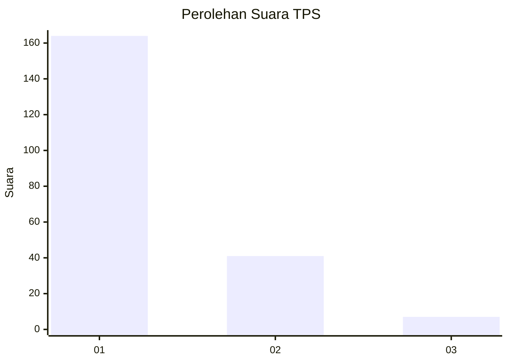
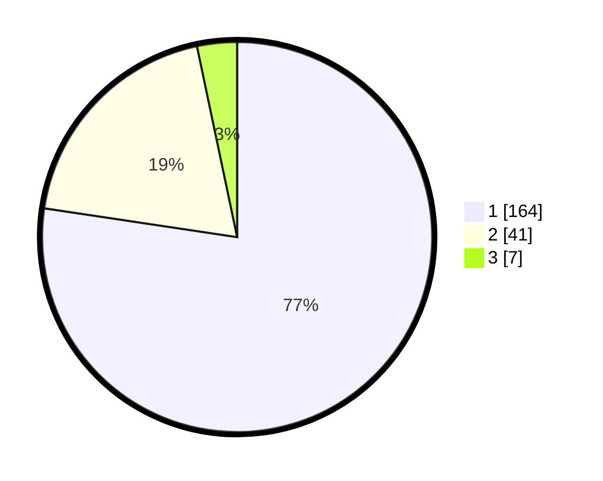

# Hasil

## Grafik

## Tabel

| No. | Nama Paslon    | Suara | Suara (raw) | Persentase |
|:--- |:-------------- | -----:| -----------:| ----------:|
| 1   | ANIES MUHAIMIN | 164   | [164][p-1]  | 77,36      |
| 2   | PRABOWO GIBRAN | 41    | [41][p-2]   | 19,34      |
| 3   | GANJAR MAHFUD  | 7     | [7][p-3]    | 3,30       |

[p-1]: https://github.com/gigit-pemilu/pemilu-2024/blob/main/pilpres/hitung-suara/sub/35-jawa-timur/sub/11-bondowoso/sub/09-wonosari/sub/2001-lombok-kulon/sub/007-tps/sub/paslon-1.txt
[p-2]: https://github.com/gigit-pemilu/pemilu-2024/blob/main/pilpres/hitung-suara/sub/35-jawa-timur/sub/11-bondowoso/sub/09-wonosari/sub/2001-lombok-kulon/sub/007-tps/sub/paslon-2.txt
[p-3]: https://github.com/gigit-pemilu/pemilu-2024/blob/main/pilpres/hitung-suara/sub/35-jawa-timur/sub/11-bondowoso/sub/09-wonosari/sub/2001-lombok-kulon/sub/007-tps/sub/paslon-3.txt

## Foto C Plano

https://sirekap-obj-formc.kpu.go.id/18b4/pemilu/ppwp/35/11/09/20/01/3511092001007-20240218-204838--9ae1ec7e-4abd-48ac-9fde-d7a4c52c65dd.jpg

https://sirekap-obj-formc.kpu.go.id/18b4/pemilu/ppwp/35/11/09/20/01/3511092001007-20240218-204921--49981ce3-a495-4092-8e3a-a94cee6d443e.jpg

https://sirekap-obj-formc.kpu.go.id/18b4/pemilu/ppwp/35/11/09/20/01/3511092001007-20240218-204944--58530ca7-4d89-4cdb-9dcd-9bbb0cfb0035.jpg

## Metadata

| Key        | Value               |
| ---------- | ------------------- |
| Time Stamp | 2024-02-19 22:00:00 |

