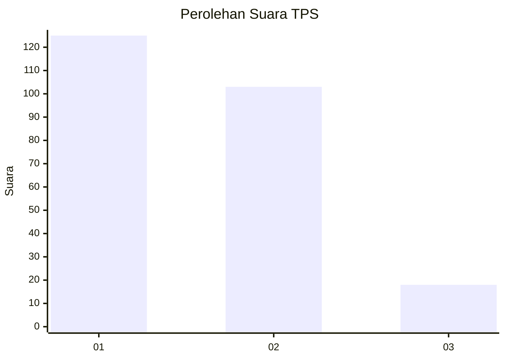
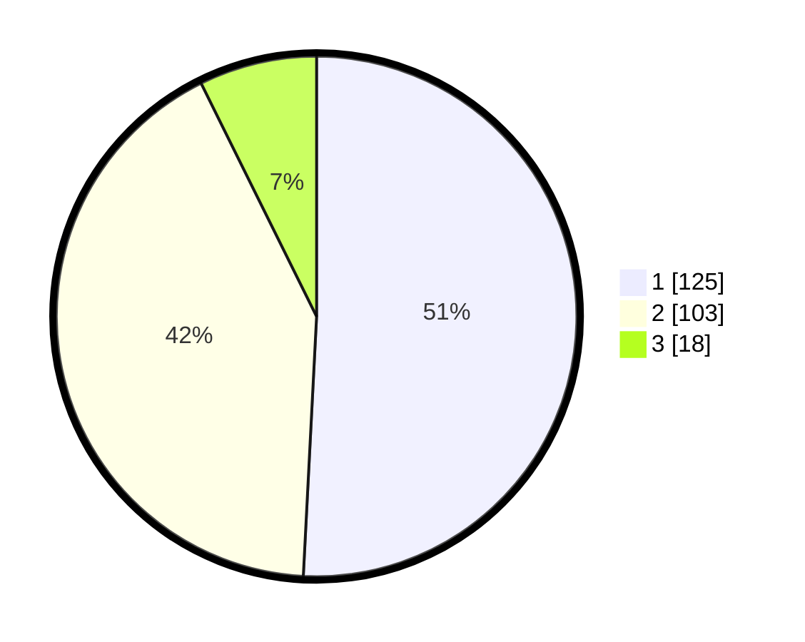

# Hasil

## Grafik

## Tabel

| No. | Nama Paslon    | Suara | Suara (raw) | Persentase |
|:--- |:-------------- | -----:| -----------:| ----------:|
| 1   | ANIES MUHAIMIN | 125   | [125][p-1]  | 50,81      |
| 2   | PRABOWO GIBRAN | 103   | [103][p-2]  | 41,87      |
| 3   | GANJAR MAHFUD  | 18    | [18][p-3]   | 7,32       |

[p-1]: https://github.com/gigit-pemilu/pemilu-2024/blob/main/pilpres/hitung-suara/sub/35-jawa-timur/sub/11-bondowoso/sub/09-wonosari/sub/2002-lombok-wetan/sub/006-tps/sub/paslon-1.txt
[p-2]: https://github.com/gigit-pemilu/pemilu-2024/blob/main/pilpres/hitung-suara/sub/35-jawa-timur/sub/11-bondowoso/sub/09-wonosari/sub/2002-lombok-wetan/sub/006-tps/sub/paslon-2.txt
[p-3]: https://github.com/gigit-pemilu/pemilu-2024/blob/main/pilpres/hitung-suara/sub/35-jawa-timur/sub/11-bondowoso/sub/09-wonosari/sub/2002-lombok-wetan/sub/006-tps/sub/paslon-3.txt

## Foto C Plano

https://sirekap-obj-formc.kpu.go.id/4011/pemilu/ppwp/35/11/09/20/02/3511092002006-20240218-110532--dee8c4f7-0365-46d6-b591-1b18a7d2cc53.jpg

https://sirekap-obj-formc.kpu.go.id/4011/pemilu/ppwp/35/11/09/20/02/3511092002006-20240218-112422--307e1e9a-3a93-4522-89df-76451c2db9c5.jpg

https://sirekap-obj-formc.kpu.go.id/4011/pemilu/ppwp/35/11/09/20/02/3511092002006-20240218-112450--3df8dfd3-754e-4246-885f-d7abca380d1b.jpg

## Metadata

| Key        | Value               |
| ---------- | ------------------- |
| Time Stamp | 2024-02-19 06:16:00 |

