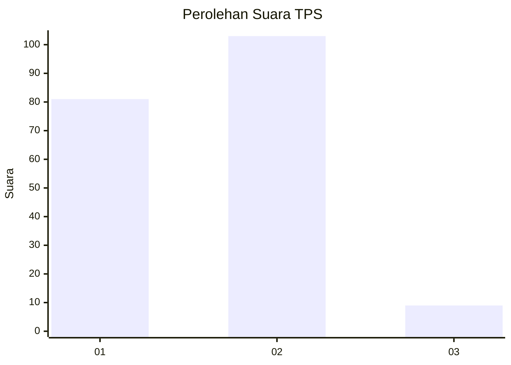
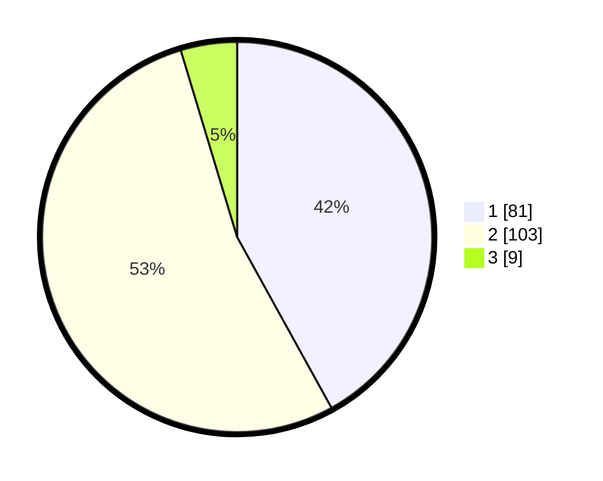

# Hasil

## Grafik

## Tabel

| No. | Nama Paslon    | Suara | Suara (raw) | Persentase |
|:--- |:-------------- | -----:| -----------:| ----------:|
| 1   | ANIES MUHAIMIN | 81    | [81][p-1]   | 41,97      |
| 2   | PRABOWO GIBRAN | 103   | [103][p-2]  | 53,37      |
| 3   | GANJAR MAHFUD  | 9     | [9][p-3]    | 4,66       |

[p-1]: https://github.com/gigit-pemilu/pemilu-2024-35-jawa-timur/blob/main/pilpres/hitung-suara/sub/35-jawa-timur/sub/11-bondowoso/sub/09-wonosari/sub/2006-pasarejo/sub/004-tps/sub/paslon-1.txt
[p-2]: https://github.com/gigit-pemilu/pemilu-2024-35-jawa-timur/blob/main/pilpres/hitung-suara/sub/35-jawa-timur/sub/11-bondowoso/sub/09-wonosari/sub/2006-pasarejo/sub/004-tps/sub/paslon-2.txt
[p-3]: https://github.com/gigit-pemilu/pemilu-2024-35-jawa-timur/blob/main/pilpres/hitung-suara/sub/35-jawa-timur/sub/11-bondowoso/sub/09-wonosari/sub/2006-pasarejo/sub/004-tps/sub/paslon-3.txt

## Foto C Plano

https://sirekap-obj-formc.kpu.go.id/8209/pemilu/ppwp/35/11/09/20/06/3511092006004-20240218-143725--c138a273-4bb2-4f71-a05d-fd02b27f8887.jpg

https://sirekap-obj-formc.kpu.go.id/8209/pemilu/ppwp/35/11/09/20/06/3511092006004-20240218-141854--46b59fe1-9e27-42ab-bdf0-65ca7e82d6dc.jpg

https://sirekap-obj-formc.kpu.go.id/8209/pemilu/ppwp/35/11/09/20/06/3511092006004-20240218-142721--019a1923-dcf2-437c-a6e5-74803fa492b1.jpg

## Metadata

| Key        | Value               |
| ---------- | ------------------- |
| Time Stamp | 2024-02-20 22:00:00 |

